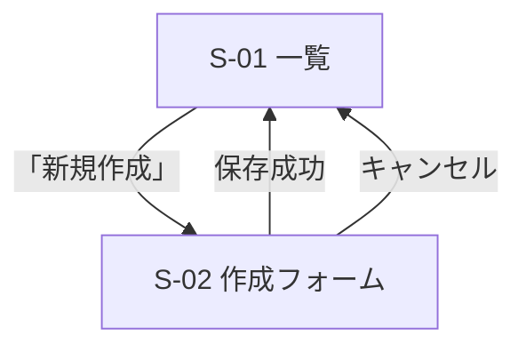

# 画面設計ガイド

このガイドは、機能設計書に基づいて Web/GUI の画面設計書を作成するための実践的な指針を提供します。

## 画面設計書の目的

画面設計書は、機能設計書で定義された「何ができるか」を、具体的な「画面・コンポーネント・状態」に落とし込むドキュメントです。実装者がデザインの意図を正確に理解し、一貫した UI を構築できるようにします。

**主な内容**:
- 画面一覧と画面遷移
- 各画面のワイヤーフレームとレイアウト
- 状態設計(loading / empty / error / success / disabled)
- 共通コンポーネントとデザインシステム(トークン)
- レスポンシブ・アクセシビリティ方針

## 作成の基本フロー

### ステップ1: 機能から画面を洗い出す

PRD のユーザーストーリーと機能設計書の機能から、必要な画面を列挙します。各画面には ID(S-01 等)を付け、対応する機能を明記して**トレーサビリティ**を確保します。

**悪い例**: 画面名だけを並べる
**良い例**: 画面ID・目的・対応機能をセットで定義し、どの機能がどの画面で実現されるか追跡できる

### ステップ2: 画面遷移を設計する

Mermaid の `flowchart` で画面間の遷移を可視化します。遷移のトリガー(ボタン押下・保存など)をラベルに記述します。



### ステップ3: 各画面をワイヤーフレーム化する

ワイヤーフレームは ASCII や Mermaid、または構造の箇条書きで表現します。**見た目の美しさより、要素の配置と優先順位**を伝えることが目的です。

```
┌────────────────────────────┐
│ ヘッダー(ロゴ / ユーザー名)   │
├────────────────────────────┤
│ [検索ボックス]  [新規作成]    │
│ ┌────────────────────────┐ │
│ │ 一覧(行: タイトル/状態)  │ │
│ └────────────────────────┘ │
└────────────────────────────┘
```

### ステップ4: 状態設計を必ず行う(最重要)

画面は「正常表示」だけでなく、以下の状態をすべて設計します。**状態の抜けは実装漏れ・UX 低下の最大の原因**です。

| 状態 | 意味 | 設計すべき内容 |
|------|------|----------------|
| loading | データ取得中 | スピナー / スケルトン表示 |
| empty | データが0件 | 空状態メッセージと次のアクション導線 |
| error | 取得・送信失敗 | エラーメッセージと再試行導線 |
| success | 正常 | 通常のコンテンツ表示 |
| disabled | 操作不可 | 無効化する要素とその条件 |

**悪い例**: 正常系のみ設計し、空・エラー時の表示が未定義
**良い例**: 「0件のときは『まだ項目がありません。〔新規作成〕から追加できます』と表示」まで定義

### ステップ5: 共通コンポーネントを抽出する

複数画面で使う要素(Button / Input / Modal / Toast など)を共通コンポーネントとして一覧化し、バリアント(primary/secondary 等)と props/状態を定義します。これにより実装の再利用性と一貫性が高まります。

### ステップ6: デザインシステム(トークン)を定義する

色・タイポグラフィ・スペーシングを**トークン**(意味のある名前を持つ値)として定義します。ハードコードされた値を避け、一貫したデザインを保証します。

**悪い例**: 各画面で `#3B82F6` を直接指定
**良い例**: `color-primary` トークンを定義し、全画面で参照

### ステップ7: レスポンシブとアクセシビリティを方針化する

- **レスポンシブ**: ブレークポイントごとのレイアウト方針を定義(モバイル1カラム等)
- **アクセシビリティ**: 準拠レベル(WCAG 2.1 AA 等)、キーボード操作、コントラスト比、ラベル・ARIA を明記

## React を用いる場合の指針

- 共通コンポーネント一覧が、そのまま `components/` の再利用コンポーネント設計になる
- 状態設計(loading/empty/error)は、データ取得フック(例: `useQuery` の isLoading/isError)と対応させる
- デザイントークンは CSS 変数やテーマ設定(Tailwind の theme、CSS-in-JS のテーマ)にマッピングする
- コンポーネントの命名・配置は `docs/development-guidelines.md` と `docs/repository-structure.md` に従う

## チェックリスト

- [ ] すべての画面に ID と対応機能が定義されている(トレーサビリティ)
- [ ] 画面遷移図があり、遷移トリガーが明記されている
- [ ] 各画面にワイヤーフレームがある
- [ ] すべての画面で状態(loading / empty / error / success / disabled)が設計されている
- [ ] 共通コンポーネントが一覧化され、バリアントが定義されている
- [ ] デザイントークン(色・タイポ・スペーシング)が定義されている
- [ ] レスポンシブのブレークポイントと方針がある
- [ ] アクセシビリティ方針(準拠レベル・キーボード・コントラスト)がある
