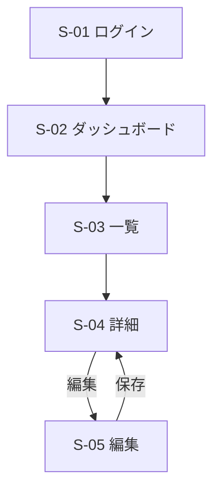

# 画面設計書 (UI Design Document)

## デザイン方針

### トーン&マナー
- [プロダクトの世界観・印象を3-5語で: 例 - シンプル、信頼感、高速]
- [ブランドカラーの方向性]

### 対象デバイス・環境
- [対象デバイス: 例 - デスクトップ優先、モバイル対応]
- [対象ブラウザ: 例 - 最新版 Chrome / Edge / Safari]

### 参考プロダクト(該当する場合)
- [参考にするUI・その理由]

## 画面一覧

| 画面ID | 画面名 | 目的 | 主要素 | 対応機能 |
|--------|--------|------|--------|----------|
| S-01 | [画面名] | [この画面で達成すること] | [主なUI要素] | [PRD/機能設計の機能名] |
| S-02 | [画面名] | [目的] | [主なUI要素] | [対応機能] |

## 画面遷移図



## 画面詳細

### S-01: [画面名]

**目的**: [この画面のゴール]

**ワイヤーフレーム**:
```
┌────────────────────────────────────┐
│ [ヘッダー: ロゴ / ナビゲーション]      │
├────────────────────────────────────┤
│                                    │
│   [メインコンテンツ領域]             │
│   ┌──────────────────────────┐     │
│   │ [入力フォーム / 一覧 など]  │     │
│   └──────────────────────────┘     │
│                                    │
│   [ 主アクションボタン ]            │
│                                    │
└────────────────────────────────────┘
```

**レイアウト構成**:
- [領域1: 役割]
- [領域2: 役割]

**主要コンポーネント**:
- [コンポーネント名] ([共通コンポーネント一覧のどれか / 画面固有か])

**状態設計**:
| 状態 | 表示内容 | 遷移条件 |
|------|----------|----------|
| loading | [ローディング表示] | データ取得中 |
| empty | [データ0件時の表示・空状態メッセージ] | 取得結果が0件 |
| error | [エラー表示・再試行導線] | 取得/送信失敗 |
| success | [正常表示] | データ取得成功 |
| disabled | [操作不可の要素と条件] | [条件] |

**入力・バリデーション**(フォームがある場合):
| 項目 | 必須 | 制約 | エラーメッセージ |
|------|------|------|------------------|
| [項目名] | [Yes/No] | [文字数・形式など] | [表示するメッセージ] |

**インタラクション**:
- [操作] → [結果・フィードバック]

---

### S-02: [画面名]

（S-01 と同じ項目で記述）

## 共通コンポーネント一覧

| コンポーネント | 用途 | バリアント | 主なprops/状態 |
|----------------|------|-----------|----------------|
| Button | アクション実行 | primary / secondary / danger | disabled, loading |
| Input | テキスト入力 | text / password / number | error, disabled |
| Modal | 確認・詳細表示 | - | open, onClose |
| Toast | 一時通知 | success / error / info | - |
| [追加] | [用途] | [バリアント] | [props] |

## デザインシステム(デザイントークン)

### カラーパレット
| トークン | 値 | 用途 |
|----------|-----|------|
| color-primary | [#HEX] | 主要アクション |
| color-danger | [#HEX] | 破壊的操作・エラー |
| color-text | [#HEX] | 本文 |
| color-bg | [#HEX] | 背景 |

### タイポグラフィ
| トークン | サイズ / 行間 / ウェイト | 用途 |
|----------|--------------------------|------|
| text-h1 | [値] | 見出し |
| text-body | [値] | 本文 |

### スペーシング
- [スペーシングスケール: 例 - 4 / 8 / 16 / 24 / 32px]

## レスポンシブ方針

### ブレークポイント
| 名称 | 幅 | レイアウト方針 |
|------|-----|----------------|
| mobile | ~767px | [1カラム / ハンバーガーメニュー等] |
| tablet | 768~1023px | [方針] |
| desktop | 1024px~ | [方針] |

## アクセシビリティ方針

- [ ] 準拠レベル: [WCAG 2.1 AA 等]
- [ ] キーボードのみで全操作が可能
- [ ] テキストと背景のコントラスト比を確保(通常テキスト 4.5:1 以上)
- [ ] フォーム要素にラベルを関連付け
- [ ] 画像に代替テキストを付与
- [ ] フォーカス状態が視覚的に分かる
- [ ] 適切な ARIA 属性・ランドマークを付与

## トレーサビリティ

| 画面ID | 対応する機能要件(PRD/機能設計) |
|--------|-------------------------------|
| S-01 | [機能名・ユーザーストーリー] |
| S-02 | [機能名・ユーザーストーリー] |
