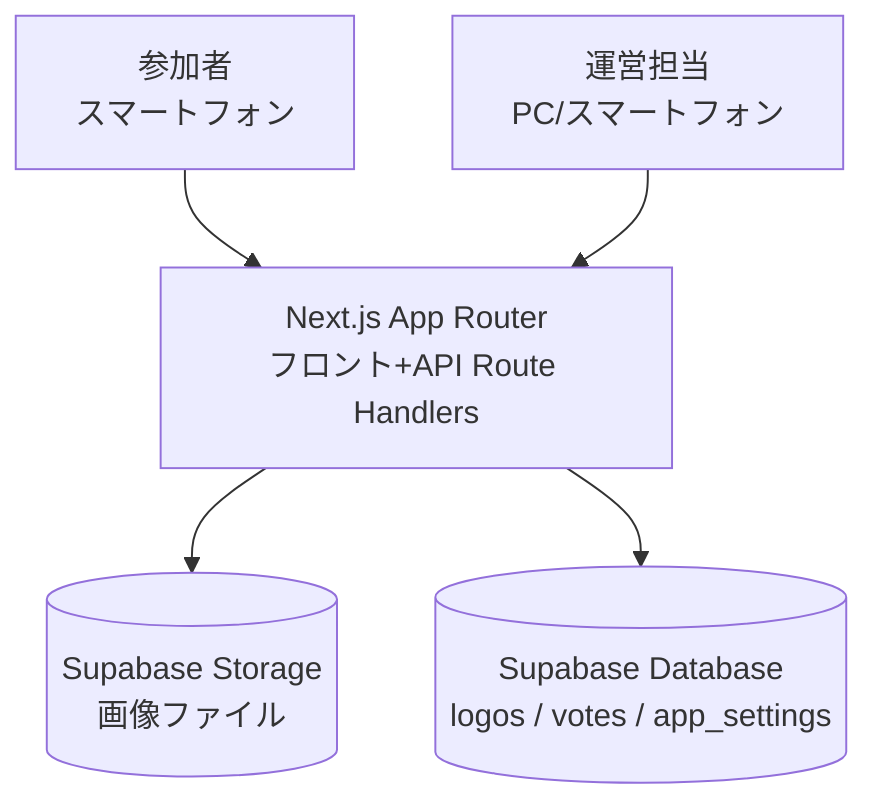
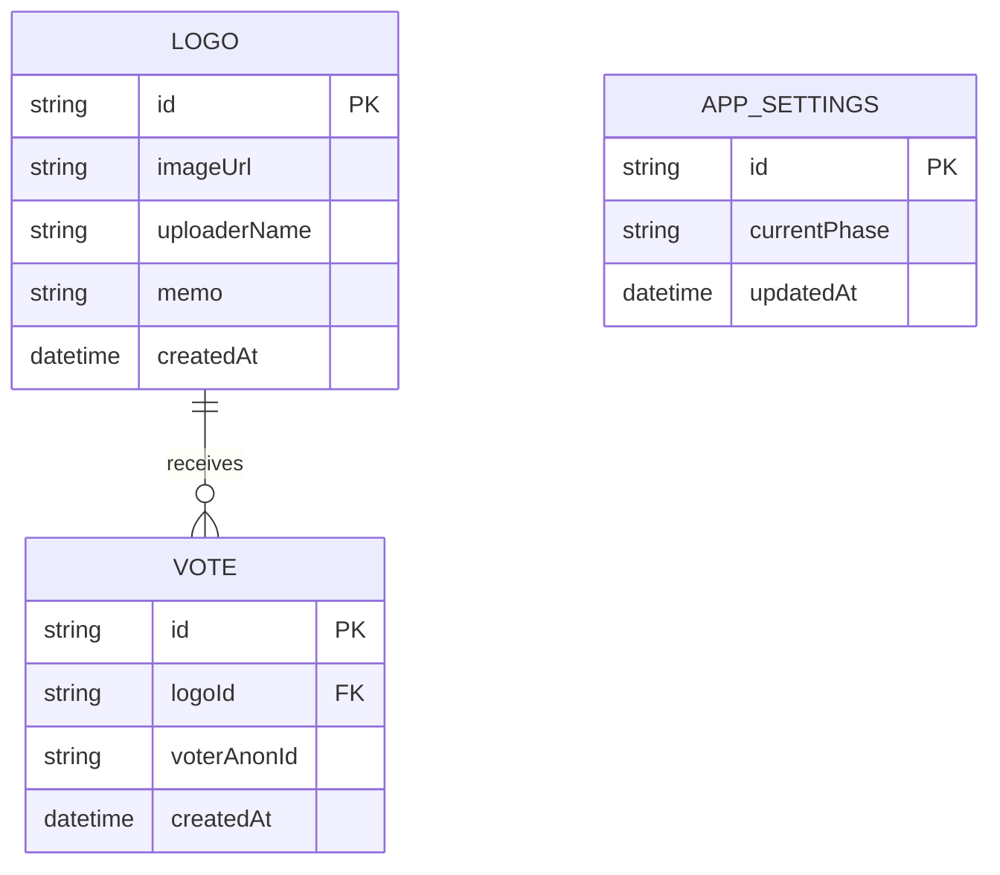
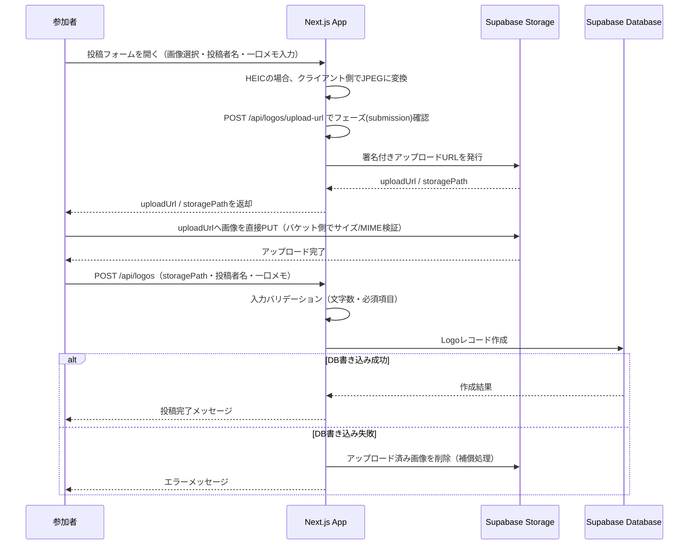
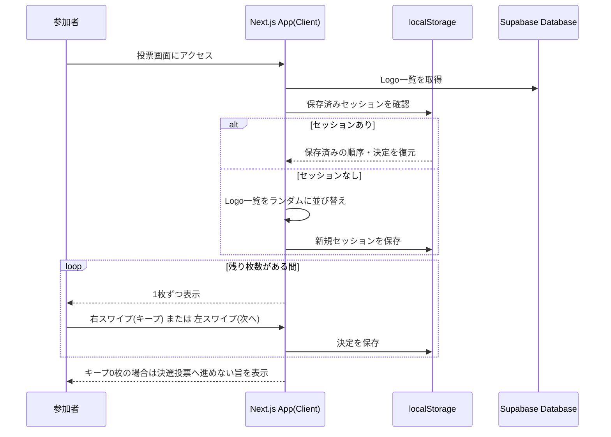
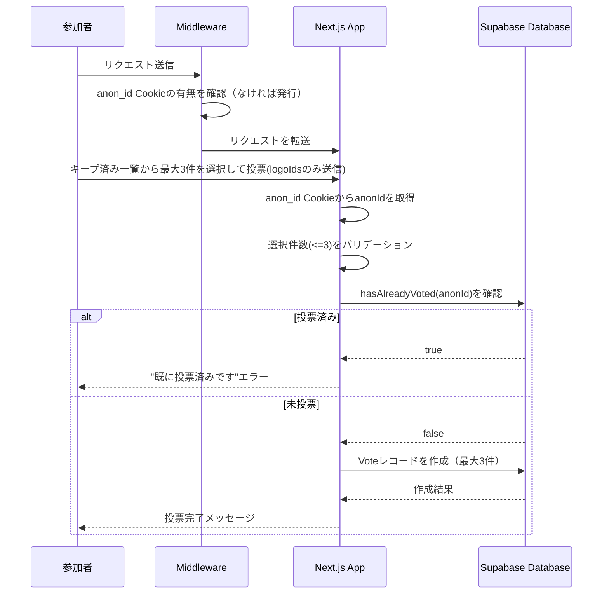
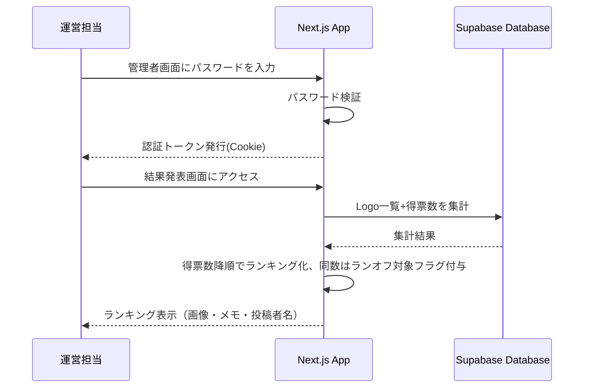
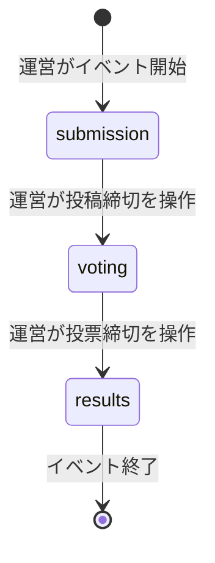

# 機能設計書 (Functional Design Document)

## システム構成図



Next.js（App Router）1つのアプリケーションが、参加者向け画面（投稿・スワイプ・決選投票）と運営向け画面（フェーズ切り替え・結果発表）の両方を提供する。サーバーサイドはRoute Handlersを介してSupabaseのDatabase／Storageにアクセスし、認証機構は持たないが管理者操作のみ簡易パスワードで保護する。

## 技術スタック

| 分類 | 技術 | 選定理由 |
|------|------|----------|
| フレームワーク | Next.js (App Router) | フロントとAPI（Route Handlers）を1つのプロジェクトで完結でき、社内イベント用の短期開発に適する |
| 言語 | TypeScript 5.x | フロント/バックエンド共通の型定義でデータモデルの整合性を保つ |
| スタイリング | Tailwind CSS | 短期間でモバイル最適なUIを組み立てられる |
| スワイプUI | `react-tinder-card` または `framer-motion` | Tinder風のスワイプ操作・アニメーションを低コストで実現 |
| バックエンド/DB | Supabase (Database) | PostgreSQLベースの無料枠で、社内イベント規模（200名程度）を十分にカバー |
| ストレージ | Supabase Storage | 画像ファイルをDatabaseと同一プラットフォームで管理でき、連携コストが低い |
| ホスティング | Vercel（想定） | Next.jsとの親和性が高く、無料枠でイベント当日の一時利用に十分 |

## データモデル定義

### エンティティ: Logo

```typescript
interface Logo {
  id: string;              // UUID
  imageUrl: string;        // Supabase Storage上の画像URL
  uploaderName: string;    // 投稿者名（管理者画面でのみ表示、投票画面では非表示）
  memo: string;            // 一口メモ（投票画面に表示、匿名）
  createdAt: Date;         // 投稿日時
}
```

**制約**:
- `imageUrl` / `uploaderName` / `memo` はすべて必須
- `uploaderName`: 1-50文字、`memo`: 1-200文字
- 画像ファイルサイズ上限10MB、アップロード時の入力形式は jpg/png/heic/webp を受け付ける。HEICはブラウザでのネイティブ表示に対応しないことが多いため、クライアント側で`heic2any`等を用いてJPEGに変換してからアップロードし、Storageに保存される`imageUrl`の実体は常にjpg/png/webpのいずれかになる
- 1人が複数件投稿可能（`uploaderName` に一意制約は設けない）

### エンティティ: Vote

```typescript
interface Vote {
  id: string;              // UUID
  logoId: string;          // 投票対象のLogo ID（FK）
  voterAnonId: string;     // 投票者の匿名ID（サーバー発行のhttpOnly Cookie `anon_id` の値）
  createdAt: Date;         // 投票日時
}
```

**制約**:
- 同一 `voterAnonId` が持てる `Vote` レコードは最大3件（決選投票で上位3つまで選択可能なため）
- 同一 `voterAnonId` が一度投票を確定した後の追加投票は拒否する（再投票不可）
- `voterAnonId` は個人を特定できる情報（投稿者名等）とは紐付けない

### エンティティ: AppSettings（フェーズ管理用シングルトン）

```typescript
type EventPhase = 'submission' | 'voting' | 'results';

interface AppSettings {
  id: string;               // 固定ID（シングルトン運用）
  currentPhase: EventPhase; // 現在のイベントフェーズ
  updatedAt: Date;
}
```

**制約**:
- レコードは常に1件のみ（運営が管理者画面から `currentPhase` を切り替える）
- `submission`: 投稿受付中、投票不可
- `voting`: 投稿締切、1次選考・決選投票が可能
- `results`: 決選投票締切、結果発表画面が閲覧可能（それ以前は管理者パスワードを知っていても結果非表示）

### ER図



> 1次選考（スワイプ）のキープ状態はDBに永続化せず、クライアントのlocalStorageのみで管理する（PRD記載の通りMVPではサーバー保存を行わない）。

## コンポーネント設計

### PhaseService（フェーズ管理・共通）

**責務**:
- 現在の`EventPhase`の取得
- 指定フェーズとの一致確認（不一致の場合は`PhaseMismatchError`をthrow）
- フェーズ遷移時、現在フェーズより後方（`submission`→`voting`→`results`の順）であることの検証（逆行遷移は`ValidationError`をthrow）

**インターフェース**:
```typescript
class PhaseService {
  getCurrentPhase(): Promise<EventPhase>;
  assertPhase(expected: EventPhase): Promise<void>;
  transitionTo(next: EventPhase): Promise<void>; // 逆行遷移はValidationError
}
```

**依存関係**:
- AppSettingsRepository

### LogoRepository / VoteRepository / AppSettingsRepository（データレイヤー）

**責務**: Supabase Database/Storageへのアクセスをカプセル化する（`docs/architecture.md`のレイヤードアーキテクチャに対応）

**インターフェース**:
```typescript
class LogoRepository {
  create(data: Omit<Logo, 'id' | 'createdAt'>): Promise<Logo>;
  findAll(): Promise<Logo[]>;
  delete(id: string): Promise<void>; // Post-MVPの投稿削除機能用（現状未使用）
  createSignedUploadUrl(): Promise<{ uploadUrl: string; storagePath: string }>; // Supabase Storageの署名付きURL発行
  deleteStorageObject(storagePath: string): Promise<void>; // DB書き込み失敗時、アップロード済み画像を削除する補償処理用
}

class VoteRepository {
  createMany(votes: Omit<Vote, 'id' | 'createdAt'>[]): Promise<Vote[]>;
  countByAnonId(anonId: string): Promise<number>;
  countByLogoId(): Promise<Record<string, number>>; // ランキング集計用
}

class AppSettingsRepository {
  get(): Promise<AppSettings>;
  updatePhase(phase: EventPhase): Promise<AppSettings>;
}
```

**依存関係**:
- `lib/supabase/client.ts`（Supabaseクライアント）

### UploadService（投稿受付）

**責務**:
- 画像・投稿者名・一口メモのバリデーション
- 署名付きアップロードURLの発行（`LogoRepository.createSignedUploadUrl`を呼び出す）
- Logoレコードの作成（DB書き込み失敗時は、`LogoRepository.deleteStorageObject`でアップロード済みの画像を削除する補償処理を行う）
- 現在のフェーズが `submission` であることの確認

**インターフェース**:
```typescript
class UploadService {
  createUploadUrl(): Promise<{ uploadUrl: string; storagePath: string }>;
  createLogo(data: { storagePath: string; uploaderName: string; memo: string }): Promise<Logo>;
}
```

**依存関係**:
- LogoRepository（Database・Storageの両方へのアクセスをカプセル化。UploadServiceはSupabaseクライアントへ直接アクセスしない）
- PhaseService（フェーズ確認）

### SwipeSessionManager（1次選考・クライアント側）

**責務**:
- 全Logo一覧の取得とランダム順への並び替え（ユーザーごとに異なる順序）
- キープ／次への操作結果をlocalStorageに保存し、リロード時に復元
- 現在の進捗（残り枚数）の算出

**インターフェース**:
```typescript
class SwipeSessionManager {
  loadOrCreateSession(logos: Logo[]): SwipeSession;
  recordDecision(logoId: string, decision: 'keep' | 'skip'): void;
  getKeptLogos(): Logo[];
  getRemainingCount(): number;
}

interface SwipeSession {
  order: string[];        // シャッフル済みのLogo ID順
  decisions: Record<string, 'keep' | 'skip'>;
  currentIndex: number;
}
```

**依存関係**:
- ブラウザ `localStorage`（固定キーで1ブラウザにつき1セッションを保持。匿名IDには依存しない）

### VoteService（決選投票）

**責務**:
- 決選投票（最大3件）のバリデーションと登録
- 匿名IDベースの多重投票チェック
- 現在のフェーズが `voting` であることの確認

**インターフェース**:
```typescript
class VoteService {
  submitVotes(anonId: string, logoIds: string[]): Promise<void>; // logoIds.length <= 3
  hasAlreadyVoted(anonId: string): Promise<boolean>;
}
```

`anonId`はRoute Handler側で`anon_id`のhttpOnly Cookieから取得して渡される（クライアントが送信するリクエストボディには含まれない）。

**依存関係**:
- VoteRepository
- PhaseService

### AdminService（運営操作）

**責務**:
- 管理者パスワードの検証とセッション（JWT Cookie）発行
- フェーズ切り替え（`submission` → `voting` → `results`、逆行遷移は`PhaseService.transitionTo`で拒否）
- 得票数ランキングの集計、同数得票のランオフ対象抽出
- 結果ランキングのCSVエクスポート

**インターフェース**:
```typescript
class AdminService {
  login(password: string): Promise<{ token: string }>;
  verifySession(token: string): Promise<void>; // 全admin Route Handlersが先頭で呼び出す共通の認証ヘルパー。未認証・期限切れの場合はUnauthorizedErrorをthrow
  setPhase(phase: EventPhase): Promise<void>; // PhaseService.transitionToを呼び出す
  getRankedResults(): Promise<RankedLogo[]>;
  exportResultsCsv(): Promise<string>; // CSV文字列を返す
}

interface RankedLogo extends Logo {
  voteCount: number;
  rank: number;
  isTiedForRunoff: boolean; // 同順位で境界にかかる場合にランオフ対象としてフラグを立てる
}
```

**依存関係**:
- AppSettingsRepository / LogoRepository / VoteRepository
- PhaseService
- 環境変数 `ADMIN_PASSWORD` / `ADMIN_SESSION_SECRET`

### 匿名ID発行用Middleware（`middleware.ts`）

**責務**:
- すべてのリクエストに対し、`anon_id`のhttpOnly Cookieが存在するか確認する
- 存在しない場合はUUID v4を発行し、`Set-Cookie`でhttpOnly・`sameSite=Lax`のCookieとして設定する（有効期限はイベント想定期間で十分。JS側からは参照・改ざんできない）

Next.jsのEdge Middlewareとして実装するため、クライアント側の`AnonIdManager`のようなクラスは持たない（匿名IDの発行・管理はサーバー側に一元化する）。

## ユースケース図

### 画像投稿フロー

Vercel Serverless Functionのリクエストボディサイズ制約（Hobbyプラン目安4.5MB程度）を回避するため、画像本体はNext.jsサーバーを経由せず、署名付きURLでクライアントからSupabase Storageへ直接アップロードする。



### スワイプ式1次選考フロー



### 決選投票フロー



### 結果発表フロー（管理者）



## 画面遷移図（イベントフェーズ）



各フェーズにおける画面アクセス制御:
- `submission`: 投稿画面のみ操作可能。投票画面は「準備中」表示
- `voting`: 投稿は不可（締切済み表示）。スワイプ1次選考・決選投票が可能
- `results`: 参加者側の投票操作は不可。管理者パスワードを持つ運営のみ結果画面を閲覧可能

## API設計

### 画像アップロード用の署名付きURL発行

```
POST /api/logos/upload-url
```

**リクエスト**: なし（ボディ不要）

**レスポンス**:
```json
{
  "uploadUrl": "https://xxxx.supabase.co/storage/v1/object/upload/sign/...",
  "storagePath": "logos/uuid.jpg"
}
```

Storageバケット側でファイルサイズ上限10MB・許可MIMEタイプ(image/jpeg, image/png, image/webp)を設定し、クライアントが`uploadUrl`へ直接PUTする際にStorage側で検証する（サーバー側の再検証をVercelのボディサイズ制約に妨げられずに実現するため、検証はStorageバケット設定に委譲する）。

**エラーレスポンス**:
- 403 Forbidden: 現在のフェーズが `submission` ではない
- 500 Internal Server Error: 署名付きURLの発行失敗

### 画像投稿（Logoレコード作成）

```
POST /api/logos
```

**リクエスト** (application/json):
```json
{
  "storagePath": "logos/uuid.jpg",
  "uploaderName": "山田太郎",
  "memo": "初めてのロゴ作成に挑戦しました！"
}
```

`storagePath`は事前に`POST /api/logos/upload-url`で取得し、Storageへのアップロードが完了している前提。

**レスポンス**:
```json
{
  "id": "uuid",
  "imageUrl": "https://xxxx.supabase.co/storage/v1/object/public/logos/uuid.jpg",
  "memo": "初めてのロゴ作成に挑戦しました！",
  "createdAt": "2026-07-17T09:00:00.000Z"
}
```

**エラーレスポンス**:
- 400 Bad Request: 必須項目未入力、投稿者名(50文字)・一口メモ(200文字)の文字数超過
- 403 Forbidden: 現在のフェーズが `submission` ではない
- 500 Internal Server Error: DB書き込み失敗（この場合、アップロード済みのStorageオブジェクトを削除する補償処理を行う）

### Logo一覧取得（投票用）

```
GET /api/logos
```

**レスポンス**:
```json
{
  "logos": [
    { "id": "uuid", "imageUrl": "https://...", "memo": "一口メモ" }
  ]
}
```

投票画面向けのため `uploaderName` は含めない。

**エラーレスポンス**:
- 403 Forbidden: 現在のフェーズが `voting` ではない

### 決選投票

```
POST /api/votes
```

**リクエスト**:
```json
{
  "logoIds": ["uuid1", "uuid2", "uuid3"]
}
```

投票者の`anonId`はリクエストボディには含めず、`anon_id`のhttpOnly Cookie（Middlewareが発行）からサーバー側で取得する。

**レスポンス**:
```json
{
  "success": true,
  "votedCount": 3
}
```

**エラーレスポンス**:
- 400 Bad Request: `logoIds` が0件または4件以上
- 403 Forbidden: 現在のフェーズが `voting` ではない
- 409 Conflict: 当該 `anonId` が既に投票済み

### 現在のフェーズ取得

```
GET /api/phase
```

**レスポンス**:
```json
{ "phase": "voting" }
```

### 管理者ログイン

```
POST /api/admin/login
```

**リクエスト**:
```json
{ "password": "xxxxx" }
```

**レスポンス**:
```json
{ "success": true }
```
（成功時、httpOnly Cookieに管理者トークン（JWT、有効期限4時間程度）をセット）

**エラーレスポンス**:
- 401 Unauthorized: パスワード不一致

### フェーズ切り替え（管理者）

```
POST /api/admin/phase
```

**リクエスト**:
```json
{ "phase": "voting" }
```

**エラーレスポンス**:
- 401 Unauthorized: 管理者未認証、またはセッション（JWT）の期限切れ
- 400 Bad Request: 不正なフェーズ値、または逆行する遷移（例: `results` → `submission`）

### 結果ランキング取得（管理者）

```
GET /api/admin/results
```

**レスポンス**:
```json
{
  "results": [
    {
      "id": "uuid",
      "imageUrl": "https://...",
      "uploaderName": "山田太郎",
      "memo": "一口メモ",
      "voteCount": 15,
      "rank": 1,
      "isTiedForRunoff": false
    }
  ]
}
```

**エラーレスポンス**:
- 401 Unauthorized: 管理者未認証、またはセッション（JWT）の期限切れ
- 403 Forbidden: 現在のフェーズが `results` ではない

### 結果ランキングのCSVエクスポート（管理者）

```
GET /api/admin/results/export
```

**レスポンス**: `text/csv`（Content-Disposition: attachment）。列は`rank, imageUrl, uploaderName, memo, voteCount`

**エラーレスポンス**:
- 401 Unauthorized: 管理者未認証、またはセッション（JWT）の期限切れ
- 403 Forbidden: 現在のフェーズが `results` ではない

## アルゴリズム設計

### ランダム順の1次選考表示

**目的**: 表示順による有利不利をなくすため、ユーザーごとに独立したランダム順で画像を表示する

**計算ロジック**:
1. `GET /api/logos` で取得したLogo一覧をクライアント側でFisher-Yatesシャッフルする
2. シャッフル結果（Logo IDの順序配列）をセッションとして `localStorage` に保存する
3. 以降、同一ブラウザでのリロード時は保存済み順序を再利用し、順序が変わらないようにする（ブラウザを閉じてキャッシュをクリアした場合は新規シャッフルとなる）

**実装例**:
```typescript
function shuffle<T>(items: T[]): T[] {
  const result = [...items];
  for (let i = result.length - 1; i > 0; i--) {
    const j = Math.floor(Math.random() * (i + 1));
    [result[i], result[j]] = [result[j], result[i]];
  }
  return result;
}
```

### 同数得票時のランオフ判定

**目的**: 結果発表時、順位の境界（例: 3位と4位）で得票数が同じ場合に、ランオフ（再投票）対象を機械的に検出する

**計算ロジック**:
1. Logoを `voteCount` の降順でソートする
2. 上位から順に累積順位を付与する（同数の場合は同順位とする）
3. 表彰対象の順位境界（例: 1位）に複数のLogoが同数で存在する場合、それらすべてに `isTiedForRunoff = true` を立てる
4. 運営はランオフ対象として提示されたLogo群に対し、決選投票と同じ仕組みで再投票を実施する（システム上は同一の `votes` テーブル・投票フローを再利用する運用とし、専用機能は設けない）

**実装例**:
```typescript
function rankWithTieDetection(logos: (Logo & { voteCount: number })[]): RankedLogo[] {
  const sorted = [...logos].sort((a, b) => b.voteCount - a.voteCount);
  const topVoteCount = sorted[0]?.voteCount ?? 0;

  return sorted.map((logo, index) => ({
    ...logo,
    rank: index + 1,
    isTiedForRunoff:
      logo.voteCount === topVoteCount &&
      sorted.filter((l) => l.voteCount === topVoteCount).length > 1,
  }));
}
```

### 匿名IDベースの多重投票防止

**目的**: 認証なしでも、決選投票の1端末あたりの投票回数を制御する

**計算ロジック**:
1. リクエスト時、Middlewareが`anon_id`のhttpOnly Cookieの有無を確認し、なければUUIDを発行してCookieとして設定する（クライアントJSからは参照・改ざんできない）
2. `POST /api/votes` 実行時、Route Handlerが`anon_id` Cookieの値をサーバー側で読み取る（リクエストボディの値は信頼しない）
3. `VoteRepository.countByAnonId(anonId)` で当該 `anonId` に紐づく既存の `Vote` レコード件数を確認する
4. 既存レコードが1件でもあれば再投票とみなし、409エラーを返す
5. 問題なければ、送信された `logoIds`（最大3件）ごとに `Vote` レコードを作成する

## パフォーマンス最適化

- 画像はSupabase Storage経由でCDN配信されるURLを利用し、Next.js Image最適化と組み合わせてスワイプ画面での表示遅延を抑える
- Logo一覧はイベント規模（100〜200件程度）であれば1回のクエリで全件取得し、クライアント側でシャッフル・ページングすることでAPI呼び出し回数を最小化する

## セキュリティ考慮事項

- 管理者エンドポイント（`/api/admin/*`）はすべてサーバー側でJWT Cookieトークンを検証し、未認証・期限切れ時は401を返す
- `uploaderName` はDBには保存するが、投票用途の `GET /api/logos` レスポンスには含めず、投票画面から投稿者名を推測できないようにする
- 匿名ID（`anon_id`）はMiddlewareがサーバー側で発行するhttpOnly Cookieとし、クライアントJSからの参照・改ざんを防ぐ。リクエストボディで送信された値は信頼しない
- `ADMIN_PASSWORD` / `ADMIN_SESSION_SECRET` は環境変数として管理し、リポジトリにはコミットしない
- 画像アップロードはStorageの署名付きURLを都度発行し、有効期限を短く設定することで不正利用を防ぐ。バケット側でファイルサイズ・MIMEタイプを検証する

## エラーハンドリング

| エラー種別 | 処理 | ユーザーへの表示 |
|-----------|------|-----------------|
| 必須項目未入力・画像サイズ/形式エラー・文字数超過 | 投稿処理を中断 | "画像・投稿者名・一口メモをすべて入力してください／画像は10MB以下のjpg/png/heic/webp形式でアップロードしてください／投稿者名は50文字、一口メモは200文字以内で入力してください" |
| フェーズ不一致（投稿締切後の投稿、投票前の投票操作等） | 該当操作を拒否 | "現在は投稿を受け付けていません／投票は開始していません" |
| 決選投票の選択件数超過（4件以上） | 送信を拒否 | "投票できるのは3作品までです" |
| 多重投票（同一anonIdで再投票） | 送信を拒否 | "既に投票済みです" |
| 1次選考でキープ0枚のまま決選投票へ遷移 | 決選投票画面への遷移を拒否 | "決選投票に進むには、1枚以上キープしてください" |
| 管理者パスワード不一致 | ログイン拒否 | "パスワードが正しくありません" |
| 管理者セッション（JWT）の期限切れ | 該当操作を拒否し、ログイン画面へ誘導 | "セッションの有効期限が切れました。再度ログインしてください" |
| Storage/DBアクセス失敗 | 処理を中断しエラー表示（画像投稿時はStorageの補償削除を実施） | "エラーが発生しました。時間をおいて再度お試しください" |

## テスト戦略

比率・カバレッジ目標は`docs/development-guidelines.md`を正とする。以下は本機能に固有のテスト対象の詳細。

### ユニットテスト
- `shuffle`（Fisher-Yatesシャッフル）の一様性・全要素保持の検証
- `rankWithTieDetection`（ランオフ判定）の境界値（同数が2件・3件のケース、同数なしのケース）
- 決選投票の選択件数バリデーション（0件・3件・4件）

### 統合テスト
- 投稿API: 正常系（画像・名前・メモ登録）、異常系（フェーズ不一致、サイズ超過）
- 投票API: 正常系（未投票状態からの投票）、異常系（多重投票、フェーズ不一致、4件以上の選択）
- 管理者API: 未認証アクセスの拒否、フェーズ切り替えの反映確認

### E2Eテスト
- 投稿フェーズで画像を投稿し、投票フェーズに切り替わった後にスワイプ選考→決選投票まで完了できる一連の流れ
- 決選投票後に管理者画面にログインし、投票結果が正しく反映されたランキングが表示される流れ
- ブラウザリロード後もスワイプの途中状態がlocalStorageから復元される流れ
