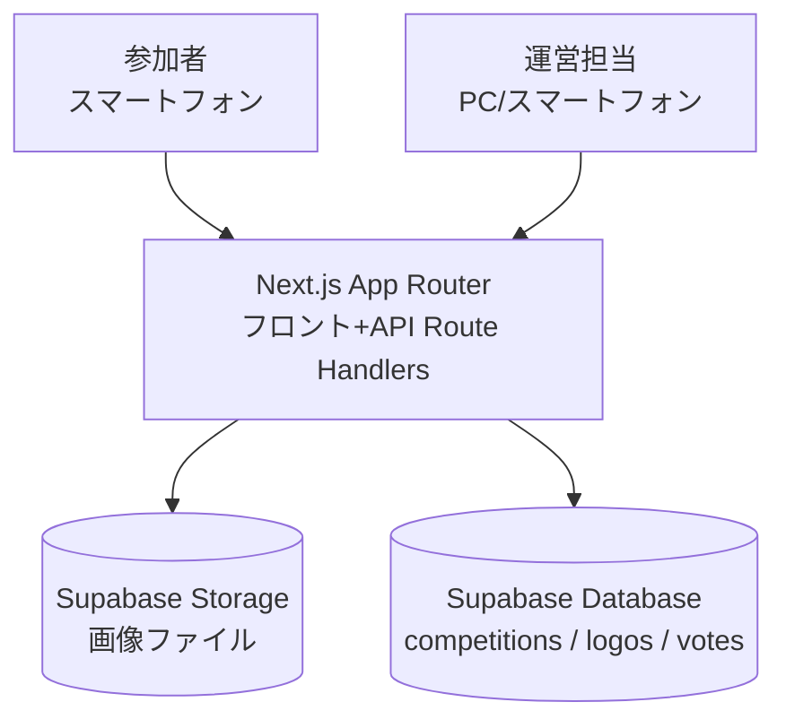
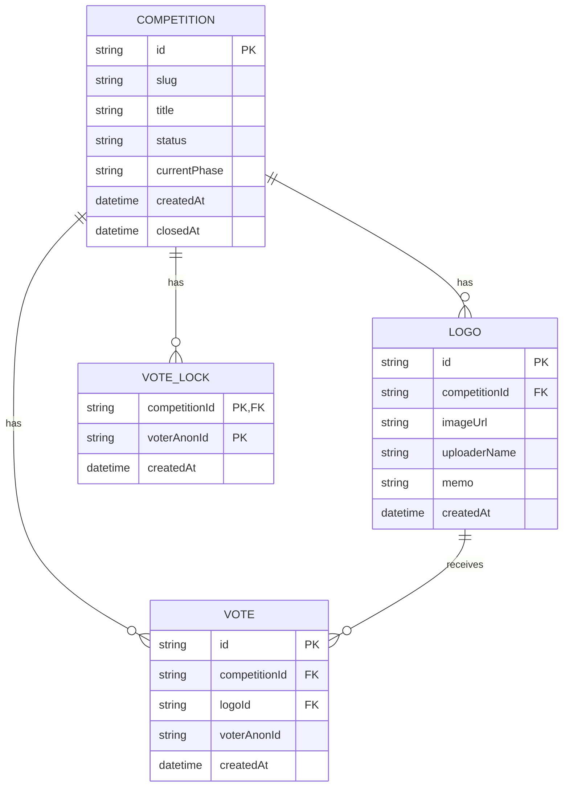
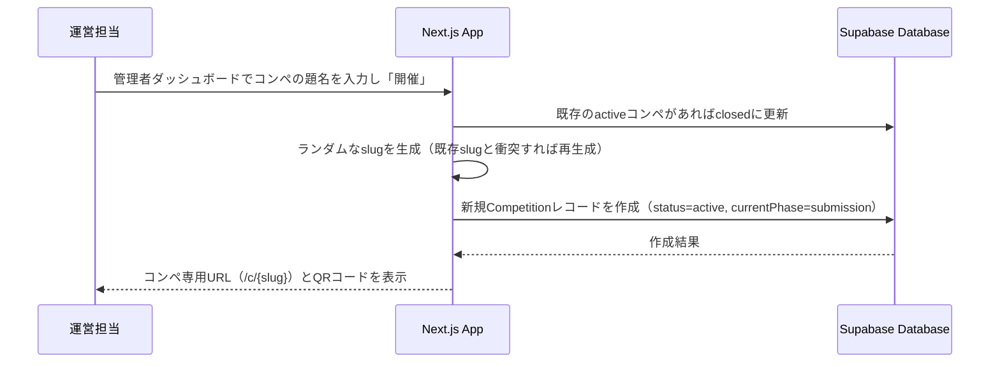
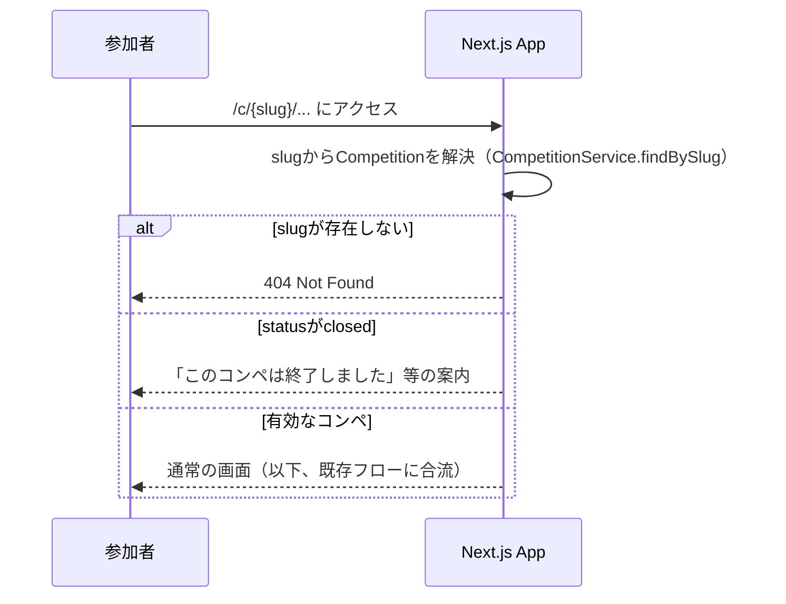
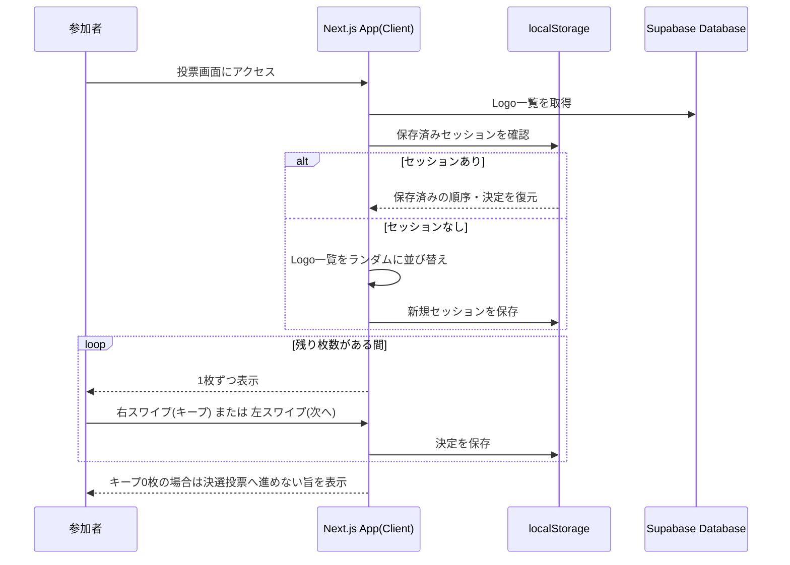
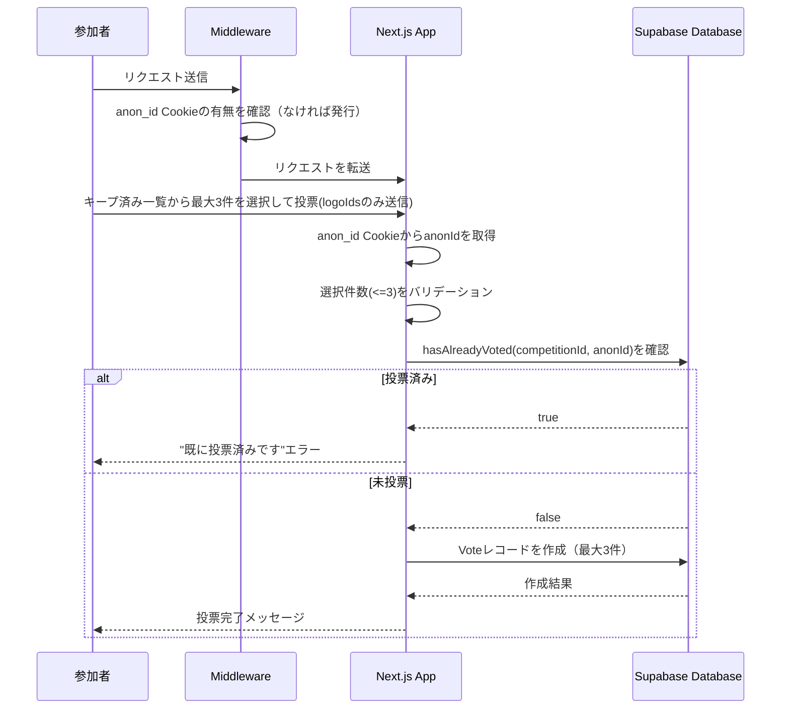
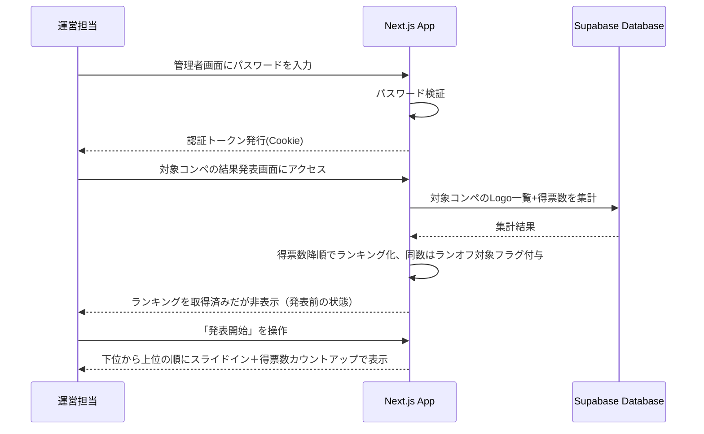
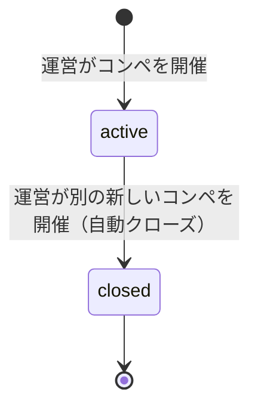
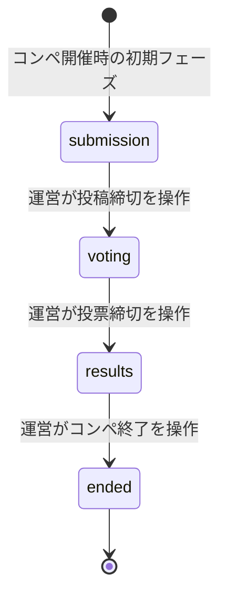

# 機能設計書 (Functional Design Document)

## システム構成図



Next.js（App Router）1つのアプリケーションが、参加者向け画面（投稿・スワイプ・決選投票）と運営向け画面（コンペ開催・フェーズ切り替え・結果発表）の両方を提供する。参加者向け画面は「コンペ」単位の専用URL（`/c/[slug]/...`）配下に置かれ、常に1件のみ存在する開催中(`active`)のコンペに紐づく投稿・投票データのみを参照する。サーバーサイドはRoute Handlersを介してSupabaseのDatabase／Storageにアクセスし、認証機構は持たないが管理者操作のみ簡易パスワードで保護する。

## 技術スタック

| 分類 | 技術 | 選定理由 |
|------|------|----------|
| フレームワーク | Next.js (App Router) | フロントとAPI（Route Handlers）を1つのプロジェクトで完結でき、社内イベント用の短期開発に適する |
| 言語 | TypeScript 5.x | フロント/バックエンド共通の型定義でデータモデルの整合性を保つ |
| スタイリング | Tailwind CSS | 短期間でモバイル最適なUIを組み立てられる |
| スワイプUI | `react-tinder-card` または `framer-motion` | Tinder風のスワイプ操作・アニメーションを低コストで実現 |
| 結果発表アニメーション | `framer-motion` | ランキングのスライドイン・得票数カウントアップを、追加ライブラリを増やさずスワイプUIと同じ依存で実現 |
| バックエンド/DB | Supabase (Database) | PostgreSQLベースの無料枠で、社内イベント規模（200名程度）を十分にカバー |
| ストレージ | Supabase Storage | 画像ファイルをDatabaseと同一プラットフォームで管理でき、連携コストが低い |
| ホスティング | Vercel（想定） | Next.jsとの親和性が高く、無料枠でイベント当日の一時利用に十分 |

## データモデル定義

### エンティティ: Competition（コンペ）

```typescript
type EventPhase = 'submission' | 'voting' | 'results' | 'ended';
type CompetitionStatus = 'active' | 'closed';

interface Competition {
  id: string;                  // UUID
  slug: string;                // URLに使うランダムな短い識別子（例: "x7k2p9"）。一意
  title: string;                // 管理者が入力するコンペの題名
  status: CompetitionStatus;    // 'active' | 'closed'
  currentPhase: EventPhase;     // このコンペのフェーズ
  createdAt: Date;
  closedAt: Date | null;        // クローズされた日時（開催中はnull）
}
```

**制約**:
- `status = 'active'` のレコードは常に0件または1件（DBの部分ユニークインデックスで保証。詳細は`docs/architecture.md`）
- 新しいコンペを開催すると、既存の`active`コンペは`closed`に更新される（`closedAt`をセット）。既存の`logos`/`votes`はそのまま保持され、削除されない
- `slug`はコンペ作成時にサーバー側でランダム生成する（英数字8桁程度）。生成した値が既存slugと衝突した場合は再生成してリトライする
- `currentPhase`は旧`AppSettings.currentPhase`に相当し、これまでアプリ全体で1つだったフェーズが、コンペごとに独立して持つ形に変わる。フェーズの遷移ルールは`submission`→`voting`→`results`→`ended`の前方一方向のみで、逆行不可。`ended`は運営がコンペの区切りとして明示的に切り替える最終フェーズであり、`status`（`active`/`closed`）とは独立した概念（`active`のまま`ended`になることも、`closed`後も`ended`の記録は保持されることもある）

### エンティティ: Logo

```typescript
interface Logo {
  id: string;              // UUID
  competitionId: string;   // 紐づくCompetitionのID（FK）
  imageUrl: string;        // Supabase Storage上の画像URL
  uploaderName: string;    // 投稿者名（管理者画面でのみ表示、投票画面では非表示）
  memo: string;            // 一口メモ（投票画面に表示、匿名）
  createdAt: Date;         // 投稿日時
}
```

**制約**:
- `competitionId` / `imageUrl` / `uploaderName` / `memo` はすべて必須
- `uploaderName`: 1-50文字、`memo`: 1-200文字。`uploaderName`はコンペ入場時に一度だけ入力する参加者名（クライアント側`localStorage`に保存、詳細はSwipeSessionManager節を参照）がそのまま使われ、画像投稿フォーム自体には投稿者名の入力欄を設けない
- 画像ファイルサイズ上限10MB、アップロード時の入力形式は jpg/png/heic/webp を受け付ける。HEICはブラウザでのネイティブ表示に対応しないことが多いため、クライアント側で`heic2any`等を用いてJPEGに変換してからアップロードし、Storageに保存される`imageUrl`の実体は常にjpg/png/webpのいずれかになる
- 1人が複数件投稿可能（`uploaderName` に一意制約は設けない）
- 一覧取得は常に`competitionId`でフィルタし、他コンペのLogoが混在しないようにする

### エンティティ: Vote

```typescript
interface Vote {
  id: string;              // UUID
  competitionId: string;   // 紐づくCompetitionのID（FK）
  logoId: string;          // 投票対象のLogo ID（FK）
  voterAnonId: string;     // 投票者の匿名ID（サーバー発行のhttpOnly Cookie `anon_id` の値）
  createdAt: Date;         // 投票日時
}
```

**制約**:
- 同一 `voterAnonId`・同一`competitionId`が持てる `Vote` レコードは最大3件（決選投票で上位3つまで選択可能なため）。`anon_id` Cookie自体はコンペ非依存でグローバルに1つのみ発行されるが、投票制限は`competitionId`とのペアで判定するため、別コンペでは同じ`anon_id`でもあらためて投票できる
- 同一 `voterAnonId`・同一`competitionId`が一度投票を確定した後の追加投票は拒否する（再投票不可。原子性の担保方法は後述の`VoteLock`を参照）
- `voterAnonId` は個人を特定できる情報（投稿者名等）とは紐付けない

### エンティティ: VoteLock（コンペ×anonId単位の投票済み予約）

```typescript
interface VoteLock {
  competitionId: string;   // PRIMARY KEY（複合）
  voterAnonId: string;     // PRIMARY KEY（複合）
  createdAt: Date;
}
```

**制約・目的**:
- `(competitionId, voterAnonId)`を複合PRIMARY KEYとすることで、同一コンペ・同一anonIdからの同時投票リクエストのどちらか一方のみが予約に成功することをDB制約で保証する。複合キーにすることで、多重投票防止の判定単位が「コンペ単位」になり、別コンペでは独立してカウントされる
- 「`countByAnonId`で件数を確認してから`Vote`を作成する」という読み取り→書き込みの2ステップだけでは、同時に届いた複数リクエストが両方とも「未投票」と判定してしまうTOCTOU（Time-of-check to time-of-use）レース条件が生じ、1人あたり最大3件という制約を突破されうる。`VoteLock`への原子的なINSERTを投票確定の前段に挟むことで、この競合をDB側で防ぐ
- `Vote`作成が失敗した場合は、対応する`VoteLock`を削除する補償処理を行い、再投票を可能にする（詳細は`VoteService`を参照）

### ER図



> 1次選考（スワイプ）のキープ状態はDBに永続化せず、クライアントのlocalStorageのみで管理する（PRD記載の通りMVPではサーバー保存を行わない）。localStorageのキーに`competitionId`（またはslug）を含めることで、コンペをまたいでキープ状態が混在しないようにする。

## コンポーネント設計

### CompetitionService（コンペ管理）

**責務**:
- コンペの新規開催（題名を受け取り、ランダムなslugを発行してレコードを作成する）
- 新規開催時、既存の`active`コンペがあれば`closed`に更新する（自動クローズ）
- slugからのコンペ解決（参加者向けURL・APIのルーティングで使用）
- 開催中コンペの取得、コンペ一覧（過去分含む）の取得
- `closed`なコンペの完全削除（画像Storage・logos・votes・vote_locks・competitions行をすべて削除。`active`なコンペは削除不可）

**インターフェース**:
```typescript
class CompetitionService {
  activate(title: string): Promise<Competition>; // 既存activeを自動クローズしてから新規作成
  findBySlug(slug: string): Promise<Competition>; // 存在しない場合はNotFoundError
  findById(id: string): Promise<Competition>; // 存在しない場合はNotFoundError
  findActive(): Promise<Competition | null>;
  listAll(): Promise<Competition[]>; // 管理者のコンペ一覧表示用（開催日時降順）
  remove(id: string): Promise<void>; // activeなら ValidationError。Storage画像削除→logos削除（votesはON DELETE CASCADEで連動削除）→vote_locks削除→competitions削除の順で実行
}
```

**依存関係**:
- CompetitionRepository / LogoRepository / VoteRepository（`remove`が画像・関連レコードの削除にこれらを利用するため）

### PhaseService（フェーズ管理・共通）

**責務**:
- 指定コンペの現在の`EventPhase`の取得
- 指定フェーズとの一致確認（不一致の場合は`PhaseMismatchError`をthrow）
- 指定フェーズ以上（`PHASE_ORDER`上で同じか後方）であることの確認（不一致の場合は`PhaseMismatchError`をthrow）
- フェーズ遷移時、現在フェーズより後方（`submission`→`voting`→`results`→`ended`の順）であることの検証（逆行遷移は`ValidationError`をthrow）

**インターフェース**:
```typescript
class PhaseService {
  getCurrentPhase(competitionId: string): Promise<EventPhase>;
  assertPhase(competitionId: string, expected: EventPhase): Promise<void>;
  assertPhaseAtLeast(competitionId: string, minPhase: EventPhase): Promise<void>; // 現在フェーズ >= minPhase でなければPhaseMismatchError
  transitionTo(competitionId: string, next: EventPhase): Promise<void>; // 逆行遷移はValidationError
}
```

**設計メモ（`assertPhaseAtLeast`）**: `getRankedResults`・`exportResultsCsv`・`getVoteTimeline`は「`results`フェーズちょうど」ではなく「`results`に到達済み（`results`または`ended`）」であれば許可する。これは、コンペを`ended`に遷移した後も結果発表画面の閲覧・CSVエクスポートを継続できるようにするための修正（`assertPhase(competitionId, 'results')`のままだと`ended`到達後に403になっていた回帰バグの修正）。

**依存関係**:
- CompetitionRepository

**設計メモ**: これまで`PhaseService`は`AppSettingsRepository`が保持するアプリ全体で1つのフェーズを操作していたが、フェーズの実体が`Competition.currentPhase`に移ったため、全メソッドの第一引数として`competitionId`を受け取るステートレスな設計に変更する。呼び出し元（UploadService/VoteService/AdminService）も同様に`competitionId`を引数として受け取り、`PhaseService`へそのまま伝搬する。

### CompetitionRepository / LogoRepository / VoteRepository（データレイヤー）

**責務**: Supabase Database/Storageへのアクセスをカプセル化する（`docs/architecture.md`のレイヤードアーキテクチャに対応）

**インターフェース**:
```typescript
class CompetitionRepository {
  create(data: { slug: string; title: string }): Promise<Competition>; // status='active', currentPhase='submission'で作成
  closeActive(): Promise<void>; // status='active'の行があればclosedに更新（無ければ何もしない）
  findBySlug(slug: string): Promise<Competition | null>;
  findById(id: string): Promise<Competition | null>;
  findActive(): Promise<Competition | null>;
  findAll(): Promise<Competition[]>; // createdAt降順
  updatePhase(id: string, phase: EventPhase): Promise<Competition>;
  delete(id: string): Promise<void>; // コンペ削除用。呼び出し前に紐づくlogos/votes/vote_locksが削除済みであること
}

class LogoRepository {
  create(data: Omit<Logo, 'id' | 'createdAt'>): Promise<Logo>; // competitionIdを含む
  findAllByCompetitionId(competitionId: string): Promise<Logo[]>;
  delete(id: string): Promise<void>; // Post-MVPの投稿削除機能用（現状未使用）
  deleteAllByCompetitionId(competitionId: string): Promise<void>; // コンペ削除用。votes.logo_idのON DELETE CASCADEにより紐づくvotesも連動削除される
  createSignedUploadUrl(): Promise<{ uploadUrl: string; storagePath: string }>; // Supabase Storageの署名付きURL発行
  deleteStorageObject(storagePath: string): Promise<void>; // DB書き込み失敗時、アップロード済み画像を削除する補償処理用。コンペ削除時の画像一括削除にも利用
}

class VoteRepository {
  reserveVoteSlot(competitionId: string, anonId: string): Promise<boolean>; // VoteLockへの原子的なINSERT。成功時true、既に予約済み(複合PRIMARY KEY制約違反)ならfalse
  releaseVoteSlot(competitionId: string, anonId: string): Promise<void>; // Vote作成失敗時の補償処理用（予約を取り消し再投票を可能にする）
  createMany(votes: Omit<Vote, 'id' | 'createdAt'>[]): Promise<Vote[]>; // 各要素にcompetitionIdを含む
  countByAnonId(competitionId: string, anonId: string): Promise<number>;
  countByLogoId(competitionId: string): Promise<Record<string, number>>; // ランキング集計用
  countVoters(competitionId: string): Promise<number>; // vote_locksの件数（投票済み人数）。管理者ダッシュボード用
  countTotal(competitionId: string): Promise<number>; // votesの件数（総投票数）。管理者ダッシュボード用
  findAllByCompetitionId(competitionId: string): Promise<Vote[]>; // created_at昇順。結果発表画面のタイムラプス演出用
  deleteLocksByCompetitionId(competitionId: string): Promise<void>; // コンペ削除用。vote_locks.competitionIdにはCASCADEが無いため明示的に削除する
}
```

**依存関係**:
- `lib/supabase/client.ts`（Supabaseクライアント）

**設計メモ**: 旧`AppSettingsRepository`は廃止し、`CompetitionRepository`に統合する。`app_settings`テーブルおよびそのシングルトン運用（`id='singleton'`固定）は使用しなくなる。

### UploadService（投稿受付）

**責務**:
- 画像・投稿者名・一口メモのバリデーション
- 署名付きアップロードURLの発行（`LogoRepository.createSignedUploadUrl`を呼び出す）
- Logoレコードの作成（DB書き込み失敗時は、`LogoRepository.deleteStorageObject`でアップロード済みの画像を削除する補償処理を行う）
- 指定コンペの現在のフェーズが `submission` であることの確認
- 指定コンペの`status`が`active`であることの確認（`closed`コンペへの新規投稿は拒否する）

**インターフェース**:
```typescript
class UploadService {
  createUploadUrl(): Promise<{ uploadUrl: string; storagePath: string }>;
  createLogo(competitionId: string, data: { storagePath: string; uploaderName: string; memo: string }): Promise<Logo>;
}
```

**依存関係**:
- LogoRepository（Database・Storageの両方へのアクセスをカプセル化。UploadServiceはSupabaseクライアントへ直接アクセスしない）
- PhaseService（フェーズ確認）
- CompetitionRepository（コンペのstatus確認）

### SwipeSessionManager（1次選考・クライアント側）

**責務**:
- 全Logo一覧の取得とランダム順への並び替え（ユーザーごとに異なる順序）
- キープ／次への操作結果をlocalStorageに保存し、リロード時に復元
- 現在の進捗（残り枚数）の算出

**インターフェース**:
```typescript
class SwipeSessionManager {
  constructor(competitionId: string); // localStorageキーにcompetitionIdを含め、コンペをまたいだセッション混在を防ぐ
  loadOrCreateSession(logos: Logo[]): SwipeSession;
  recordDecision(logoId: string, decision: 'keep' | 'skip'): void;
  getKeptLogos(): Logo[];
  getRemainingCount(): number;
}

interface SwipeSession {
  order: string[];        // シャッフル済みのLogo ID順
  decisions: Record<string, 'keep' | 'skip'>;
  currentIndex: number;
}
```

**依存関係**:
- ブラウザ `localStorage`（`competitionId`を含むキーで1ブラウザ・1コンペにつき1セッションを保持。匿名IDには依存しない）

### 参加者名（NameGate・クライアント側）

**責務**:
- `/c/[slug]`配下への初回アクセス時、参加者名（何でもよい・匿名可、1-50文字）の入力を求める
- 入力済みの名前をブラウザの`localStorage`に保存し、以後の画像投稿で投稿者名として自動的に使用する（画像投稿フォーム自体には投稿者名の入力欄を設けない）

**インターフェース**:
```typescript
function getParticipantName(): string | null;
function setParticipantName(name: string): void;
```

**依存関係**:
- ブラウザ `localStorage`（キー`swipematch_participant_name`。`anon_id` Cookieはサーバー発行のhttpOnlyでクライアントJSから読めないため、名前は別のキーで管理する。コンペ横断で共通の名前を使い回してよい設計とする）

### フェーズポーリング（`usePhasePolling`・クライアント側）

**責務**:
- 参加者向け画面が現在のフェーズを一定間隔（デフォルト5秒）でポーリングし、運営によるフェーズ切替をリロード無しで画面に反映する

**インターフェース**:
```typescript
function usePhasePolling(slug: string, intervalMs?: number): {
  phase: EventPhase | null;
  status: 'loading' | 'loaded' | 'unknown';
};
```

トップ画面（S-01、投稿／投票導線の活性・非活性の切り替え）と、決選投票完了後の結果待ち表示（S-04、フェーズに応じたメッセージ更新）の双方から共通で利用する。

### VoteService（決選投票）

`submitVotes`は`VoteRepository.reserveVoteSlot`による原子的な予約を投票確定の前段に挟むことで、同一anonIdからの同時リクエストによる多重投票を防ぐ（詳細は「匿名IDベースの多重投票防止」を参照）。予約後に`Vote`作成が失敗した場合は`releaseVoteSlot`で予約を取り消し、再投票を可能にする。

**責務**:
- 決選投票（最大3件）のバリデーションと登録
- 匿名ID・コンペ単位の多重投票チェック
- 指定コンペの現在のフェーズが `voting` であることの確認

**インターフェース**:
```typescript
class VoteService {
  submitVotes(competitionId: string, anonId: string, logoIds: string[]): Promise<void>; // logoIds.length <= 3
  hasAlreadyVoted(competitionId: string, anonId: string): Promise<boolean>;
}
```

`anonId`はRoute Handler側で`anon_id`のhttpOnly Cookieから取得して渡される（クライアントが送信するリクエストボディには含まれない）。`competitionId`はURLのslugから`CompetitionService.findBySlug`で解決して渡す。

**依存関係**:
- VoteRepository
- PhaseService

### AdminService（運営操作）

**責務**:
- 管理者パスワードの検証とセッション（JWT Cookie）発行
- 指定コンペのフェーズ切り替え（`submission` → `voting` → `results` → `ended`、逆行遷移は`PhaseService.transitionTo`で拒否）
- 指定コンペの得票数ランキングの集計、同数得票のランオフ対象抽出
- 指定コンペの結果ランキングのCSVエクスポート
- 指定コンペの投稿数・投稿詳細・投票状況（投票済み人数／総投票数）の集計（管理者ダッシュボード用。`getRankedResults`と異なり`results`フェーズ以外でも取得可能）
- 指定コンペの投票タイムライン（投票日時昇順）の取得（結果発表画面のタイムラプス演出用）

**インターフェース**:
```typescript
class AdminService {
  login(password: string): Promise<{ token: string }>;
  verifySession(token: string): Promise<void>; // 全admin Route Handlersが先頭で呼び出す共通の認証ヘルパー。未認証・期限切れの場合はUnauthorizedErrorをthrow
  setPhase(competitionId: string, phase: EventPhase): Promise<void>; // PhaseService.transitionToを呼び出す
  getRankedResults(competitionId: string): Promise<RankedLogo[]>; // assertPhaseAtLeast(competitionId, 'results')
  exportResultsCsv(competitionId: string): Promise<string>; // CSV文字列を返す。内部でgetRankedResultsを呼ぶため同じフェーズガード
  getDashboardStats(competitionId: string): Promise<DashboardStats>; // 管理者ダッシュボード（コンペ管理画面）用の集計
  getVoteTimeline(competitionId: string): Promise<VoteTimelineEntry[]>; // assertPhaseAtLeast(competitionId, 'results')
}

interface RankedLogo extends Logo {
  voteCount: number;
  rank: number;
  isTiedForRunoff: boolean; // 同順位で境界にかかる場合にランオフ対象としてフラグを立てる
}

interface DashboardStats {
  submissionCount: number;
  submissions: Array<{ id: string; imageUrl: string; uploaderName: string; memo: string; createdAt: Date }>;
  voterCount: number;   // vote_locksの件数
  totalVotes: number;   // votesの件数
}

interface VoteTimelineEntry {
  logoId: string;
  votedAt: Date; // voterAnonIdは匿名性維持のため含めない
}
```

管理者のパスワード認証（`login`/`verifySession`）自体はコンペ非依存のまま変更しない。コンペの作成・一覧・クローズは`CompetitionService`が担い、`AdminService`はフェーズ操作・結果集計のみを引き続き担当する（責務の分離）。

**依存関係**:
- LogoRepository / VoteRepository
- PhaseService
- 環境変数 `ADMIN_PASSWORD` / `ADMIN_SESSION_SECRET`

### 匿名ID発行用Middleware（`middleware.ts`）

**責務**:
- すべてのリクエストに対し、`anon_id`のhttpOnly Cookieが存在するか確認する
- 存在しない場合はUUID v4を発行し、`Set-Cookie`でhttpOnly・`sameSite=Lax`のCookieとして設定する（有効期限はイベント想定期間で十分。JS側からは参照・改ざんできない）

Next.jsのEdge Middlewareとして実装するため、クライアント側の`AnonIdManager`のようなクラスは持たない（匿名IDの発行・管理はサーバー側に一元化する）。

**設計メモ**: `anon_id` Cookieはコンペ導入後も**変更せずグローバル単一のまま**とする。コンペ単位の多重投票防止は`VoteLock`の複合主キー（`competitionId`, `voterAnonId`）で担保しており、Cookie自体をコンペごとに分けると`middleware.ts`がリクエストパスからslugを解決する必要が生じ複雑化するため、その複雑化には見合わないと判断した。

### AnimatedRankingList（結果発表アニメーション・クライアント側）

**責務**:
- `GET /api/admin/competitions/[id]/results` で取得したランキングを、下位から上位の順に1件ずつスライドイン表示する
- 表示済みの各アイテムについて、得票数を0から実際の値までカウントアップさせる
- 管理者が明示的に「発表開始」を操作するまでアニメーションは開始しない（自動再生しない）

**インターフェース**:
```typescript
interface AnimatedRankingListProps {
  items: RankedLogo[];       // 事前に取得済みのランキング（順位昇順）
  isPlaying: boolean;        // 「発表開始」操作で true になる
  onComplete?: () => void;   // 全件のアニメーションが完了した時に呼ばれる
}
```

`framer-motion`の`motion.li` + `AnimatePresence`で1件ずつのマウント（スライドイン）を制御し、得票数のカウントアップは`animate()`（`useMotionValue`ベース）で実装する。既存の`components/RankingList.tsx`（管理者向けの静的一覧表示、アニメーションなし）とは別コンポーネントとして併存させ、既存の呼び出し元には影響を与えない。

**依存関係**:
- `framer-motion`
- なし（データはpropsで受け取るのみ。API呼び出しは呼び出し元のページコンポーネントが担う）

## ユースケース図

### コンペ開催フロー（管理者）



### 参加者のコンペ専用URLアクセス（共通）

投稿・スワイプ選考・決選投票の各画面は、いずれもアクセス時にURLの`slug`からコンペを解決する前段ステップを共通で持つ。



### 画像投稿フロー

Vercel Serverless Functionのリクエストボディサイズ制約（Hobbyプラン目安4.5MB程度）を回避するため、画像本体はNext.jsサーバーを経由せず、署名付きURLでクライアントからSupabase Storageへ直接アップロードする。


### スワイプ式1次選考フロー



### 決選投票フロー



### 結果発表フロー（管理者）



## 画面遷移図（コンペのライフサイクルとフェーズ）

コンペには「開催中/クローズ」というライフサイクル状態と、開催中コンペが持つ「投稿/投票/結果発表」というフェーズの、2つの状態がある。





各フェーズにおける画面アクセス制御（開催中コンペ単位で判定。他のコンペのフェーズには影響しない）:
- `submission`: 投稿画面のみ操作可能。投票画面は「準備中」表示
- `voting`: 投稿は不可（締切済み表示）。スワイプ1次選考・決選投票が可能
- `results`: 参加者側の投票操作は不可。管理者パスワードを持つ運営のみ結果画面を閲覧可能
- `ended`: 参加者向け画面（`/c/[slug]`配下）は`closed`と同様に「このコンペは終了しました」を表示し、投稿・投票を含むすべての操作を受け付けない。管理者は引き続き結果・ダッシュボードを閲覧できる

コンペが`closed`になった後も、そのコンペの`currentPhase`とデータはそのまま保持され、管理者は過去のコンペとして結果を閲覧できる。`ended`は`status`（`active`/`closed`）とは独立したフェーズであり、`active`のまま`ended`に切り替えることもできる（次のコンペが開催されるまでは`active`かつ`ended`の状態が続く）。

## API設計

参加者向けAPIはすべて`/api/c/[slug]/...`の形式でコンペのslugをパスに含める。各ハンドラは冒頭で`CompetitionService.findBySlug(slug)`を呼び、存在しなければ404、`status`が`closed`なら操作系（投稿・投票）は403を返す（結果閲覧系は管理者APIのみで、参加者向けには結果APIを設けない。PRDのスコープ外「参加者が自分の端末で結果発表画面を直接閲覧する機能」を参照）。`currentPhase`が`ended`の場合の参加者アクセス遮断は、個々のAPIハンドラでは重複実装せず、`closed`と同様に`app/c/[slug]/layout.tsx`の共通の前段チェックとして一箇所に集約する。

### 画像アップロード用の署名付きURL発行

```
POST /api/c/[slug]/logos/upload-url
```

**リクエスト**: なし（ボディ不要）

**レスポンス**:
```json
{
  "uploadUrl": "https://xxxx.supabase.co/storage/v1/object/upload/sign/...",
  "storagePath": "logos/uuid.jpg"
}
```

Storageバケット側でファイルサイズ上限10MB・許可MIMEタイプ(image/jpeg, image/png, image/webp)を設定し、クライアントが`uploadUrl`へ直接PUTする際にStorage側で検証する（サーバー側の再検証をVercelのボディサイズ制約に妨げられずに実現するため、検証はStorageバケット設定に委譲する）。

**エラーレスポンス**:
- 404 Not Found: `slug`に該当するコンペが存在しない
- 403 Forbidden: コンペが`closed`、または現在のフェーズが `submission` ではない
- 500 Internal Server Error: 署名付きURLの発行失敗

### 画像投稿（Logoレコード作成）

```
POST /api/c/[slug]/logos
```

**リクエスト** (application/json):
```json
{
  "storagePath": "logos/uuid.jpg",
  "uploaderName": "山田太郎",
  "memo": "初めてのロゴ作成に挑戦しました！"
}
```

`storagePath`は事前に`POST /api/c/[slug]/logos/upload-url`で取得し、Storageへのアップロードが完了している前提。作成される`Logo`レコードには、slugから解決した`competitionId`が付与される。

**レスポンス**:
```json
{
  "id": "uuid",
  "imageUrl": "https://xxxx.supabase.co/storage/v1/object/public/logos/uuid.jpg",
  "memo": "初めてのロゴ作成に挑戦しました！",
  "createdAt": "2026-07-17T09:00:00.000Z"
}
```

**エラーレスポンス**:
- 400 Bad Request: 必須項目未入力、投稿者名(50文字)・一口メモ(200文字)の文字数超過
- 404 Not Found: `slug`に該当するコンペが存在しない
- 403 Forbidden: コンペが`closed`、または現在のフェーズが `submission` ではない
- 500 Internal Server Error: DB書き込み失敗（この場合、アップロード済みのStorageオブジェクトを削除する補償処理を行う）

### Logo一覧取得（投票用）

```
GET /api/c/[slug]/logos
```

**レスポンス**:
```json
{
  "logos": [
    { "id": "uuid", "imageUrl": "https://...", "memo": "一口メモ" }
  ]
}
```

指定コンペに属する`Logo`のみを返す。投票画面向けのため `uploaderName` は含めない。

**エラーレスポンス**:
- 404 Not Found: `slug`に該当するコンペが存在しない
- 403 Forbidden: 現在のフェーズが `voting` ではない

### 決選投票

```
POST /api/c/[slug]/votes
```

**リクエスト**:
```json
{
  "logoIds": ["uuid1", "uuid2", "uuid3"]
}
```

投票者の`anonId`はリクエストボディには含めず、`anon_id`のhttpOnly Cookie（Middlewareが発行、コンペ非依存でグローバル共通）からサーバー側で取得する。多重投票判定は`competitionId`とのペアで行われる。

**レスポンス**:
```json
{
  "success": true,
  "votedCount": 3
}
```

**エラーレスポンス**:
- 400 Bad Request: `logoIds` が0件または4件以上
- 404 Not Found: `slug`に該当するコンペが存在しない
- 403 Forbidden: 現在のフェーズが `voting` ではない
- 409 Conflict: 当該 `anonId` が当該コンペで既に投票済み

### 現在のフェーズ取得

```
GET /api/c/[slug]/phase
```

**レスポンス**:
```json
{ "phase": "voting" }
```

**エラーレスポンス**:
- 404 Not Found: `slug`に該当するコンペが存在しない

### 開催中コンペの解決（トップページ用）

```
GET /api/competitions/active
```

**レスポンス**（開催中コンペがある場合）:
```json
{ "slug": "x7k2p9" }
```

**レスポンス**（開催中コンペが無い場合）: `204 No Content`

`app/page.tsx`（トップページ）がこのAPIを呼び出し、開催中コンペがあればそのURL（`/c/{slug}`）へリダイレクトし、無ければ「現在開催中のコンペはありません」の案内を表示する。

### 管理者ログイン

```
POST /api/admin/login
```

**リクエスト**:
```json
{ "password": "xxxxx" }
```

**レスポンス**:
```json
{ "success": true }
```
（成功時、httpOnly Cookieに管理者トークン（JWT、有効期限4時間程度）をセット）

**エラーレスポンス**:
- 401 Unauthorized: パスワード不一致

管理者認証はコンペ非依存のまま変更しない。以降の管理者APIはすべてこのCookieによるセッション検証を先頭で行う。

### コンペ一覧取得・新規開催（管理者）

```
GET /api/admin/competitions
```

**レスポンス**:
```json
{
  "competitions": [
    { "id": "uuid", "slug": "x7k2p9", "title": "第2回ロゴ作成大会", "status": "active", "currentPhase": "submission", "createdAt": "2026-07-20T09:00:00.000Z", "closedAt": null },
    { "id": "uuid2", "slug": "a1b2c3", "title": "第1回ロゴ作成大会", "status": "closed", "currentPhase": "results", "createdAt": "2026-07-18T09:00:00.000Z", "closedAt": "2026-07-20T09:00:00.000Z" }
  ]
}
```

`createdAt`降順（新しい順）で返す。

```
POST /api/admin/competitions
```

**リクエスト**:
```json
{ "title": "第2回ロゴ作成大会" }
```

既存の`active`コンペがあれば自動的に`closed`に更新したうえで、新規コンペを`status=active, currentPhase=submission`で作成する。

**レスポンス**:
```json
{ "id": "uuid", "slug": "x7k2p9", "title": "第2回ロゴ作成大会", "status": "active", "currentPhase": "submission", "createdAt": "2026-07-20T09:00:00.000Z", "closedAt": null }
```

**エラーレスポンス**:
- 400 Bad Request: 題名が未入力、または文字数超過
- 401 Unauthorized: 管理者未認証、またはセッション（JWT）の期限切れ

### フェーズ切り替え（管理者）

```
POST /api/admin/competitions/[id]/phase
```

**リクエスト**:
```json
{ "phase": "voting" }
```

**エラーレスポンス**:
- 401 Unauthorized: 管理者未認証、またはセッション（JWT）の期限切れ
- 404 Not Found: `id`に該当するコンペが存在しない
- 400 Bad Request: 不正なフェーズ値、または逆行する遷移（例: `results` → `submission`）

### 結果ランキング取得（管理者）

```
GET /api/admin/competitions/[id]/results
```

**レスポンス**:
```json
{
  "results": [
    {
      "id": "uuid",
      "imageUrl": "https://...",
      "uploaderName": "山田太郎",
      "memo": "一口メモ",
      "voteCount": 15,
      "rank": 1,
      "isTiedForRunoff": false
    }
  ]
}
```

`closed`になったコンペに対しても呼び出し可能（過去コンペの結果閲覧のため）。

**エラーレスポンス**:
- 401 Unauthorized: 管理者未認証、またはセッション（JWT）の期限切れ
- 404 Not Found: `id`に該当するコンペが存在しない
- 403 Forbidden: 対象コンペの`currentPhase`が `results` 未満（`submission`/`voting`）（`results`・`ended`はいずれも許可。`assertPhaseAtLeast`を参照）

### 結果ランキングのCSVエクスポート（管理者）

```
GET /api/admin/competitions/[id]/results/export
```

**レスポンス**: `text/csv`（Content-Disposition: attachment）。列は`rank, imageUrl, uploaderName, memo, voteCount`

**エラーレスポンス**:
- 401 Unauthorized: 管理者未認証、またはセッション（JWT）の期限切れ
- 404 Not Found: `id`に該当するコンペが存在しない
- 403 Forbidden: 対象コンペの`currentPhase`が `results` 未満（`submission`/`voting`）（`results`・`ended`はいずれも許可）

### 投票タイムライン取得（管理者・結果発表画面のタイムラプス演出用）

```
GET /api/admin/competitions/[id]/results/timeline
```

**レスポンス**:
```json
{ "timeline": [{ "logoId": "uuid", "votedAt": "2026-07-22T01:40:00.000Z" }] }
```

投票日時の昇順。`voterAnonId`は匿名性維持のため含めない。

**エラーレスポンス**:
- 401 Unauthorized: 管理者未認証、またはセッション（JWT）の期限切れ
- 404 Not Found: `id`に該当するコンペが存在しない
- 403 Forbidden: 対象コンペの`currentPhase`が `results` 未満（`submission`/`voting`）（`results`・`ended`はいずれも許可）

### コンペダッシュボード集計取得（管理者）

```
GET /api/admin/competitions/[id]/stats
```

**レスポンス**:
```json
{
  "submissionCount": 12,
  "submissions": [
    { "id": "uuid", "imageUrl": "https://...", "uploaderName": "山田太郎", "memo": "一口メモ", "createdAt": "2026-07-20T09:00:00.000Z" }
  ],
  "voterCount": 8,
  "totalVotes": 20
}
```

`results`フェーズ以外でも取得可能（運営がコンペ進行中に随時確認できるようにするため。得票数ランキングそのものは`GET /api/admin/competitions/[id]/results`と異なり含まない）。

**エラーレスポンス**:
- 401 Unauthorized: 管理者未認証、またはセッション（JWT）の期限切れ
- 404 Not Found: `id`に該当するコンペが存在しない

### コンペの削除（管理者）

```
DELETE /api/admin/competitions/[id]
```

**リクエスト**:
```json
{ "title": "第1回ロゴ作成大会" }
```

誤操作防止のため、削除対象コンペの`title`と完全一致することをサーバー側でも検証する（クライアント側のUIバリデーションのみに依存しない）。一致した場合、対象コンペに紐づく画像（Supabase Storage）・`logos`・`votes`・`vote_locks`・`competitions`行をすべて削除する（`CompetitionService.remove`を参照）。

**レスポンス**:
```json
{ "success": true }
```

**エラーレスポンス**:
- 401 Unauthorized: 管理者未認証、またはセッション（JWT）の期限切れ
- 404 Not Found: `id`に該当するコンペが存在しない
- 400 Bad Request: リクエストボディの`title`が対象コンペの題名と一致しない、または対象コンペの`status`が`active`（開催中のコンペは削除不可）

## アルゴリズム設計

### コンペURL用スラッグの生成

**目的**: コンペ専用URL（`/c/{slug}`）に使う、予測されにくいランダムな短い識別子を発行する

**計算ロジック**:
1. 暗号学的乱数（`crypto.randomBytes`等）から英数字8文字程度のslugを生成する
2. `CompetitionRepository.findBySlug`で既存slugと衝突していないか確認する
3. 衝突していれば1に戻ってリトライする（コンペ開催は低頻度の管理者操作のため、衝突時の再試行コストは問題にならない）

**実装例**:
```typescript
function generateSlug(): string {
  return crypto.randomBytes(6).toString('base64url').slice(0, 8);
}

async function createUniqueSlug(repo: CompetitionRepository): Promise<string> {
  for (let i = 0; i < 5; i++) {
    const slug = generateSlug();
    if (!(await repo.findBySlug(slug))) return slug;
  }
  throw new Error('スラッグの生成に失敗しました');
}
```

### ランダム順の1次選考表示

**目的**: 表示順による有利不利をなくすため、ユーザーごとに独立したランダム順で画像を表示する

**計算ロジック**:
1. `GET /api/c/[slug]/logos` で取得したLogo一覧をクライアント側でFisher-Yatesシャッフルする
2. シャッフル結果（Logo IDの順序配列）をセッションとして `localStorage` に保存する
3. 以降、同一ブラウザでのリロード時は保存済み順序を再利用し、順序が変わらないようにする（ブラウザを閉じてキャッシュをクリアした場合は新規シャッフルとなる）

**実装例**:
```typescript
function shuffle<T>(items: T[]): T[] {
  const result = [...items];
  for (let i = result.length - 1; i > 0; i--) {
    const j = Math.floor(Math.random() * (i + 1));
    [result[i], result[j]] = [result[j], result[i]];
  }
  return result;
}
```

### 同数得票時のランオフ判定

**目的**: 結果発表時、順位の境界（例: 3位と4位）で得票数が同じ場合に、ランオフ（再投票）対象を機械的に検出する

対象のLogo一覧は事前に`competitionId`でフィルタ済みのものを渡す前提とし、本アルゴリズム自体はコンペを意識しない（コンペ単位のスコープ切り出しは呼び出し元の`AdminService.getRankedResults(competitionId)`が行う）。

**計算ロジック**:
1. Logoを `voteCount` の降順でソートする
2. 上位から順に累積順位を付与する（同数の場合は同順位とする）
3. 表彰対象の順位境界（例: 1位）に複数のLogoが同数で存在する場合、それらすべてに `isTiedForRunoff = true` を立てる
4. 運営はランオフ対象として提示されたLogo群に対し、決選投票と同じ仕組みで再投票を実施する（システム上は同一の `votes` テーブル・投票フローを再利用する運用とし、専用機能は設けない）

**実装例**:
```typescript
function rankWithTieDetection(logos: (Logo & { voteCount: number })[]): RankedLogo[] {
  const sorted = [...logos].sort((a, b) => b.voteCount - a.voteCount);
  const topVoteCount = sorted[0]?.voteCount ?? 0;

  return sorted.map((logo, index) => ({
    ...logo,
    rank: index + 1,
    isTiedForRunoff:
      logo.voteCount === topVoteCount &&
      sorted.filter((l) => l.voteCount === topVoteCount).length > 1,
  }));
}
```

### 匿名IDベースの多重投票防止

**目的**: 認証なしでも、決選投票の1端末あたりの投票回数を、コンペ単位で制御する

**計算ロジック**:
1. リクエスト時、Middlewareが`anon_id`のhttpOnly Cookieの有無を確認し、なければUUIDを発行してCookieとして設定する（クライアントJSからは参照・改ざんできない。このCookieはコンペ非依存でグローバルに1つのみ）
2. `POST /api/c/[slug]/votes` 実行時、Route Handlerが`anon_id` Cookieの値をサーバー側で読み取り（リクエストボディの値は信頼しない）、URLの`slug`から`competitionId`を解決する
3. `VoteRepository.reserveVoteSlot(competitionId, anonId)` で `VoteLock` テーブルに `(competitionId, voterAnonId)` を原子的にINSERTする。この組が複合PRIMARY KEYのため、同一コンペ・同一anonIdからの同時リクエストでもどちらか一方のみが成功する（別コンペであれば同じanonIdでも独立して予約できる）
4. 予約に失敗した場合（既に同一`(competitionId, voterAnonId)`の`VoteLock`が存在する＝一意制約違反）は当該コンペでの再投票とみなし、409エラーを返す
5. 予約に成功した場合、送信された `logoIds`（最大3件）ごとに `Vote` レコードを作成する（`competitionId`を含む）。この作成が失敗した場合は `VoteRepository.releaseVoteSlot(competitionId, anonId)` で予約を取り消し、再投票を可能にする

> 「`countByAnonId`で件数を確認してから`Vote`を作成する」という読み取り→書き込みの2ステップだけでは、同時に届いた複数リクエストが両方とも「未投票」と判定してしまうTOCTOUレース条件が生じうる。`VoteLock`への原子的なINSERTを前段に挟むことで、この競合をDB制約で防ぐ。

## パフォーマンス最適化

- 画像はSupabase Storage経由でCDN配信されるURLを利用し、Next.js Image最適化と組み合わせてスワイプ画面での表示遅延を抑える
- Logo一覧はコンペ単位の規模（100〜200件程度）であれば1回のクエリで全件取得し、クライアント側でシャッフル・ページングすることでAPI呼び出し回数を最小化する
- `logos.competition_id` / `votes.competition_id` にインデックスを張り、コンペ数が増えてもコンペ単位の絞り込みクエリの速度が劣化しないようにする

## セキュリティ考慮事項

- 管理者エンドポイント（`/api/admin/*`）はすべてサーバー側でJWT Cookieトークンを検証し、未認証・期限切れ時は401を返す
- `uploaderName` はDBには保存するが、投票用途の `GET /api/c/[slug]/logos` レスポンスには含めず、投票画面から投稿者名を推測できないようにする
- 匿名ID（`anon_id`）はMiddlewareがサーバー側で発行するhttpOnly Cookieとし、クライアントJSからの参照・改ざんを防ぐ。リクエストボディで送信された値は信頼しない
- コンペのslugは推測されにくいランダム値とするが、それ自体を秘匿情報として扱うわけではない（URLを知っていれば誰でも投稿・投票できる想定は既存の単一イベント時と同じ）。一方、`closed`になったコンペへの新規投稿・投票はサーバー側で一律403拒否する
- `ADMIN_PASSWORD` / `ADMIN_SESSION_SECRET` は環境変数として管理し、リポジトリにはコミットしない（コンペごとに個別のパスワードは持たない）
- 画像アップロードはStorageの署名付きURLを都度発行し、有効期限を短く設定することで不正利用を防ぐ。バケット側でファイルサイズ・MIMEタイプを検証する

## エラーハンドリング

| エラー種別 | 処理 | ユーザーへの表示 |
|-----------|------|-----------------|
| 必須項目未入力・画像サイズ/形式エラー・文字数超過 | 投稿処理を中断 | "画像・投稿者名・一口メモをすべて入力してください／画像は10MB以下のjpg/png/heic/webp形式でアップロードしてください／投稿者名は50文字、一口メモは200文字以内で入力してください" |
| フェーズ不一致（投稿締切後の投稿、投票前の投票操作等） | 該当操作を拒否 | "現在は投稿を受け付けていません／投票は開始していません" |
| 決選投票の選択件数超過（4件以上） | 送信を拒否 | "投票できるのは3作品までです" |
| 多重投票（同一anonId・同一コンペで再投票） | 送信を拒否 | "既に投票済みです" |
| 1次選考でキープ0枚のまま決選投票へ遷移 | 決選投票画面への遷移を拒否 | "決選投票に進むには、1枚以上キープしてください" |
| 存在しないslugへのアクセス | 404を返す | "ページが見つかりません" |
| クローズ済みコンペへの投稿・投票操作 | 該当操作を拒否 | "このコンペは終了しました" |
| 開催中のコンペが存在しない状態でのトップページアクセス | 案内メッセージを表示 | "現在開催中のコンペはありません" |
| 管理者パスワード不一致 | ログイン拒否 | "パスワードが正しくありません" |
| 管理者セッション（JWT）の期限切れ | 該当操作を拒否し、ログイン画面へ誘導 | "セッションの有効期限が切れました。再度ログインしてください" |
| Storage/DBアクセス失敗 | 処理を中断しエラー表示（画像投稿時はStorageの補償削除を実施） | "エラーが発生しました。時間をおいて再度お試しください" |

## テスト戦略

比率・カバレッジ目標は`docs/development-guidelines.md`を正とする。以下は本機能に固有のテスト対象の詳細。

### ユニットテスト
- `shuffle`（Fisher-Yatesシャッフル）の一様性・全要素保持の検証
- `rankWithTieDetection`（ランオフ判定）の境界値（同数が2件・3件のケース、同数なしのケース）
- 決選投票の選択件数バリデーション（0件・3件・4件）
- `generateSlug`/`createUniqueSlug`: 生成される文字列の形式、既存slugと衝突した場合のリトライ

### 統合テスト
- 投稿API: 正常系（画像・名前・メモ登録）、異常系（フェーズ不一致、サイズ超過、存在しないslug、closedなコンペ）
- 投票API: 正常系（未投票状態からの投票）、異常系（多重投票、フェーズ不一致、4件以上の選択）。同一anonIdでも別コンペでは独立してカウントされることの確認
- コンペ管理API: 新規開催時に既存activeコンペが自動closedになること、常に1件のみactiveであること、コンペ一覧が作成日時降順で返ること
- 管理者API: 未認証アクセスの拒否、フェーズ切り替えの反映確認、対象コンペIDが存在しない場合の404、closedコンペに対する結果取得の許可

### E2Eテスト
- 管理者がコンペを開催し、発行された専用URLから投稿フェーズで画像を投稿し、投票フェーズに切り替わった後にスワイプ選考→決選投票まで完了できる一連の流れ
- 決選投票後に管理者画面にログインし、「発表開始」操作でランキングがアニメーション表示される流れ
- 新しいコンペを開催すると前のコンペが自動的にクローズされ、前のコンペのURLでは投稿・投票ができなくなるが、管理者は引き続き前のコンペの結果を閲覧できる流れ
- ブラウザリロード後もスワイプの途中状態が、同一コンペである限りlocalStorageから復元される流れ
