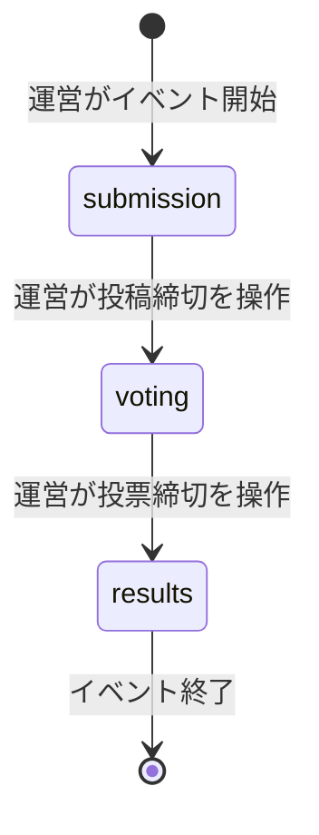

# プロジェクト用語集 (Glossary)

## 概要

このドキュメントは、SwipeMatch（社内AIイベント ロゴ投票アプリ）プロジェクト内で使用される用語の定義を管理します。

**更新日**: 2026-07-17

## ドメイン用語

### ロゴ (Logo)

**定義**: 参加者が投稿するロゴ画像とその付随情報（投稿者名・一口メモ）をまとめたエンティティ

**説明**: 1人が複数件投稿してもよい。投稿者名は管理者画面でのみ表示され、投票画面（1次選考・決選投票）では匿名化される。

**関連用語**: [一口メモ](#一口メモ)、[キープ / 次へ](#キープ--次へ)、[Logo（データモデル）](#logo)

**使用例**:
- 「ロゴを投稿する」: 画像・投稿者名・一口メモを送信し、`logos`テーブルにレコードを作成する
- 「ロゴをキープする」: 1次選考で右スワイプし、決選投票の候補として残す

**英語表記**: Logo

### 一口メモ

**定義**: ロゴ投稿時に投稿者が入力する、作品への思いを表す短いコメント

**説明**: 投票画面（1次選考・決選投票）では画像とともに表示される、投票者が参照できる唯一のテキスト情報。投稿者名とは異なり匿名化されない（メモ自体は常に表示対象）。

**関連用語**: [ロゴ](#ロゴ-logo)

**使用例**:
- 「一口メモを読んでキープするか判断する」

**英語表記**: Memo

### キープ / 次へ

**定義**: スワイプ式1次選考における2種類の仕分け操作。「キープ」は右スワイプ（決選投票の候補として残す）、「次へ」は左スワイプ（候補から外す）を指す

**説明**: 一般的なマッチングアプリの「Like/Dislike」を、キープ（ポジティブな保留）と次へ（ネガティブな評価を明示しない中立的な操作）に置き換えることで、同僚の作品を無下に扱う心理的抵抗を軽減する狙いがある。決選投票に進むには最低1件のキープが必須。

**関連用語**: [1次選考（スワイプ式1次選考）](#1次選考スワイプ式1次選考)、[決選投票](#決選投票)

**使用例**:
- 「右スワイプでキープする」「左スワイプで次へ送る」

**英語表記**: Keep / Skip

### 1次選考（スワイプ式1次選考）

**定義**: 投稿されたロゴをランダム順に1枚ずつ表示し、キープ／次へで仕分ける選考フェーズの操作

**説明**: 表示順による有利不利をなくすため、順序はユーザーごとに独立してシャッフルされる。選考状態はサーバーに保存せず、ブラウザの`localStorage`にのみ保持する（MVP方針）。

**関連用語**: [キープ / 次へ](#キープ--次へ)、[決選投票](#決選投票)、[シャッフル（Fisher-Yates）](#シャッフルfisher-yates)

**使用例**:
- 「1次選考でキープした画像だけが決選投票に進む」

**英語表記**: First Screening (Swipe Screening)

### 決選投票

**定義**: 1次選考でキープしたロゴの中から、上位3つまでを選んで行う最終投票

**説明**: 匿名IDにより1端末あたり最大3票までに制限される。自己投票（投稿者が自分の作品に投票すること）は許可されている。

**関連用語**: [キープ / 次へ](#キープ--次へ)、[匿名ID](#匿名id)、[ランオフ](#ランオフ)

**使用例**:
- 「決選投票で上位3つの作品を選ぶ」

**英語表記**: Final Vote

### 匿名ID

**定義**: 認証を行わない代わりに、サーバー側（Next.js Edge Middleware）がhttpOnly Cookieとして発行するブラウザ単位のランダムID

**説明**: 決選投票の多重投票防止のみに用いられ、投稿者名など個人を特定できる情報とは紐付けない。クライアントの自己申告値を信頼しない設計とするため、httpOnly属性によりJavaScriptからの参照・改ざんを防いでいる。

**関連用語**: [決選投票](#決選投票)、[Vote（データモデル）](#vote)

**使用例**:
- 「匿名IDごとに投票を3件までに制限する」

**英語表記**: Anonymous ID

### イベントフェーズ

**定義**: アプリ全体の進行状態を表す3つの状態（投稿フェーズ／投票フェーズ／結果発表フェーズ）

**説明**: 運営が管理者ダッシュボードから切り替える。フェーズに応じて各画面の操作可否が変わる（詳細は[EventPhase](#eventphase)を参照）。

**関連用語**: [EventPhase](#eventphase)、[管理者ダッシュボード](#管理者ダッシュボード)

**使用例**:
- 「投稿フェーズが終わったら投票フェーズに切り替える」

**英語表記**: Event Phase

### ランオフ

**定義**: 決選投票の結果、順位境界（特に1位）で得票数が同数となった場合に、対象作品同士で行う再投票

**説明**: システム上は専用機能を設けず、決選投票と同じ仕組み（`votes`テーブル・投票フロー）を再利用して運営が手動で実施する運用とする。同数対象には`isTiedForRunoff`フラグが立つ。

**関連用語**: [決選投票](#決選投票)、[ランオフ判定](#ランオフ判定rankwithtiedetection)

**使用例**:
- 「1位が同数のためランオフを実施する」

**英語表記**: Runoff

### 管理者ダッシュボード

**定義**: 運営担当がイベントフェーズの切り替えやQRコード表示を行う画面（画面設計書 S-06）

**説明**: 管理者パスワードによるログインが必要。フェーズの逆行（例: 結果発表中に投稿フェーズへ戻す）はUI上で非活性化されるほか、`PhaseService.transitionTo`がサーバー側でも拒否する（多層防御）。

**関連用語**: [イベントフェーズ](#イベントフェーズ)、[結果発表画面](#結果発表画面)

**英語表記**: Admin Dashboard

### 結果発表画面

**定義**: 得票数ランキングを画像・一口メモ・投稿者名とともに表示する管理者専用画面（画面設計書 S-07）

**説明**: イベント当日にスクリーン投影して優勝者を発表することを想定。結果発表フェーズ以外ではアクセスできない。Supabase無料枠に自動バックアップがないことへの備えとして、ランキングをCSVでエクスポートする機能も持つ。

**関連用語**: [イベントフェーズ](#イベントフェーズ)、[ランオフ](#ランオフ)

**英語表記**: Results Screen

## 技術用語

### Next.js (App Router)

**定義**: Reactベースのフルスタックフレームワーク。App Routerはファイルシステムベースのルーティングとサーバー/クライアントコンポーネントを統合した最新のアーキテクチャ

**公式サイト**: https://nextjs.org/

**本プロジェクトでの用途**: フロントエンド（`app/`配下のページ）とバックエンドAPI（`app/api/`配下のRoute Handlers）を1つのプロジェクトで実装する

**バージョン**: ^15.x

**関連ドキュメント**: [アーキテクチャ設計書](./architecture.md#テクノロジースタック)、[リポジトリ構造定義書](./repository-structure.md)

### TypeScript

**定義**: JavaScriptに静的型付けを追加したプログラミング言語

**公式サイト**: https://www.typescriptlang.org/

**本プロジェクトでの用途**: フロントエンド・バックエンドすべてのソースコードで使用し、`Logo` / `Vote` / `AppSettings`等のデータモデルを型として定義する

**バージョン**: 5.x

**関連ドキュメント**: [開発ガイドライン](./development-guidelines.md#コーディング規約)

### Tailwind CSS

**定義**: ユーティリティクラスベースのCSSフレームワーク

**公式サイト**: https://tailwindcss.com/

**本プロジェクトでの用途**: モバイル優先のUIを短期間で構築するためのスタイリング全般

**バージョン**: ^3.x

### react-tinder-card / framer-motion

**定義**: スワイプ操作・アニメーションを実装するためのReactライブラリ

**本プロジェクトでの用途**: スワイプ式1次選考（S-03画面）のカードUIとスワイプ演出、キープ／次への操作フィードバックの実装

**バージョン**: react-tinder-card ^1.x / framer-motion ^11.x

**関連ドキュメント**: [画面設計書](./ui-design.md#s-03-スワイプ1次選考画面)

### Supabase (Database / Storage)

**定義**: PostgreSQLベースのBaaS（Backend as a Service）。DatabaseとStorage（ファイル保存）を提供する

**公式サイト**: https://supabase.com/

**本プロジェクトでの用途**: `logos` / `votes` / `app_settings`テーブルの永続化（Database）と、ロゴ画像ファイルの保存・配信（Storage）

**バージョン**: `@supabase/supabase-js` ^2.x

**関連ドキュメント**: [アーキテクチャ設計書](./architecture.md#データ永続化戦略)、初期セットアップ手順は`docs/ideas/setup_guide.md`

### zod

**定義**: TypeScript向けのスキーマ検証ライブラリ

**本プロジェクトでの用途**: Route Handlersにおけるリクエストボディのバリデーション

**バージョン**: ^3.x

### jose

**定義**: JWT（JSON Web Token）の署名・検証を行う軽量ライブラリ

**本プロジェクトでの用途**: 管理者ログイン成功時に発行する短命JWTの署名・検証（httpOnly Cookieとして保持）

**バージョン**: ^5.x

**関連ドキュメント**: [アーキテクチャ設計書](./architecture.md#セキュリティアーキテクチャ)

### qrcode.react

**定義**: QRコードを生成・表示するReactコンポーネントライブラリ

**本プロジェクトでの用途**: 管理者ダッシュボードでのアプリURL QRコード表示

**バージョン**: ^3.x

### Vercel

**定義**: Next.jsアプリケーションのホスティングサービス

**公式サイト**: https://vercel.com/

**本プロジェクトでの用途**: 本番環境のデプロイ先（想定）

### Vitest / Playwright

**定義**: Vitestはユニット・統合テスト向けのテストランナー、Playwrightは実ブラウザを用いたE2Eテストツール

**本プロジェクトでの用途**: `lib/services/`・`lib/algorithms/`のユニットテスト、`app/api/`の統合テスト（Vitest）、投稿〜結果発表の一連のシナリオテスト（Playwright）

**バージョン**: Vitest ^2.x / Playwright ^1.x

**関連ドキュメント**: [開発ガイドライン](./development-guidelines.md#テスト戦略)

### heic2any

**定義**: HEIC形式の画像をJPEG等のブラウザ互換形式にブラウザ上で変換するJavaScriptライブラリ

**本プロジェクトでの用途**: iOS端末で撮影されたHEIC画像を、アップロード前にクライアント側でJPEGへ変換し、Supabase Storageには常にjpg/png/webpのいずれかとして保存する

**バージョン**: ^0.x

**関連ドキュメント**: [機能設計書](./functional-design.md#エンティティ-logo)、[アーキテクチャ設計書](./architecture.md#テクノロジースタック)

## 略語・頭字語

### PRD

**正式名称**: Product Requirements Document（プロダクト要求定義書）

**意味**: プロダクトが解決する課題・ターゲット・機能要件・非機能要件を定義したドキュメント

**本プロジェクトでの使用**: `docs/product-requirements.md`

### MVP

**正式名称**: Minimum Viable Product（実用最小限の製品）

**意味**: 最小限の機能でプロダクトの価値を検証できる状態

**本プロジェクトでの使用**: `docs/product-requirements.md`のMVPスコープで、イベント当日までに実装すべき必須機能を定義

### KPI

**正式名称**: Key Performance Indicator（重要業績評価指標）

**意味**: プロダクトの成功を測定するための定量的な指標

**本プロジェクトでの使用**: `docs/product-requirements.md`の成功指標（投稿数50件以上、決選投票完了率80%以上等）

### JWT

**正式名称**: JSON Web Token

**意味**: 署名付きのトークン形式。認証情報を安全にやり取りするために使用される

**本プロジェクトでの使用**: 管理者ログイン成功時にサーバーが発行し、httpOnly Cookieとして保持する短命セッショントークン

### CDN

**正式名称**: Content Delivery Network

**意味**: 静的コンテンツを地理的に分散したサーバーから配信する仕組み

**本プロジェクトでの使用**: Supabase Storageに保存されたロゴ画像の配信

### WCAG

**正式名称**: Web Content Accessibility Guidelines

**意味**: Webコンテンツのアクセシビリティに関する国際的なガイドライン

**本プロジェクトでの使用**: `docs/ui-design.md`のアクセシビリティ方針でWCAG 2.1 AA相当を目標として言及

### CI/CD

**正式名称**: Continuous Integration / Continuous Delivery

**意味**: コードの統合・テスト・デプロイを自動化する開発プラクティス

**本プロジェクトでの使用**: GitHub Actionsによるlint/typecheck/testの自動実行（`docs/development-guidelines.md`）

## アーキテクチャ用語

### レイヤードアーキテクチャ

**定義**: システムを役割ごとに複数の層に分割し、上位層から下位層への一方向の依存関係を持たせる設計パターン

**本プロジェクトでの適用**:
```
UIレイヤー (app/)
    ↓
APIレイヤー (app/api/、Route Handlers)
    ↓
サービスレイヤー (lib/services/)
    ↓
データレイヤー (lib/repositories/)
```

**メリット**: 関心の分離による保守性向上、各層を独立してテスト可能

**関連コンポーネント**: `UploadService` / `VoteService` / `AdminService` / `PhaseService`（サービスレイヤー）、`LogoRepository` / `VoteRepository` / `AppSettingsRepository`（データレイヤー）

**参考資料**: [アーキテクチャ設計書](./architecture.md#アーキテクチャパターン)、[リポジトリ構造定義書](./repository-structure.md)

### Route Handlers

**定義**: Next.js App Routerにおける、`app/api/**/route.ts`ファイルで定義するAPIエンドポイントの実装方式

**本プロジェクトでの適用**: `POST /api/logos`、`POST /api/votes`等のバックエンドAPIをRoute Handlersとして実装し、サービスレイヤーを呼び出す薄い層として保つ

**関連コンポーネント**: `lib/services/`

**参考資料**: [機能設計書](./functional-design.md#api設計)

### Server Components / Client Components

**定義**: Next.js App Routerにおける2種類のReactコンポーネント。Server Componentsはサーバー側でレンダリングされデフォルトで使用され、Client Componentsは`'use client'`宣言によりブラウザで動作しインタラクティブな処理を担う

**本プロジェクトでの適用**: 静的な表示はServer Components、スワイプ操作やフォーム入力などインタラクティブ性が必須な箇所のみClient Componentsとする

**参考資料**: [開発ガイドライン](./development-guidelines.md#next-js固有の規約)

## ステータス・状態

### EventPhase

**定義**: `app_settings`テーブルの`currentPhase`カラムが取りうる、イベント全体の進行状態

| ステータス | 意味 | 遷移条件 | 次の状態 |
|----------|------|---------|---------|
| `submission` | 投稿受付中。投票は不可 | 運営がイベントを開始した初期状態 | `voting` |
| `voting` | 投稿締切。1次選考・決選投票が可能 | 運営が投稿締切を操作 | `results` |
| `results` | 決選投票締切。結果発表画面が閲覧可能 | 運営が投票締切を操作 | なし（イベント終了） |

**状態遷移図**:


**実装**: `lib/types/AppSettings.ts`

**ビジネスルール**: 逆行遷移（例: `results`→`submission`）はUI上で非活性化するほか、`PhaseService.transitionTo`がサーバー側でも拒否する（`ValidationError`／400 Bad Request）。UIとAPI双方での多層防御とする（`docs/functional-design.md`のAPI設計「フェーズ切り替え」を参照）

## データモデル用語

### Logo

**定義**: 参加者が投稿したロゴ画像とその付随情報を表すエンティティ

**主要フィールド**:
- `id`: UUID
- `imageUrl`: Supabase Storage上の画像URL
- `uploaderName`: 投稿者名（管理者画面でのみ表示）
- `memo`: 一口メモ（投票画面に表示）
- `createdAt`: 投稿日時

**関連エンティティ**: [Vote](#vote)（1対多）

**制約**: すべてのフィールドが必須。1人が複数件投稿可能なため`uploaderName`に一意制約はない

### Vote

**定義**: 決選投票における1件の投票を表すエンティティ

**主要フィールド**:
- `id`: UUID
- `logoId`: 投票対象の`Logo.id`（外部キー）
- `voterAnonId`: 投票者の匿名ID
- `createdAt`: 投票日時

**関連エンティティ**: [Logo](#logo)（多対1）

**制約**: 同一`voterAnonId`につき最大3件まで。一度投票を確定した`voterAnonId`からの追加投票は拒否される

### AppSettings

**定義**: イベント全体のフェーズを管理するシングルトンエンティティ

**主要フィールド**:
- `id`: 固定ID
- `currentPhase`: [EventPhase](#eventphase)
- `updatedAt`: 更新日時

**関連エンティティ**: なし

**制約**: レコードは常に1件のみ

## エラー・例外

### ValidationError

**クラス名**: `ValidationError`

**発生条件**: 必須項目未入力、画像サイズ・形式の不正、決選投票の選択件数（4件以上）など、リクエスト内容がビジネスルールに違反した場合

**対処方法**:
- ユーザー: エラーメッセージに従って入力を修正
- 開発者: `zod`スキーマとサービスレイヤーのバリデーションロジックを確認

**実装箇所**: `lib/errors.ts`

**使用例**:
```typescript
throw new ValidationError('投票できるのは3作品までです', 'logoIds');
```

### PhaseMismatchError

**クラス名**: `PhaseMismatchError`

**発生条件**: 現在の[EventPhase](#eventphase)と一致しない操作が行われた場合（例: 投票フェーズ中に投稿しようとした）

**対処方法**: ユーザーには「現在は受け付けていません」等のメッセージを表示する

**実装箇所**: `lib/errors.ts`

### DuplicateVoteError

**クラス名**: `DuplicateVoteError`

**発生条件**: 既に投票済みの[匿名ID](#匿名id)から再度決選投票が送信された場合

**対処方法**: ユーザーには「既に投票済みです」を表示する

**実装箇所**: `lib/errors.ts`

### UnauthorizedError

**クラス名**: `UnauthorizedError`

**発生条件**: 管理者用エンドポイント（`app/api/admin/**`）に未認証または期限切れのトークンでアクセスした場合

**対処方法**: 管理者ログイン画面（S-05）へ誘導する

**実装箇所**: `lib/errors.ts`

## 計算・アルゴリズム

### シャッフル（Fisher-Yates）

**定義**: 配列をランダムかつ一様に並び替えるアルゴリズム

**本プロジェクトでの用途**: 1次選考で表示するロゴ一覧を、ユーザーごとに独立したランダム順にするために使用し、表示順による有利不利をなくす

**実装箇所**: `lib/algorithms/shuffle.ts`

**例**:
```
入力: [logoA, logoB, logoC, logoD]
出力（ある1ユーザーのセッション）: [logoC, logoA, logoD, logoB]
```

**関連ドキュメント**: [機能設計書](./functional-design.md#ランダム順の1次選考表示)

### ランオフ判定（rankWithTieDetection）

**定義**: 得票数の降順でロゴを順位付けし、順位境界で同数得票があった場合に[ランオフ](#ランオフ)対象としてフラグを立てる処理

**計算式**:
```
1. voteCount降順でソート
2. 累積順位を付与（同数は同順位）
3. 最上位の得票数と同数のロゴが複数存在する場合、それらに isTiedForRunoff = true を設定
```

**実装箇所**: `lib/algorithms/rankWithTieDetection.ts`

**例**:
```
入力: [{logo: A, voteCount: 15}, {logo: B, voteCount: 15}, {logo: C, voteCount: 10}]
出力: [{A, rank: 1, isTiedForRunoff: true}, {B, rank: 1, isTiedForRunoff: true}, {C, rank: 3, isTiedForRunoff: false}]
```

**関連ドキュメント**: [機能設計書](./functional-design.md#同数得票時のランオフ判定)
