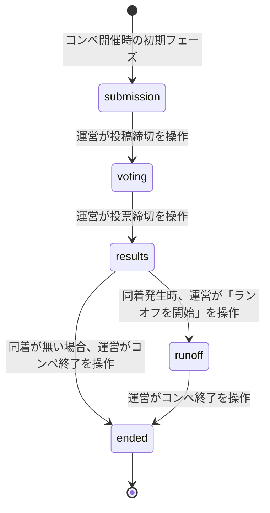
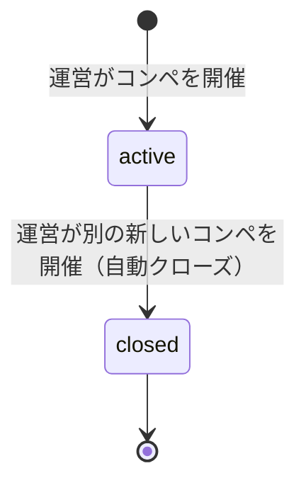

# プロジェクト用語集 (Glossary)

## 概要

このドキュメントは、SwipeMatch（社内AIイベント ロゴ投票アプリ）プロジェクト内で使用される用語の定義を管理します。

**更新日**: 2026-07-20

## ドメイン用語

### コンペ (Competition)

**定義**: 管理者が題名を決めて開催する、1回のロゴ作成大会の単位。専用URL（`/c/[slug]`）・進行状態（[イベントフェーズ](#イベントフェーズ)）・投稿（[ロゴ](#ロゴ-logo)）・投票を独立して持つ

**説明**: 常に1件のみが「開催中(active)」の状態になり、新しいコンペを開催すると既存の開催中コンペは自動的に「クローズ(closed)」される。クローズされたコンペの投稿・投票データは削除されず、管理者は後から結果を閲覧できる（不要になった場合は管理者コンペ一覧画面から完全に削除することもできる）。参加者は専用URLに直接アクセスするか、トップページ（`/`）に表示される「投票に参加する」ボタン（開催中コンペが1件のみのため、複数コンペからの選択導線ではない）から到達する。

**関連用語**: [コンペ専用URL / slug](#コンペ専用url--slug)、[イベントフェーズ](#イベントフェーズ)、[Competition（データモデル）](#competition)、[CompetitionStatus](#competitionstatus)

**使用例**:
- 「新しいコンペを開催する」: 管理者コンペ一覧画面で題名を入力し「開催する」を押すと、既存の開催中コンペが自動クローズされたうえで新規`Competition`レコードが作成される
- 「過去のコンペの結果を見る」: クローズ済みコンペの結果発表画面に、管理者コンペ一覧画面から遷移する

**英語表記**: Competition

### コンペ専用URL / slug

**定義**: 各コンペにサーバー側で自動発行される、ランダムな短い識別子（例: `x7k2p9`）を含む参加者向けURL（`/c/{slug}`）

**説明**: 参加者はこのURLに直接アクセスすることで、そのコンペの投稿・スワイプ選考・決選投票画面に到達する。予測されにくいことを優先しており、コンペの題名から生成する読みやすいスラッグ（例: `logo-contest-2026`）は採用しない。既存slugとの衝突時はサーバー側で再生成する。

**関連用語**: [コンペ](#コンペ-competition)、[管理者コンペ一覧画面](#管理者コンペ一覧画面)

**英語表記**: Competition URL / Slug

### ロゴ (Logo)

**定義**: 参加者が投稿するロゴ画像とその付随情報（投稿者名・一口メモ）をまとめたエンティティ

**説明**: 1人が複数件投稿してもよい。投稿者名は管理者画面でのみ表示され、投票画面（1次選考・決選投票）では匿名化される。投稿者名は画像投稿画面で都度入力するのではなく、コンペ入場時に一度だけ入力する[参加者名](#参加者名)がそのまま使用される。

**関連用語**: [一口メモ](#一口メモ)、[キープ / 次へ](#キープ--次へ)、[参加者名](#参加者名)、[Logo（データモデル）](#logo)

**使用例**:
- 「ロゴを投稿する」: 画像・一口メモを送信し、参加者名を投稿者名として`logos`テーブルにレコードを作成する
- 「ロゴをキープする」: 1次選考で右スワイプし、決選投票の候補として残す

**英語表記**: Logo

### 一口メモ

**定義**: ロゴ投稿時に投稿者が入力する、作品への思いを表す短いコメント

**説明**: 投票画面（1次選考・決選投票）では画像とともに表示される、投票者が参照できる唯一のテキスト情報。投稿者名とは異なり匿名化されない（メモ自体は常に表示対象）。

**関連用語**: [ロゴ](#ロゴ-logo)

**使用例**:
- 「一口メモを読んでキープするか判断する」

**英語表記**: Memo

### 参加者名

**定義**: 参加者が`/c/[slug]`への初回アクセス時に一度だけ入力する、何でもよい・匿名可の名前

**説明**: ブラウザの`localStorage`に保存され、以後の画像投稿における投稿者名として自動的に使用される。画像投稿画面には投稿者名の入力欄を設けない（一度入力すれば同じブラウザで再入力不要）。決選投票の多重投票防止に使う[匿名ID](#匿名id)（httpOnly Cookie）とは別の仕組みであり、個人の識別・認証を目的としたものではない。

**関連用語**: [ロゴ](#ロゴ-logo)、[匿名ID](#匿名id)

**使用例**:
- 「名前を入力してはじめる」: 名前入力ゲートで入力した名前が、以後の画像投稿の投稿者名として使われる

**英語表記**: Participant Name

### キープ / 次へ

**定義**: スワイプ式1次選考における2種類の仕分け操作。「キープ」は右スワイプ（決選投票の候補として残す）、「次へ」は左スワイプ（候補から外す）を指す

**説明**: 一般的なマッチングアプリの「Like/Dislike」を、キープ（ポジティブな保留）と次へ（ネガティブな評価を明示しない中立的な操作）に置き換えることで、同僚の作品を無下に扱う心理的抵抗を軽減する狙いがある。決選投票に進むには最低1件のキープが必須。

**関連用語**: [1次選考（スワイプ式1次選考）](#1次選考スワイプ式1次選考)、[決選投票](#決選投票)

**使用例**:
- 「右スワイプでキープする」「左スワイプで次へ送る」

**英語表記**: Keep / Skip

### 1次選考（スワイプ式1次選考）

**定義**: 投稿されたロゴをランダム順に1枚ずつ表示し、キープ／次へで仕分ける選考フェーズの操作

**説明**: 表示順による有利不利をなくすため、順序はユーザーごとに独立してシャッフルされる。選考状態はサーバーに保存せず、ブラウザの`localStorage`にのみ保持する（MVP方針）。

**関連用語**: [キープ / 次へ](#キープ--次へ)、[決選投票](#決選投票)、[シャッフル（Fisher-Yates）](#シャッフルfisher-yates)

**使用例**:
- 「1次選考でキープした画像だけが決選投票に進む」

**英語表記**: First Screening (Swipe Screening)

### 決選投票

**定義**: 1次選考でキープしたロゴの中から、上位3つまでを選んで行う最終投票（内部的には`round=1`の投票として扱う）

**説明**: 匿名IDにより1端末あたり最大3票までに制限される。自己投票（投稿者が自分の作品に投票すること）は許可されている。同着が発生した場合の再投票は[ランオフ](#ランオフ)を参照。

**関連用語**: [キープ / 次へ](#キープ--次へ)、[匿名ID](#匿名id)、[ランオフ](#ランオフ)

**使用例**:
- 「決選投票で上位3つの作品を選ぶ」

**英語表記**: Final Vote

### 匿名ID

**定義**: 認証を行わない代わりに、サーバー側（Next.js Edge Middleware）がhttpOnly Cookieとして発行するブラウザ単位のランダムID

**説明**: 決選投票・ランオフ投票の多重投票防止に用いられ、投稿者名など個人を特定できる情報とは紐付けない。クライアントの自己申告値を信頼しない設計とするため、httpOnly属性によりJavaScriptからの参照・改ざんを防いでいる。多重投票防止の判定単位は「コンペ×ラウンド」であり（[Vote（データモデル）](#vote)参照）、ランオフの参加資格判定（`round=1`に投票済みか）にも同じ仕組みを流用する。

**関連用語**: [決選投票](#決選投票)、[ランオフ](#ランオフ)、[Vote（データモデル）](#vote)

**使用例**:
- 「匿名IDごとに投票を3件までに制限する」

**英語表記**: Anonymous ID

### イベントフェーズ

**定義**: 開催中の[コンペ](#コンペ-competition)ごとの進行状態を表す5つの状態（投稿フェーズ／投票フェーズ／結果発表フェーズ／ランオフフェーズ／終了フェーズ）

**説明**: 運営がコンペ管理画面（ランオフフェーズへの遷移のみ結果発表画面の専用操作）から切り替える。フェーズに応じて各画面の操作可否が変わる（詳細は[EventPhase](#eventphase)を参照）。以前はアプリ全体で1つだけ存在したが、コンペ機能の導入によりコンペごとに独立して持つように変わった。他のコンペのフェーズには影響しない。

**関連用語**: [EventPhase](#eventphase)、[コンペ管理画面](#コンペ管理画面)、[ランオフ](#ランオフ)

**使用例**:
- 「投稿フェーズが終わったら投票フェーズに切り替える」

**英語表記**: Event Phase

### ランオフ

**定義**: 決選投票の結果、順位境界（特に1位）で得票数が同数となった場合に、対象作品同士で行う再投票

**説明**: `submission`/`voting`/`results`/`ended`と並ぶ正式な[イベントフェーズ](#イベントフェーズ)`runoff`として実装されている。同着（`isTiedForRunoff`）が検出されると、運営が結果発表画面から「ランオフを開始」を操作し、対象作品を`round=2`としてスナップショットする。参加者は`round=1`（通常決選投票）に投票済みの匿名IDに限り、対象作品から1つだけ選んで投票できる。運営が投票を締め切っても同着が続く場合は、「再投票」（`round`を1つ進めて繰り返す）または「同率優勝」（それ以上投票せず対象を同順位のまま確定する）を選択する。

かつては「決選投票と同じ仕組みを再利用する運用とし、専用機能は設けない」という想定だったが、フェーズの逆行禁止・投票APIのフェーズ限定・コンペ内での再投票禁止という既存の制約により、実際には同一コンペ内でその運用が不可能だったため、`round`概念とともに正式なフェーズ・データモデル・API・画面として実装した（詳細は`docs/functional-design.md`の「ランオフの実施（同着の解消）」を参照）。

**関連用語**: [決選投票](#決選投票)、[イベントフェーズ](#イベントフェーズ)、[ランオフ投票画面](#ランオフ投票画面)、[ランオフ判定](#ランオフ判定rankwithtiedetection)

**使用例**:
- 「1位が同数のためランオフを実施する」

**英語表記**: Runoff

### ランオフ投票画面

**定義**: 決選投票で同着になった作品から1つだけ選んで投票する、参加者向け画面（画面設計書 S-09）

**説明**: `/c/[slug]/vote/runoff`に配置される。トップ画面（S-01）に表示される「ランオフ投票へ進む」導線からアクセスする。決選投票画面（S-04）と選択方式（単一選択か最大3つまでか）と対象作品（同着になった作品のみか、キープした全作品か）が異なるが、投票完了後にトップ画面へ自動遷移する点は共通。

**関連用語**: [ランオフ](#ランオフ)、[決選投票](#決選投票)

**英語表記**: Runoff Voting Screen

### コンペ管理画面

**定義**: 運営担当が対象コンペのイベントフェーズの切り替えやQRコード表示、投稿・投票の進捗確認を行う画面（画面設計書 S-06。旧称: 管理者ダッシュボード）

**説明**: 管理者パスワードによるログインが必要。フェーズの逆行（例: 結果発表中に投稿フェーズへ戻す）はUI上で非活性化されるほか、`PhaseService.transitionTo`がサーバー側でも拒否する（多層防御）。コンペ機能の導入により、対象コンペを1件選んだ状態で操作する画面（`/admin/competitions/[id]`）に変わった。コンペの選択自体は[管理者コンペ一覧画面](#管理者コンペ一覧画面)から行う。投稿数・投稿詳細・投票済み人数／総投票数を表示するダッシュボードセクションを持ち、`results`フェーズ到達後は「コンペを終了する」操作で[イベントフェーズ](#イベントフェーズ)を`ended`に切り替えられる。

**関連用語**: [イベントフェーズ](#イベントフェーズ)、[結果発表画面](#結果発表画面)、[管理者コンペ一覧画面](#管理者コンペ一覧画面)

**英語表記**: Competition Management Screen

### 管理者コンペ一覧画面

**定義**: 運営担当が新規コンペの開催と、過去に開催したコンペの一覧・結果閲覧への導線を得る画面（画面設計書 S-08。コンペ機能導入により新設）

**説明**: 管理者パスワードによるログインが必要。`/admin`直下に配置され、コンペ横断で唯一グローバルな管理者向け画面（他のS-06/S-07は特定のコンペに紐付く）。新規開催時、既存の開催中コンペがあれば自動的にクローズすることを確認ダイアログで案内する。過去の（`closed`な）コンペは、コンペ名の入力一致を必須とする確認ダイアログを経て完全に削除できる（画像Storage・投稿・投票データを含む。開催中コンペは削除できない）。

**関連用語**: [コンペ](#コンペ-competition)、[コンペ管理画面](#コンペ管理画面)

**英語表記**: Admin Competition List Screen

### 結果発表画面

**定義**: 対象コンペの得票数ランキングを画像・一口メモ・投稿者名とともにアニメーション付きで表示する管理者専用画面（画面設計書 S-07）

**説明**: イベント当日にスクリーン投影して優勝者を発表することを想定。対象コンペの結果発表フェーズ以外ではアクセスできない（クローズ済みコンペに対しては、結果発表フェーズに達していれば引き続き閲覧できる）。管理者が「発表開始」を操作すると、下位から上位の順にランキングがスライドイン表示され、得票数がカウントアップする演出が再生される（`framer-motion`で実装）。Supabase無料枠に自動バックアップがないことへの備えとして、ランキングをCSVでエクスポートする機能も持つ。同着が検出された場合、この画面から[ランオフ](#ランオフ)の開始・締切・再投票・同率優勝確定を操作する（`runoff`フェーズへの遷移はこの画面の専用操作からのみ行い、コンペ管理画面の汎用フェーズ切替ボタンには含まれない）。

**関連用語**: [イベントフェーズ](#イベントフェーズ)、[ランオフ](#ランオフ)、[コンペ管理画面](#コンペ管理画面)

**英語表記**: Results Screen

## 技術用語

### Next.js (App Router)

**定義**: Reactベースのフルスタックフレームワーク。App Routerはファイルシステムベースのルーティングとサーバー/クライアントコンポーネントを統合した最新のアーキテクチャ

**公式サイト**: https://nextjs.org/

**本プロジェクトでの用途**: フロントエンド（`app/`配下のページ）とバックエンドAPI（`app/api/`配下のRoute Handlers）を1つのプロジェクトで実装する

**バージョン**: ^15.x

**関連ドキュメント**: [アーキテクチャ設計書](./architecture.md#テクノロジースタック)、[リポジトリ構造定義書](./repository-structure.md)

### TypeScript

**定義**: JavaScriptに静的型付けを追加したプログラミング言語

**公式サイト**: https://www.typescriptlang.org/

**本プロジェクトでの用途**: フロントエンド・バックエンドすべてのソースコードで使用し、`Competition` / `Logo` / `Vote`等のデータモデルを型として定義する

**バージョン**: 5.x

**関連ドキュメント**: [開発ガイドライン](./development-guidelines.md#コーディング規約)

### Tailwind CSS

**定義**: ユーティリティクラスベースのCSSフレームワーク

**公式サイト**: https://tailwindcss.com/

**本プロジェクトでの用途**: モバイル優先のUIを短期間で構築するためのスタイリング全般

**バージョン**: ^3.x

### react-tinder-card / framer-motion

**定義**: スワイプ操作・アニメーションを実装するためのReactライブラリ

**本プロジェクトでの用途**: スワイプ式1次選考（S-03画面）のカードUIとスワイプ演出、キープ／次への操作フィードバックの実装。`framer-motion`は結果発表画面（S-07）のランキングスライドイン・得票数カウントアップ演出にも用いる（追加ライブラリを増やさず対応）

**バージョン**: react-tinder-card ^1.x / framer-motion ^11.x

**関連ドキュメント**: [画面設計書](./ui-design.md#s-03-スワイプ1次選考画面)

### Supabase (Database / Storage)

**定義**: PostgreSQLベースのBaaS（Backend as a Service）。DatabaseとStorage（ファイル保存）を提供する

**公式サイト**: https://supabase.com/

**本プロジェクトでの用途**: `competitions` / `logos` / `votes` / `vote_locks`テーブルの永続化（Database）と、ロゴ画像ファイルの保存・配信（Storage）

**バージョン**: `@supabase/supabase-js` ^2.x

**関連ドキュメント**: [アーキテクチャ設計書](./architecture.md#データ永続化戦略)、初期セットアップ手順は`docs/ideas/setup_guide.md`

### zod

**定義**: TypeScript向けのスキーマ検証ライブラリ

**本プロジェクトでの用途**: Route Handlersにおけるリクエストボディのバリデーション

**バージョン**: ^3.x

### jose

**定義**: JWT（JSON Web Token）の署名・検証を行う軽量ライブラリ

**本プロジェクトでの用途**: 管理者ログイン成功時に発行する短命JWTの署名・検証（httpOnly Cookieとして保持）

**バージョン**: ^5.x

**関連ドキュメント**: [アーキテクチャ設計書](./architecture.md#セキュリティアーキテクチャ)

### qrcode.react

**定義**: QRコードを生成・表示するReactコンポーネントライブラリ

**本プロジェクトでの用途**: コンペ管理画面・管理者コンペ一覧画面でのコンペ専用URL QRコード表示

**バージョン**: ^3.x

### Vercel

**定義**: Next.jsアプリケーションのホスティングサービス

**公式サイト**: https://vercel.com/

**本プロジェクトでの用途**: 本番環境のデプロイ先（想定）

### Vitest / Playwright

**定義**: Vitestはユニット・統合テスト向けのテストランナー、Playwrightは実ブラウザを用いたE2Eテストツール

**本プロジェクトでの用途**: `lib/services/`・`lib/algorithms/`のユニットテスト、`app/api/`の統合テスト（Vitest）、投稿〜結果発表の一連のシナリオテスト（Playwright）

**バージョン**: Vitest ^2.x / Playwright ^1.x

**関連ドキュメント**: [開発ガイドライン](./development-guidelines.md#テスト戦略)

### heic2any

**定義**: HEIC形式の画像をJPEG等のブラウザ互換形式にブラウザ上で変換するJavaScriptライブラリ

**本プロジェクトでの用途**: iOS端末で撮影されたHEIC画像を、アップロード前にクライアント側でJPEGへ変換し、Supabase Storageには常にjpg/png/webpのいずれかとして保存する

**バージョン**: ^0.x

**関連ドキュメント**: [機能設計書](./functional-design.md#エンティティ-logo)、[アーキテクチャ設計書](./architecture.md#テクノロジースタック)

## 略語・頭字語

### PRD

**正式名称**: Product Requirements Document（プロダクト要求定義書）

**意味**: プロダクトが解決する課題・ターゲット・機能要件・非機能要件を定義したドキュメント

**本プロジェクトでの使用**: `docs/product-requirements.md`

### MVP

**正式名称**: Minimum Viable Product（実用最小限の製品）

**意味**: 最小限の機能でプロダクトの価値を検証できる状態

**本プロジェクトでの使用**: `docs/product-requirements.md`のMVPスコープで、イベント当日までに実装すべき必須機能を定義

### KPI

**正式名称**: Key Performance Indicator（重要業績評価指標）

**意味**: プロダクトの成功を測定するための定量的な指標

**本プロジェクトでの使用**: `docs/product-requirements.md`の成功指標（投稿数50件以上、決選投票完了率80%以上等）

### JWT

**正式名称**: JSON Web Token

**意味**: 署名付きのトークン形式。認証情報を安全にやり取りするために使用される

**本プロジェクトでの使用**: 管理者ログイン成功時にサーバーが発行し、httpOnly Cookieとして保持する短命セッショントークン

### CDN

**正式名称**: Content Delivery Network

**意味**: 静的コンテンツを地理的に分散したサーバーから配信する仕組み

**本プロジェクトでの使用**: Supabase Storageに保存されたロゴ画像の配信

### WCAG

**正式名称**: Web Content Accessibility Guidelines

**意味**: Webコンテンツのアクセシビリティに関する国際的なガイドライン

**本プロジェクトでの使用**: `docs/ui-design.md`のアクセシビリティ方針でWCAG 2.1 AA相当を目標として言及

### CI/CD

**正式名称**: Continuous Integration / Continuous Delivery

**意味**: コードの統合・テスト・デプロイを自動化する開発プラクティス

**本プロジェクトでの使用**: GitHub Actionsによるlint/typecheck/testの自動実行（`docs/development-guidelines.md`）

## アーキテクチャ用語

### レイヤードアーキテクチャ

**定義**: システムを役割ごとに複数の層に分割し、上位層から下位層への一方向の依存関係を持たせる設計パターン

**本プロジェクトでの適用**:
```
UIレイヤー (app/)
    ↓
APIレイヤー (app/api/、Route Handlers)
    ↓
サービスレイヤー (lib/services/)
    ↓
データレイヤー (lib/repositories/)
```

**メリット**: 関心の分離による保守性向上、各層を独立してテスト可能

**関連コンポーネント**: `CompetitionService` / `UploadService` / `VoteService` / `AdminService` / `PhaseService`（サービスレイヤー）、`CompetitionRepository` / `LogoRepository` / `VoteRepository`（データレイヤー）

**参考資料**: [アーキテクチャ設計書](./architecture.md#アーキテクチャパターン)、[リポジトリ構造定義書](./repository-structure.md)

### Route Handlers

**定義**: Next.js App Routerにおける、`app/api/**/route.ts`ファイルで定義するAPIエンドポイントの実装方式

**本プロジェクトでの適用**: `POST /api/c/[slug]/logos`、`POST /api/c/[slug]/votes`、`POST /api/admin/competitions`等のバックエンドAPIをRoute Handlersとして実装し、サービスレイヤーを呼び出す薄い層として保つ

**関連コンポーネント**: `lib/services/`

**参考資料**: [機能設計書](./functional-design.md#api設計)

### Server Components / Client Components

**定義**: Next.js App Routerにおける2種類のReactコンポーネント。Server Componentsはサーバー側でレンダリングされデフォルトで使用され、Client Componentsは`'use client'`宣言によりブラウザで動作しインタラクティブな処理を担う

**本プロジェクトでの適用**: 静的な表示はServer Components、スワイプ操作やフォーム入力などインタラクティブ性が必須な箇所のみClient Componentsとする

**参考資料**: [開発ガイドライン](./development-guidelines.md#next-js固有の規約)

## ステータス・状態

### EventPhase

**定義**: `competitions`テーブルの`currentPhase`カラムが取りうる、コンペごとの進行状態

| ステータス | 意味 | 遷移条件 | 次の状態 |
|----------|------|---------|---------|
| `submission` | 投稿受付中。投票は不可 | コンペ開催時の初期状態 | `voting` |
| `voting` | 投稿締切。1次選考・決選投票が可能 | 運営が投稿締切を操作 | `results` |
| `results` | 決選投票締切。結果発表画面が閲覧可能 | 運営が投票締切を操作 | `runoff`（同着がある場合）または`ended`（同着が無い場合） |
| `runoff` | [ランオフ](#ランオフ)実施中。`Competition.runoffRound`が非nullの間のみ参加者は投票できる | 運営が結果発表画面から「ランオフを開始」を操作 | `ended` |
| `ended` | コンペ終了。参加者向け画面（`/c/[slug]`配下）は[CompetitionStatus](#competitionstatus)の`closed`と同様にすべての操作を拒否する。管理者は引き続き結果・ダッシュボードを閲覧できる | 運営がコンペ終了を操作 | なし |

**状態遷移図**:


**実装**: `lib/types/Competition.ts`

**ビジネスルール**: 逆行遷移（例: `results`→`submission`）はUI上で非活性化するほか、`PhaseService.transitionTo`がサーバー側でも拒否する（`ValidationError`／400 Bad Request）。UIとAPI双方での多層防御とする（`docs/functional-design.md`のAPI設計「フェーズ切り替え」を参照）。以前はアプリ全体で1つのシングルトンだったが、コンペ機能の導入により`competitions`テーブルの各行が独立してこの状態を持つように変わった。`ended`は[CompetitionStatus](#competitionstatus)の`active`/`closed`とは独立した概念であり、`active`のまま`ended`になることもある。`runoff`は同着が無ければ`results`から`ended`へ直接スキップされ、汎用フェーズ切替API（`POST /api/admin/competitions/[id]/phase`）からは直接指定できない（[ランオフ](#ランオフ)の専用操作からのみ遷移する）

### CompetitionStatus

**定義**: `competitions`テーブルの`status`カラムが取りうる、コンペのライフサイクル状態（コンペ機能導入により新設）

| ステータス | 意味 | 遷移条件 | 次の状態 |
|----------|------|---------|---------|
| `active` | 開催中。参加者がアクセスでき、投稿・投票が可能 | 運営がコンペを開催した状態 | `closed` |
| `closed` | クローズ済み。新規の投稿・投票は拒否されるが、データと[EventPhase](#eventphase)はそのまま保持され、管理者は結果を閲覧できる | 運営が別の新しいコンペを開催（自動クローズ） | なし |

**状態遷移図**:


**実装**: `lib/types/Competition.ts`

**ビジネスルール**: `status='active'`のレコードは常に0件または1件のみ許可される。DBの部分ユニークインデックス（`docs/architecture.md`のデータ永続化戦略を参照）とアプリロジックの両方で保証する

## データモデル用語

### Competition

**定義**: [コンペ](#コンペ-competition)を表すエンティティ。コンペ機能導入により新設され、旧`AppSettings`（イベントフェーズのシングルトン管理）を置き換える

**主要フィールド**:
- `id`: UUID
- `slug`: [コンペ専用URL](#コンペ専用url--slug)に使うランダムな短い識別子（一意）
- `title`: コンペの題名
- `status`: [CompetitionStatus](#competitionstatus)
- `currentPhase`: [EventPhase](#eventphase)
- `runoffRound`: 現在受付中の[ランオフ](#ランオフ)ラウンド番号。受付中でなければ`null`
- `createdAt`: 作成日時
- `closedAt`: クローズされた日時（開催中は`null`）

**関連エンティティ**: [Logo](#logo)（1対多）、[Vote](#vote)（1対多）、[RunoffRound](#runoffround)（1対多）

**制約**: `status='active'`のレコードは常に0件または1件のみ。`slug`は一意

### Logo

**定義**: 参加者が投稿したロゴ画像とその付随情報を表すエンティティ

**主要フィールド**:
- `id`: UUID
- `competitionId`: 紐づく`Competition.id`（外部キー）
- `imageUrl`: Supabase Storage上の画像URL
- `uploaderName`: 投稿者名（管理者画面でのみ表示）
- `memo`: 一口メモ（投票画面に表示）
- `createdAt`: 投稿日時

**関連エンティティ**: [Competition](#competition)（多対1）、[Vote](#vote)（1対多）

**制約**: すべてのフィールドが必須。1人が複数件投稿可能なため`uploaderName`に一意制約はない

### Vote

**定義**: 決選投票・[ランオフ](#ランオフ)投票における1件の投票を表すエンティティ

**主要フィールド**:
- `id`: UUID
- `competitionId`: 紐づく`Competition.id`（外部キー）
- `logoId`: 投票対象の`Logo.id`（外部キー）
- `voterAnonId`: 投票者の匿名ID
- `round`: 1=通常の決選投票、2以降=ランオフの各回
- `createdAt`: 投票日時

**関連エンティティ**: [Competition](#competition)（多対1）、[Logo](#logo)（多対1）

**制約**: 同一`voterAnonId`・同一`competitionId`・同一`round`につき、`round=1`なら最大3件、`round>=2`なら最大1件まで。一度投票を確定した組み合わせからの追加投票は拒否される（別コンペ・別ラウンドであれば同じ`voterAnonId`でも改めて投票できる）

### RunoffRound

**定義**: [ランオフ](#ランオフ)の各ラウンドを表すエンティティ。ラウンド開始時点の対象作品をスナップショットとして保持する

**主要フィールド**:
- `id`: UUID
- `competitionId`: 紐づく`Competition.id`（外部キー）
- `round`: ラウンド番号（2以上。1は通常の決選投票のため対象外）
- `logoIds`: このラウンドの対象`Logo.id`の配列
- `resolution`: 運営が「同率優勝」を選択した場合にのみ`'joint_winner'`がセットされる。それ以外は`null`
- `createdAt`: 作成日時

**関連エンティティ**: [Competition](#competition)（多対1）

**制約**: `(competitionId, round)`の組が一意

## エラー・例外

### ValidationError

**クラス名**: `ValidationError`

**発生条件**: 必須項目未入力、画像サイズ・形式の不正、決選投票の選択件数（4件以上）など、リクエスト内容がビジネスルールに違反した場合

**対処方法**:
- ユーザー: エラーメッセージに従って入力を修正
- 開発者: `zod`スキーマとサービスレイヤーのバリデーションロジックを確認

**実装箇所**: `lib/errors.ts`

**使用例**:
```typescript
throw new ValidationError('投票できるのは3作品までです', 'logoIds');
```

### PhaseMismatchError

**クラス名**: `PhaseMismatchError`

**発生条件**: 現在の[EventPhase](#eventphase)と一致しない操作が行われた場合（例: 投票フェーズ中に投稿しようとした）

**対処方法**: ユーザーには「現在は受け付けていません」等のメッセージを表示する

**実装箇所**: `lib/errors.ts`

### NotFoundError

**クラス名**: `NotFoundError`（コンペ機能導入により新設）

**発生条件**: URLの`slug`または管理者APIの`id`に該当する[コンペ](#コンペ-competition)が存在しない場合（`CompetitionService.findBySlug`/`findById`が対象レコードを見つけられない場合）

**対処方法**: ユーザーには404（存在しないURL）として扱う。管理者操作の場合は「コンペが見つかりません」等のメッセージを表示する

**実装箇所**: `lib/errors.ts`

### DuplicateVoteError

**クラス名**: `DuplicateVoteError`

**発生条件**: 既に投票済みの[匿名ID](#匿名id)から、同一ラウンドへ再度決選投票・ランオフ投票が送信された場合

**対処方法**: ユーザーには「既に投票済みです」を表示する

**実装箇所**: `lib/errors.ts`

### RunoffNotOpenError

**クラス名**: `RunoffNotOpenError`（[ランオフ](#ランオフ)機能導入により新設）

**発生条件**: 現在受付中のランオフラウンドが無い（`Competition.runoffRound`が`null`）状態でランオフ投票が送信された場合

**対処方法**: ユーザーには「ランオフの投票受付中ではありません」を表示する

**実装箇所**: `lib/errors.ts`

### RunoffNotEligibleError

**クラス名**: `RunoffNotEligibleError`（[ランオフ](#ランオフ)機能導入により新設）

**発生条件**: 通常の決選投票（`round=1`）に投票していない匿名IDからランオフ投票が送信された場合

**対処方法**: ユーザーには「通常の決選投票をしていないため、ランオフには参加できません」を表示する

**実装箇所**: `lib/errors.ts`

### UnauthorizedError

**クラス名**: `UnauthorizedError`

**発生条件**: 管理者用エンドポイント（`app/api/admin/**`）に未認証または期限切れのトークンでアクセスした場合

**対処方法**: 管理者ログイン画面（S-05）へ誘導する

**実装箇所**: `lib/errors.ts`

## 計算・アルゴリズム

### スラッグ生成

**定義**: [コンペ専用URL](#コンペ専用url--slug)に使う、予測されにくいランダムな短い識別子を発行する処理

**本プロジェクトでの用途**: コンペ新規開催時（`CompetitionService.activate`）に呼び出され、暗号学的乱数から英数字8文字程度のslugを生成する。既存slugと衝突した場合は再生成してリトライする

**実装箇所**: `lib/algorithms/`（`generateSlug`/`createUniqueSlug`）

**関連ドキュメント**: [機能設計書](./functional-design.md#コンペurl用スラッグの生成)

### シャッフル（Fisher-Yates）

**定義**: 配列をランダムかつ一様に並び替えるアルゴリズム

**本プロジェクトでの用途**: 1次選考で表示するロゴ一覧を、ユーザーごとに独立したランダム順にするために使用し、表示順による有利不利をなくす

**実装箇所**: `lib/algorithms/shuffle.ts`

**例**:
```
入力: [logoA, logoB, logoC, logoD]
出力（ある1ユーザーのセッション）: [logoC, logoA, logoD, logoB]
```

**関連ドキュメント**: [機能設計書](./functional-design.md#ランダム順の1次選考表示)

### ランオフ判定（rankWithTieDetection）

**定義**: 得票数の降順でロゴを順位付けし、順位境界で同数得票があった場合に[ランオフ](#ランオフ)対象としてフラグを立てる処理

**計算式**:
```
1. voteCount降順でソート
2. 累積順位を付与（同数は同順位）
3. 最上位の得票数と同数のロゴが複数存在する場合、それらに isTiedForRunoff = true を設定
```

**実装箇所**: `lib/algorithms/rankWithTieDetection.ts`

**例**:
```
入力: [{logo: A, voteCount: 15}, {logo: B, voteCount: 15}, {logo: C, voteCount: 10}]
出力: [{A, rank: 1, isTiedForRunoff: true, isJointWinner: false}, {B, rank: 1, isTiedForRunoff: true, isJointWinner: false}, {C, rank: 3, isTiedForRunoff: false, isJointWinner: false}]
```

**このアルゴリズムのスコープ**: `round=1`（通常決選投票）の得票数のみを対象とした基本順位付けを行う。ランオフ実施後の順位反映（各ラウンドの得票数による上書き、`isJointWinner`の設定）は`AdminService.getRankedResults`が本関数の出力に対して追加で行う多段ロジックの責務であり、本関数自体はランオフの経過を意識しない。

**関連ドキュメント**: [機能設計書](./functional-design.md#同数得票時のランオフ判定)
