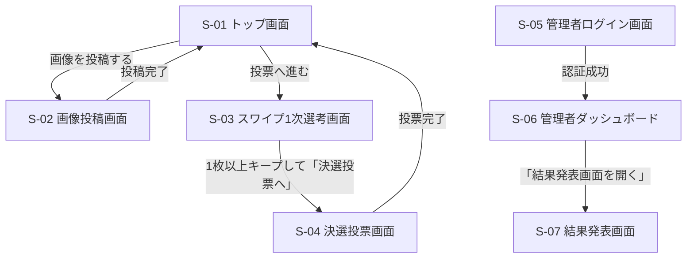

# 画面設計書 (UI Design Document)

## デザイン方針

### トーン&マナー
- ポップ、カジュアル、前向き（社内イベントのアイスブレイクにふさわしい明るさ）
- 「Dislike」を感じさせない、キープ操作が主役のポジティブな配色・言葉遣い
- スマートフォンでの片手操作を意識した、大きめのタップ領域とシンプルな構成

### 対象デバイス・環境
- 参加者向け画面（トップ／投稿／スワイプ／決選投票）: モバイル優先（スマートフォンのブラウザ）
- 運営向け画面（管理者ログイン／ダッシュボード／結果発表）: PC・タブレットでの利用も想定（結果発表画面はスクリーン投影を前提にデスクトップ幅で見やすくする）
- 対象ブラウザ: 最新版 Chrome / Safari（iOS Safari含む）

### 参考プロダクト
- Tinder: カードのスワイプ操作・アニメーションの参考

## 画面一覧

| 画面ID | 画面名 | 目的 | 主要素 | 対応機能 |
|--------|--------|------|--------|----------|
| S-01 | トップ画面 | イベント概要を伝え、投稿／投票への導線を提供する | イベント説明、2つの導線ボタン | フェーズ管理 |
| S-02 | 画像投稿画面 | ロゴ画像・投稿者名・一口メモを投稿する | アップロードフォーム | 画像アップロード機能 |
| S-03 | スワイプ1次選考画面 | 画像をランダム順に表示し、キープ／次へで仕分けする | スワイプカード、進捗バー | スワイプ式1次選考 |
| S-04 | 決選投票画面 | キープした画像から上位3つまで選んで投票する | グリッド選択、投票ボタン | 決選投票、匿名IDによる多重投票防止 |
| S-05 | 管理者ログイン画面 | 運営が管理者機能にアクセスするための認証 | パスワード入力フォーム | 結果発表（管理者画面） |
| S-06 | 管理者ダッシュボード | フェーズ切り替え、QRコード表示など運営操作を行う | フェーズ切替ボタン、QRコード | フェーズ管理、QRコード配布 |
| S-07 | 結果発表画面 | 得票ランキングと投稿者名を表示し、優勝者を発表する | ランキングリスト | 結果発表（管理者画面） |

## 画面遷移図



> S-05〜S-07 は `/admin` 配下のURLに直接アクセスすることで到達する（S-01からのリンクは設置しない。管理者パスワードによってのみ保護する）。S-06〜S-07 は有効な管理者セッションが無い場合、ページ本体をレンダリングする前にサーバー側（Server Component）でS-05へリダイレクトする（事前アクセスガード）。

## 画面詳細

### S-01: トップ画面

**目的**: イベントの概要を伝え、現在のフェーズに応じて「投稿する」「投票へ進む」の導線を出し分ける

**ワイヤーフレーム**:
```
┌────────────────────────────────────┐
│  🏆 社内AIイベント ロゴ投票アプリ      │
├────────────────────────────────────┤
│                                    │
│   イベントの概要説明テキスト          │
│   （ロゴ作成大会について）           │
│                                    │
│   ┌──────────────────────────┐     │
│   │   📤 画像を投稿する         │     │
│   └──────────────────────────┘     │
│   ┌──────────────────────────┐     │
│   │   🗳  投票へ進む            │     │
│   └──────────────────────────┘     │
│                                    │
└────────────────────────────────────┘
```

**レイアウト構成**:
- ヘッダー: イベントタイトル
- メイン: イベント概要テキスト、2つの導線ボタン

**主要コンポーネント**:
- Button（primary） × 2

**状態設計**:
| 状態 | 表示内容 | 遷移条件 |
|------|----------|----------|
| loading | フェーズ取得中はボタンをスケルトン表示 | `GET /api/phase` 実行中 |
| error | フェーズ取得失敗時、汎用エラーメッセージを表示しつつ両ボタンは活性のままにする（遷移先で個別にフェーズチェックされるため） | フェーズAPI取得失敗 |
| success | フェーズに応じてボタンの活性/非活性を出し分けて表示 | フェーズ取得成功 |
| disabled | `submission`中は「投票へ進む」を非活性にし「準備中」ラベルを添える／`voting`・`results`中は「画像を投稿する」を非活性にし「受付終了」ラベルを添える | 現在のフェーズによる |

**インタラクション**:
- 「画像を投稿する」タップ → S-02へ遷移
- 「投票へ進む」タップ → S-03へ遷移

---

### S-02: 画像投稿画面

**目的**: ロゴ画像・投稿者名・一口メモを入力し、投稿を完了する

**ワイヤーフレーム**:
```
┌────────────────────────────────────┐
│  ← 戻る    画像を投稿する             │
├────────────────────────────────────┤
│  ┌──────────────────────────┐      │
│  │   [画像を選択] (プレビュー)  │      │
│  └──────────────────────────┘      │
│  投稿者名 [___________________]    │
│  一口メモ [___________________]    │
│           [___________________]    │
│                                    │
│   ┌──────────────────────────┐     │
│   │        投稿する            │     │
│   └──────────────────────────┘     │
└────────────────────────────────────┘
```

**レイアウト構成**:
- ヘッダー: 戻る導線、画面タイトル
- メイン: 画像選択+プレビュー、投稿者名入力、一口メモ入力、送信ボタン

**主要コンポーネント**:
- ImagePicker（画面固有）
- Input（text）
- Textarea
- Button（primary、loading対応）
- Toast（success/error）

**状態設計**:
| 状態 | 表示内容 | 遷移条件 |
|------|----------|----------|
| uploading | Storageへの画像アップロード中は進捗率(%)を表示する（4G回線等で時間がかかってもフリーズと誤解されないようにする） | Storageへの直接PUT中 |
| loading | 署名付きURL取得・Logoレコード登録中はボタンをスピナー付きで非活性化 | アップロード完了後の送信リクエスト中 |
| error | フィールド直下にエラーメッセージ、または画面上部にToastでエラー表示 | バリデーション失敗／送信失敗 |
| success | 「投稿ありがとうございました」のToast表示後、S-01へ自動遷移 | 送信成功 |
| disabled | フェーズが`submission`でない場合、フォーム全体を非活性にし「投稿受付は終了しました」を表示 | フェーズ不一致 |

**入力・バリデーション**:
| 項目 | 必須 | 制約 | エラーメッセージ |
|------|------|------|------------------|
| ロゴ画像 | Yes | 10MB以下、jpg/png/heic/webp形式 | "画像は10MB以下のjpg/png/heic/webp形式でアップロードしてください" |
| 投稿者名 | Yes | 1-50文字 | "投稿者名を入力してください" |
| 一口メモ | Yes | 1-200文字 | "一口メモを入力してください" |

**インタラクション**:
- 画像選択 → プレビュー表示
- 「投稿する」タップ → バリデーション → 送信 → 成功Toast → S-01へ遷移

---

### S-03: スワイプ1次選考画面

**目的**: ランダム順に表示される画像を、右スワイプ（キープ）／左スワイプ（次へ）で仕分ける

**ワイヤーフレーム**:
```
┌────────────────────────────────────┐
│  投票フェーズ    進捗: ●●●●○○○○ (4/8) │
├────────────────────────────────────┤
│                                    │
│   ┌──────────────────────────┐     │
│   │                          │     │
│   │      [ロゴ画像]           │     │
│   │                          │     │
│   │  一口メモテキスト          │     │
│   └──────────────────────────┘     │
│                                    │
│   [ ✕ 次へ ]        [ ♥ キープ ]    │
│                                    │
└────────────────────────────────────┘
```

**レイアウト構成**:
- ヘッダー: 進捗バー（残り枚数）
- メイン: スワイプカード（画像＋一口メモ）、左右の操作ボタン（スワイプ操作の代替導線としても機能）

**主要コンポーネント**:
- SwipeCard（画面固有、`react-tinder-card`ベース）
- ProgressBar
- Button（icon付き） × 2

**状態設計**:
| 状態 | 表示内容 | 遷移条件 |
|------|----------|----------|
| loading | 画像一覧取得中はスケルトンカードを表示 | `GET /api/logos` 実行中 |
| empty | 「まだ投稿がありません」を表示し、トップ画面への導線を出す | 取得結果が0件 |
| error | 「読み込みに失敗しました」＋再試行ボタン | 一覧取得失敗 |
| success | カードスタックと進捗バーを表示 | 取得成功、かつ残り枚数 > 0 |
| disabled | 全カード仕分け完了時、キープ0枚なら「決選投票へ」ボタンを非活性にし「1枚以上キープしてください」と表示。1枚以上あれば活性化 | 全カード仕分け完了後 |

**インタラクション**:
- カードを右スワイプ／「キープ」ボタンタップ → `framer-motion`でカードを右方向へ200ms程度でフェードアウトさせ、淡いprimaryカラーのオーバーレイを一瞬表示 → キープとして記録、次のカードへ
- カードを左スワイプ／「次へ」ボタンタップ → `framer-motion`でカードを左方向へ200ms程度でフェードアウトさせ、淡いcolor-skipのオーバーレイを一瞬表示 → スキップとして記録、次のカードへ
- 本MVPでは効果音は実装せず、アニメーションのみでフィードバックする
- 全カード仕分け完了 → 「決選投票へ」ボタンを表示（条件はdisabled状態を参照）

---

### S-04: 決選投票画面

**目的**: キープした画像の中から上位3つまでを選んで決選投票する

**ワイヤーフレーム**:
```
┌────────────────────────────────────┐
│  ← 戻る   決選投票（最大3つまで選択）  │
├────────────────────────────────────┤
│  ┌─────┐ ┌─────┐ ┌─────┐          │
│  │ ✓画像 │ │ 画像  │ │ ✓画像 │  ...  │
│  └─────┘ └─────┘ └─────┘          │
│  ┌─────┐ ┌─────┐                  │
│  │ 画像  │ │ 画像  │                │
│  └─────┘ └─────┘                  │
│                                    │
│   選択中: 2/3                      │
│   ┌──────────────────────────┐     │
│   │        投票する            │     │
│   └──────────────────────────┘     │
└────────────────────────────────────┘
```

**レイアウト構成**:
- ヘッダー: 戻る導線、選択上限の案内
- メイン: キープ画像のグリッド一覧（タップで選択トグル）、選択数カウンター、投票ボタン

**主要コンポーネント**:
- SelectableGrid（画面固有）
- Counter（選択数表示）
- Button（primary、loading対応）
- Toast（success/error）

**状態設計**:
| 状態 | 表示内容 | 遷移条件 |
|------|----------|----------|
| loading | 投票送信中はボタンをスピナー付きで非活性化 | `POST /api/votes` 実行中 |
| empty | キープ画像が0件の場合、「キープした作品がありません」＋S-03へ戻る導線（本来S-03から遷移できないための保険） | キープ0件でこの画面に到達した場合 |
| error | 多重投票時「既に投票済みです」、フェーズ不一致時「投票は終了しました」 | 送信失敗（409／403等） |
| success | 「投票ありがとうございました」Toast表示後、S-01へ自動遷移 | 送信成功 |
| disabled | 3件選択済みの状態で4件目をタップすると選択不可（軽いフィードバックで通知）。投票送信済みの場合はグリッド全体を非活性化 | 選択数が上限、または投票済み |

**インタラクション**:
- 画像タップ → 選択トグル（最大3件、上限到達時は4件目の選択を無視し、対象カードを軽くシェイクさせつつ「最大3つまで選択できます」をToast(info)で0.5秒程度表示）
- 「投票する」タップ → 送信 → 成功Toast → S-01へ遷移

---

### S-05: 管理者ログイン画面

**目的**: 運営担当が管理者パスワードを入力し、管理者機能へのアクセス権を得る

**ワイヤーフレーム**:
```
┌────────────────────────────────────┐
│         管理者ログイン               │
├────────────────────────────────────┤
│                                    │
│   パスワード [_____________]        │
│                                    │
│   ┌──────────────────────────┐     │
│   │        ログイン            │     │
│   └──────────────────────────┘     │
│                                    │
└────────────────────────────────────┘
```

**レイアウト構成**:
- 中央寄せの単一フォーム（パスワード入力、ログインボタン）

**主要コンポーネント**:
- Input（password）
- Button（primary、loading対応）

**状態設計**:
| 状態 | 表示内容 | 遷移条件 |
|------|----------|----------|
| loading | ログインボタンがスピナー付きで非活性化 | `POST /api/admin/login` 実行中 |
| error | 「パスワードが正しくありません」をフォーム下に表示 | 認証失敗（401） |
| success | S-06へ遷移 | 認証成功 |

**入力・バリデーション**:
| 項目 | 必須 | 制約 | エラーメッセージ |
|------|------|------|------------------|
| パスワード | Yes | 1文字以上 | "パスワードを入力してください" |

---

### S-06: 管理者ダッシュボード

**目的**: 現在のイベントフェーズを確認・切り替え、会場配布用のQRコードを表示する

**ワイヤーフレーム**:
```
┌────────────────────────────────────┐
│  管理者ダッシュボード                 │
├────────────────────────────────────┤
│  現在のフェーズ: 投票中 (voting)      │
│                                    │
│  ┌──────────┐┌──────────┐┌───────┐│
│  │投稿受付開始││投票開始   ││結果発表││
│  └──────────┘└──────────┘└───────┘│
│                                    │
│  アプリURL QRコード                 │
│  ┌──────────┐                     │
│  │  [QR画像] │                     │
│  └──────────┘                     │
│                                    │
│   [ 結果発表画面を開く ]             │
└────────────────────────────────────┘
```

**レイアウト構成**:
- 現在フェーズの表示
- フェーズ切り替えボタン群（3フェーズ分）
- QRコード表示エリア
- 結果発表画面（S-07）への導線

**主要コンポーネント**:
- Badge（現在フェーズ表示）
- Button（フェーズ切替） × 3
- ConfirmDialog（フェーズ切替の確認）
- QRCodeDisplay（画面固有）
- Button（結果発表画面への遷移、CSVエクスポート）

**状態設計**:
| 状態 | 表示内容 | 遷移条件 |
|------|----------|----------|
| loading | フェーズ取得中はBadgeをスケルトン表示 | `GET /api/phase` 実行中 |
| confirming | フェーズ切替ボタンタップ直後、ConfirmDialogで「〇〇フェーズに切り替えます。よろしいですか？」を表示 | ボタンタップ直後 |
| error | フェーズ切り替え失敗時、Toastでエラー表示（画面は現在の状態を保持）。管理者セッション期限切れ(401)の場合は「セッションの有効期限が切れました。再度ログインしてください」を表示しS-05へリダイレクトする | フェーズ切替API失敗 |
| success | 現在のフェーズと切替ボタン群を表示 | 取得・切替成功 |
| disabled | 現在のフェーズより前方（逆行）のフェーズへの切替ボタンは非活性化する。現在フェーズと同じボタンも非活性化し、チェックマーク表示で選択中であることを示す（誤操作防止のため、進行方向のみ許可） | 現在フェーズによる |

**インタラクション**:
- フェーズ切替ボタンタップ → ConfirmDialog表示（「投票フェーズに切り替えます。投稿は締め切られます。よろしいですか？」等） → 確定でAPI呼び出し → 成功Toast
- 「結果発表画面を開く」タップ → S-07へ遷移（新しいタブでもよい）
- 印刷は専用ボタンを設けず、ブラウザ標準の印刷機能（Ctrl+P等）を利用する想定とする

---

### S-07: 結果発表画面

**目的**: 得票数ランキングを画像・一口メモ・投稿者名とともに表示し、スクリーン投影で優勝者を発表する

**ワイヤーフレーム**:
```
┌────────────────────────────────────┐
│           結果発表                  │
├────────────────────────────────────┤
│  🥇 1位  [画像]  山田太郎           │
│         "一口メモ"  15票            │
│                                    │
│  🥈 2位  [画像]  佐藤花子           │
│         "一口メモ"  12票            │
│                                    │
│  🥉 3位  [画像]  鈴木一郎  [同着]    │
│         "一口メモ"  10票            │
│  ...                               │
└────────────────────────────────────┘
```

**レイアウト構成**:
- ランキングリスト（縦スクロール、順位が高いほど視覚的に強調）
- 同着（ランオフ対象）にはバッジを付与

**主要コンポーネント**:
- RankingList（画面固有）
- Badge（同着表示用）

**状態設計**:
| 状態 | 表示内容 | 遷移条件 |
|------|----------|----------|
| loading | ランキング集計中はスケルトン表示 | `GET /api/admin/results` 実行中 |
| empty | 「まだ投票がありません」を表示 | 投票データが0件 |
| error | フェーズが`results`でない場合「結果発表はまだ準備中です」を表示。管理者セッション期限切れ(401)の場合は「セッションの有効期限が切れました。再度ログインしてください」を表示しS-05へリダイレクトする | フェーズ不一致／セッション期限切れ |
| success | ランキングリストを表示、同着作品には「同着（ランオフ対象）」バッジを表示 | 集計成功 |

## UIコンポーネント一覧（共通＋画面固有）

| コンポーネント | 用途 | 区分 | バリアント | 主なprops/状態 |
|----------------|------|------|-----------|----------------|
| Button | アクション実行 | 共通 | primary / secondary / icon | disabled, loading |
| Input | テキスト入力（投稿者名、パスワード等） | 共通 | text / password | error, disabled |
| Textarea | 複数行テキスト入力（一口メモ） | 共通 | - | error, disabled, maxLength |
| Toast | 一時通知 | 共通 | success / error / info | - |
| ProgressBar | 1次選考の進捗表示 | 共通 | - | current, total |
| Badge | フェーズ・同着等のラベル表示 | 共通 | default / warning | - |
| ConfirmDialog | 不可逆操作（フェーズ切替等）の確認 | 共通 | - | title, message, onConfirm, onCancel |
| SwipeCard | 1次選考のカードUI | 画面固有(S-03) | - | image, memo, onSwipeLeft, onSwipeRight |
| SelectableGrid | 決選投票の複数選択グリッド | 画面固有(S-04) | - | items, maxSelectable, selected |
| Counter | 決選投票の選択数表示 | 画面固有(S-04) | - | current, max |
| QRCodeDisplay | アプリURLのQRコード表示 | 画面固有(S-06) | - | url |
| RankingList | 結果発表のランキング表示 | 画面固有(S-07) | - | items |

## デザインシステム(デザイントークン)

### カラーパレット
| トークン | 値 | 用途 |
|----------|-----|------|
| color-primary | #FF6B6B | キープ・投稿・投票などの主要アクション（温かみのある珊瑚色） |
| color-secondary | #4ECDC4 | 補助アクション・アクセント |
| color-skip | #A0AEC0 | 「次へ（スキップ）」操作。ネガティブな印象を避けるため彩度を抑える |
| color-danger | #E53E3E | エラー表示 |
| color-text | #1A202C | 本文 |
| color-text-muted | #718096 | 補足テキスト |
| color-bg | #FFFFFF | 背景 |
| color-bg-muted | #F7F8FA | カード・セクション背景 |

### タイポグラフィ
| トークン | サイズ / 行間 / ウェイト | 用途 |
|----------|--------------------------|------|
| text-h1 | 28px / 1.3 / bold | 画面タイトル |
| text-h2 | 20px / 1.4 / semibold | セクション見出し |
| text-body | 16px / 1.6 / regular | 本文・フォームラベル |
| text-caption | 13px / 1.4 / regular | 補足・エラーメッセージ |

### スペーシング
- 4 / 8 / 16 / 24 / 32 / 48px のスケールを使用

## レスポンシブ方針

### ブレークポイント
| 名称 | 幅 | レイアウト方針 |
|------|-----|----------------|
| mobile | ~767px | 1カラム、フルスクリーンのスワイプカード、ボタンは画面幅いっぱい |
| tablet | 768~1023px | フォーム・グリッドは中央寄せで最大幅600px程度に制限 |
| desktop | 1024px~ | 管理者画面・結果発表画面はゆったりとした余白で中央最大幅800px程度に配置（スクリーン投影を意識） |

## アクセシビリティ方針

- [ ] 準拠レベル: WCAG 2.1 AA相当を目標とする（社内向け短期イベントのため必須要件は主要項目に絞る）
- [ ] キーボードのみで主要操作（投稿・スワイプ代替ボタン・投票・管理者操作）が可能
- [ ] テキストと背景のコントラスト比を確保(通常テキスト 4.5:1 以上)
- [ ] フォーム要素にラベルを関連付け
- [ ] ロゴ画像には一口メモまたは「投稿されたロゴ画像」を代替テキストとして付与
- [ ] フォーカス状態が視覚的に分かる
- [ ] スワイプ操作には必ずボタンによる代替操作を用意する
- [ ] 進捗バー・Toast等の動的に更新される箇所には`aria-live`領域を用い、スクリーンリーダー利用者にも変化を伝える

## トレーサビリティ

| 画面ID | 対応する機能要件(PRD/機能設計) |
|--------|-------------------------------|
| S-01 | フェーズ管理（投稿フェーズ／投票フェーズ） |
| S-02 | 画像アップロード機能 |
| S-03 | スワイプ式1次選考（Tinder風UI） |
| S-04 | 決選投票、匿名IDによる多重投票防止 |
| S-05 | 結果発表（管理者画面）のアクセス制御 |
| S-06 | フェーズ管理、QRコード配布 |
| S-07 | 結果発表（管理者画面） |
