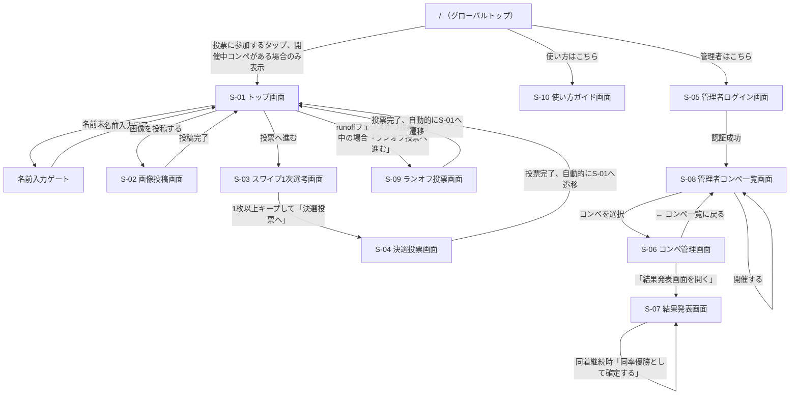

# 画面設計書 (UI Design Document)

## デザイン方針

### トーン&マナー
- ポップ、カジュアル、前向き（社内イベントのアイスブレイクにふさわしい明るさ）
- 「Dislike」を感じさせない、キープ操作が主役のポジティブな配色・言葉遣い
- スマートフォンでの片手操作を意識した、大きめのタップ領域とシンプルな構成
- **ビジュアルコンセプト「PRESS PROOF（印刷校正紙）」**（2026-07-22刷新）: 「ロゴ作成大会」という題材（グラフィックデザインの投稿・審査）に根ざし、投稿されたロゴを印刷の校正刷りとして審査する見立てに基づく。トンボ（crop marks）・色校正バー・検版スタンプ風のランクバッジを視覚言語とする。詳細は「デザインシステム(デザイントークン)」を参照

### 対象デバイス・環境
- 参加者向け画面（トップ／投稿／スワイプ／決選投票、いずれもコンペ専用URL `/c/[slug]/...` 配下）: モバイル優先（スマートフォンのブラウザ）
- 運営向け画面（管理者ログイン／コンペ一覧／コンペ管理／結果発表）: PC・タブレットでの利用も想定（結果発表画面はスクリーン投影を前提にデスクトップ幅で見やすくする）
- 対象ブラウザ: 最新版 Chrome / Safari（iOS Safari含む）

### 参考プロダクト
- Tinder: カードのスワイプ操作・アニメーションの参考

## 画面一覧

| 画面ID | 画面名 | 目的 | 主要素 | 対応機能 |
|--------|--------|------|--------|----------|
| S-01 | トップ画面 | コンペ概要を伝え、投稿／投票への導線を提供する（`/c/[slug]`） | コンペ説明、2つの導線ボタン | フェーズ管理、参加者名入力ゲート |
| S-02 | 画像投稿画面 | ロゴ画像・投稿者名・一口メモを投稿する | アップロードフォーム | 画像アップロード機能 |
| S-03 | スワイプ1次選考画面 | 画像をランダム順に表示し、キープ／次へで仕分けする | スワイプカード、進捗バー | スワイプ式1次選考 |
| S-04 | 決選投票画面 | キープした画像から上位3つまで選んで投票する | グリッド選択、投票ボタン | 決選投票、匿名IDによる多重投票防止 |
| S-05 | 管理者ログイン画面 | 運営が管理者機能にアクセスするための認証 | パスワード入力フォーム | 結果発表（管理者画面） |
| S-06 | コンペ管理画面 | 対象コンペのフェーズ切り替え、QRコード表示など運営操作を行う | フェーズ切替ボタン、QRコード | フェーズ管理、QRコード配布 |
| S-07 | 結果発表画面 | 対象コンペの得票ランキングと投稿者名をアニメーション付きで表示し、優勝者を発表する | ランキングリスト、発表開始ボタン | 結果発表（管理者画面） |
| S-08 | 管理者コンペ一覧画面 | コンペの新規開催と、過去に開催したコンペの一覧・結果閲覧への導線を提供する | 題名入力＋開催ボタン、コンペ一覧 | コンペ管理（開催・専用URL発行） |
| S-09 | ランオフ投票画面 | 決選投票で同着になった作品から1つだけ選んでランオフ投票する | 単一選択グリッド、投票ボタン | ランオフ（同数得票時の再投票） |
| S-10 | 使い方ガイド画面 | 参加者向けに、参加方法から結果発表までの流れを実画面のスクリーンショット付きで説明する（`/how-to-use`） | ステップ説明、スクリーンショット、FAQ | なし（参加フロー自体の機能ではなく、ヘルプコンテンツ） |

## 画面遷移図



> `/`（グローバルトップ）は開催中コンペの有無にかかわらず自動リダイレクトせず、明示的な導線ボタンを表示する。開催中コンペがある場合のみ「投票に参加する」ボタンを表示し、常に「使い方はこちら」リンク（S-10）と「管理者はこちら」リンク（S-05）を表示する。**方針変更**: 従来「参加者向け画面から管理者画面へのリンクは設置しない」としていたが、グローバルトップに限り管理者画面へのリンクを設置する方針に変更した。`/c/[slug]`配下（S-01〜S-04）からは引き続き管理者画面へのリンクを設置しない（S-05〜S-08は`/admin`配下のURLへの直接アクセスとパスワードによってのみ保護する）。S-06〜S-08 は有効な管理者セッションが無い場合、ページ本体をレンダリングする前にサーバー側（Server Component）でS-05へリダイレクトする（事前アクセスガード）。
>
> 参加者向け画面（S-01〜S-04）はいずれも`/c/[slug]/...`配下に置かれ、アクセス時にslugが存在しない場合は404、対象コンペが`closed`または`currentPhase`が`ended`の場合は「このコンペは終了しました」等の案内を表示する（各画面共通の前段チェックとして扱い、画面ごとの状態設計としては個別に記載しない）。上記の閉鎖判定を通過した場合、参加者名（何でもよい・匿名可）が未入力であれば名前入力ゲートを表示し、入力完了後にS-01以降へ進める（画像投稿画面の投稿者名として自動的に使用される。詳細はS-01を参照）。

## 画面詳細

### S-01: トップ画面

**目的**: コンペの概要を伝え、現在のフェーズに応じて「投稿する」「投票へ進む」の導線を出し分ける（`/c/[slug]`）

**ワイヤーフレーム**:
```
┌────────────────────────────────────┐
│  🏆 第2回ロゴ作成大会                 │
├────────────────────────────────────┤
│                                    │
│   イベントの概要説明テキスト          │
│   （ロゴ作成大会について）           │
│                                    │
│   ┌──────────────────────────┐     │
│   │   📤 画像を投稿する         │     │
│   └──────────────────────────┘     │
│   ┌──────────────────────────┐     │
│   │   🗳  投票へ進む            │     │
│   └──────────────────────────┘     │
│                                    │
└────────────────────────────────────┘
```

**レイアウト構成**:
- ヘッダー: コンペの題名
- メイン: コンペ概要テキスト、2つの導線ボタン

**主要コンポーネント**:
- Button（primary） × 2
- NameGate（画面固有ではなく`/c/[slug]`配下共通。名前未入力時にS-01を含む配下画面のレンダリングをブロックし、名前入力フォームを表示する）

**状態設計**:
| 状態 | 表示内容 | 遷移条件 |
|------|----------|----------|
| nameGate | 参加者名（何でもよい・匿名可）が未入力の場合、S-01本体の代わりに名前入力フォーム（「はじめる」ボタン）を表示する | 名前未入力 |
| loading | フェーズ取得中はボタンをスケルトン表示 | `GET /api/c/[slug]/phase` 実行中 |
| error | フェーズ取得失敗時、汎用エラーメッセージを表示しつつ両ボタンは活性のままにする（遷移先で個別にフェーズチェックされるため） | フェーズAPI取得失敗 |
| success | フェーズに応じてボタンの活性/非活性を出し分けて表示。表示中も5秒間隔でフェーズを再取得し、運営がフェーズを切り替えた場合はリロード無しでボタンの活性/非活性を追従させる | フェーズ取得成功 |
| disabled | `submission`中は「投票へ進む」を非活性にし「準備中」ラベルを添える／`voting`・`results`中は「画像を投稿する」を非活性にし「受付終了」ラベルを添える | 現在のフェーズによる |
| voted | このブラウザで決選投票（S-04）が完了済みの場合、`runoff`以外のフェーズでは「投票へ進む」ボタンの代わりにフェーズ別の投票済みメッセージ（`voting`:「投票ありがとうございました。結果発表をお楽しみに🎉」／`results`:「ただいま結果発表中です。会場の画面をご確認ください」／`ended`:「コンペは終了しました。ご参加ありがとうございました」）を表示する | ブラウザの`localStorage`に決選投票済みの記録がある場合（S-04で投票成功時に記録） |
| runoffOpen | `runoff`フェーズかつ現在受付中のランオフラウンドがあり（`runoffRound`が非null）、当該ラウンドに未投票の場合、「⚖️ ランオフ投票へ進む」ボタンを表示する（round1未投票者にもボタン自体は表示し、参加資格の判定はS-09側で行う。理由はS-09を参照） | `runoff`フェーズかつ`runoffRound`非nullかつ当該ラウンド未投票 |
| runoffWaiting | `runoff`フェーズで、現在受付中のランオフラウンドが無い（`runoffRound`がnull＝運営が締め切って再投票/同率優勝を検討中）、または当該ラウンドに投票済みの場合、待機メッセージ（前者:「同着があったため、ランオフを集計中です。会場の画面をご確認ください」／後者:「ランオフ投票ありがとうございました。結果発表をお楽しみに🎉」）を表示する | `runoff`フェーズかつ（`runoffRound`がnull、または当該ラウンド投票済み） |

**インタラクション**:
- 名前未入力時、名前を入力し「はじめる」タップ → ブラウザに保存（`localStorage`）し、以後S-02の投稿者名として自動使用する → S-01本体を表示
- 「画像を投稿する」タップ → S-02へ遷移
- 「投票へ進む」タップ → S-03へ遷移
- S-04で決選投票が完了すると自動的にS-01へ遷移してくる。この際「投票へ進む」ボタンは`voted`状態（上記参照）に切り替わっており、再度投票フローへ進むことはできない（同一ブラウザである限りリロードしても維持される。別ブラウザ・別端末では対象外）
- 「ランオフ投票へ進む」タップ → S-09へ遷移。S-09で投票が完了すると自動的にS-01へ遷移してくる

**ルート（`/`）での挙動**: `/`はグローバルトップとして常に表示され、自動リダイレクトは行わない。`GET /api/competitions/active`相当の情報を取得し、開催中コンペがあれば「投票に参加する」ボタン（`/c/{slug}`＝S-01への遷移）を、無い場合は案内文を表示する。いずれの場合も「管理者はこちら」リンク（`/admin`）を常に表示する。

```
┌────────────────────────────────────┐
│  🏆 社内AIイベント ロゴ投票アプリ      │
├────────────────────────────────────┤
│                                    │
│   ┌──────────────────────────┐     │
│   │      投票に参加する         │     │  ← 開催中コンペがある場合のみ
│   └──────────────────────────┘     │
│   （無い場合）現在開催中のコンペは     │
│   ありません                        │
│                                    │
│         管理者はこちら               │
└────────────────────────────────────┘
```

---

### S-02: 画像投稿画面

**目的**: ロゴ画像・一口メモを入力し、投稿を完了する（投稿者名は名前入力ゲートで取得済みの参加者名を自動使用する）

**ワイヤーフレーム**:
```
┌────────────────────────────────────┐
│  ← 戻る    画像を投稿する             │
├────────────────────────────────────┤
│  ┌──────────────────────────┐      │
│  │   [画像を選択] (プレビュー)  │      │
│  └──────────────────────────┘      │
│  一口メモ [___________________]    │
│           [___________________]    │
│                                    │
│   ┌──────────────────────────┐     │
│   │        投稿する            │     │
│   └──────────────────────────┘     │
└────────────────────────────────────┘
```

**レイアウト構成**:
- ヘッダー: 戻る導線、画面タイトル
- メイン: 画像選択+プレビュー、一口メモ入力、送信ボタン（投稿者名の入力欄は無く、名前入力ゲートで取得済みの参加者名を自動送信する）

**主要コンポーネント**:
- ImagePicker（画面固有）
- Input（text）
- Textarea
- Button（primary、loading対応）
- Toast（success/error）

**状態設計**:
| 状態 | 表示内容 | 遷移条件 |
|------|----------|----------|
| uploading | Storageへの画像アップロード中は進捗率(%)を表示する（4G回線等で時間がかかってもフリーズと誤解されないようにする） | Storageへの直接PUT中 |
| loading | 署名付きURL取得・Logoレコード登録中はボタンをスピナー付きで非活性化 | アップロード完了後の送信リクエスト中 |
| error | フィールド直下にエラーメッセージ、または画面上部にToastでエラー表示 | バリデーション失敗／送信失敗 |
| success | 「投稿ありがとうございました」のToast表示後、S-01へ自動遷移 | 送信成功 |
| disabled | フェーズが`submission`でない場合、フォーム全体を非活性にし「投稿受付は終了しました」を表示 | フェーズ不一致 |

**入力・バリデーション**:
| 項目 | 必須 | 制約 | エラーメッセージ |
|------|------|------|------------------|
| ロゴ画像 | Yes | 10MB以下、jpg/png/heic/webp形式 | "画像は10MB以下のjpg/png/heic/webp形式でアップロードしてください" |
| 一口メモ | Yes | 1-200文字 | "一口メモを入力してください" |

投稿者名は本画面では入力せず、名前入力ゲート（S-01参照）で取得済みの参加者名（1-50文字）をそのまま送信する。

**インタラクション**:
- 画像選択 → プレビュー表示
- 「投稿する」タップ → バリデーション → 送信 → 成功Toast → S-01へ遷移

---

### S-03: スワイプ1次選考画面

**目的**: ランダム順に表示される画像を、右スワイプ（キープ）／左スワイプ（次へ）で仕分ける

**ワイヤーフレーム**（PRESS PROOF: カード四隅にトンボ、画像直下に色校正バー）:
```
┌────────────────────────────────────┐
│  投票フェーズ    進捗: ●●●●○○○○ (4/8) │
├────────────────────────────────────┤
│  ⌐                              ¬  │
│    ┌──────────────────────────┐    │
│    │                          │    │
│    │      [ロゴ画像]           │    │
│    │                          │    │
│    │  ■■■■ (色校正バー)        │    │
│    │  一口メモテキスト          │    │
│    └──────────────────────────┘    │
│  L                              ⌐  │
│                                    │
│   [ ✕ 次へ ]        [ ♥ キープ ]    │
│                                    │
└────────────────────────────────────┘
```

**レイアウト構成**:
- ヘッダー: 進捗バー（残り枚数）
- メイン: スワイプカード（画像＋一口メモ）、左右の操作ボタン（スワイプ操作の代替導線としても機能）
- カードの四隅にCropMarks（トンボ）、画像直下にColorBar（色校正バー）を配置し、投稿ロゴを「校正紙」として審査する見立てを表現する（PRESS PROOFのシグネチャー要素。2026-07-22刷新）

**主要コンポーネント**:
- SwipeCard（画面固有、`framer-motion`のドラッグジェスチャーベース。CropMarks・ColorBarを内包）
- ProgressBar
- Button（icon付き） × 2

**状態設計**:
| 状態 | 表示内容 | 遷移条件 |
|------|----------|----------|
| loading | 画像一覧取得中はスケルトンカードを表示 | `GET /api/c/[slug]/logos` 実行中 |
| empty | 「まだ投稿がありません」を表示し、トップ画面への導線を出す | 取得結果が0件 |
| error | 「読み込みに失敗しました」＋再試行ボタン | 一覧取得失敗 |
| success | カードスタックと進捗バーを表示 | 取得成功、かつ残り枚数 > 0 |
| disabled | 全カード仕分け完了時、キープ0枚なら「決選投票へ」ボタンを非活性にし「1枚以上キープしてください」と表示。1枚以上あれば活性化 | 全カード仕分け完了後 |

**インタラクション**:
- カードを右スワイプ／「キープ」ボタンタップ → `framer-motion`でカードを右方向へ200ms程度でフェードアウトさせ、淡いprimaryカラーのオーバーレイを一瞬表示 → キープとして記録、次のカードへ
- カードを左スワイプ／「次へ」ボタンタップ → `framer-motion`でカードを左方向へ200ms程度でフェードアウトさせ、淡いcolor-skipのオーバーレイを一瞬表示 → スキップとして記録、次のカードへ
- 本MVPでは効果音は実装せず、アニメーションのみでフィードバックする
- 全カード仕分け完了 → 「決選投票へ」ボタンを表示（条件はdisabled状態を参照）

---

### S-04: 決選投票画面

**目的**: キープした画像の中から上位3つまでを選んで決選投票する

**ワイヤーフレーム**:
```
┌────────────────────────────────────┐
│  ← 戻る   決選投票（最大3つまで選択）  │
├────────────────────────────────────┤
│  ┌─────┐ ┌─────┐ ┌─────┐          │
│  │ ✓画像 │ │ 画像  │ │ ✓画像 │  ...  │
│  └─────┘ └─────┘ └─────┘          │
│  ┌─────┐ ┌─────┐                  │
│  │ 画像  │ │ 画像  │                │
│  └─────┘ └─────┘                  │
│                                    │
│   選択中: 2/3                      │
│   ┌──────────────────────────┐     │
│   │        投票する            │     │
│   └──────────────────────────┘     │
└────────────────────────────────────┘
```

**レイアウト構成**:
- ヘッダー: 戻る導線、選択上限の案内
- メイン: キープ画像のグリッド一覧（タップで選択トグル）、選択数カウンター、投票ボタン

**主要コンポーネント**:
- SelectableGrid（画面固有）
- Counter（選択数表示）
- Button（primary、loading対応）
- Toast（success/error）

**状態設計**:
| 状態 | 表示内容 | 遷移条件 |
|------|----------|----------|
| loading | 投票送信中はボタンをスピナー付きで非活性化 | `POST /api/c/[slug]/votes` 実行中 |
| empty | キープ画像が0件の場合、「キープした作品がありません」＋S-03へ戻る導線（本来S-03から遷移できないための保険） | キープ0件でこの画面に到達した場合 |
| error | 多重投票時「既に投票済みです」、フェーズ不一致時「投票は終了しました」 | 送信失敗（409／403等） |
| success | 「投票ありがとうございました」Toast表示後、ブラウザに決選投票済みを記録し、S-01（`/c/[slug]`）へ自動遷移する（下記参照） | 送信成功 |
| disabled | 3件選択済みの状態で4件目をタップすると選択不可（軽いフィードバックで通知）。投票送信済みの場合はグリッド全体を非活性化 | 選択数が上限、または投票済み |

**インタラクション**:
- 画像タップ → 選択トグル（最大3件、上限到達時は4件目の選択を無視し、対象カードを軽くシェイクさせつつ「最大3つまで選択できます」をToast(info)で0.5秒程度表示）
- 「投票する」タップ → 送信 → 成功Toast → ブラウザの`localStorage`に決選投票済みを記録 → 約2秒後にS-01へ自動遷移

**投票完了後の遷移**: 投票送信成功後はS-04内には留まらず、S-01（トップ画面）へ自動的に遷移する。S-01は遷移後、この記録に基づき「投票へ進む」ボタンを非活性化し、フェーズに応じたメッセージ（投票直後／結果発表中／コンペ終了）を表示する（詳細はS-01の「状態設計」の`voted`状態を参照）。フェーズの進行に追従するポーリングも、この時点からはS-01側の`usePhasePolling`（5秒間隔）が担う。

---

### S-05: 管理者ログイン画面

**目的**: 運営担当が管理者パスワードを入力し、管理者機能へのアクセス権を得る

**ワイヤーフレーム**:
```
┌────────────────────────────────────┐
│         管理者ログイン               │
├────────────────────────────────────┤
│                                    │
│   パスワード [_____________]        │
│                                    │
│   ┌──────────────────────────┐     │
│   │        ログイン            │     │
│   └──────────────────────────┘     │
│                                    │
└────────────────────────────────────┘
```

**レイアウト構成**:
- 中央寄せの単一フォーム（パスワード入力、ログインボタン）

**主要コンポーネント**:
- Input（password）
- Button（primary、loading対応）

**状態設計**:
| 状態 | 表示内容 | 遷移条件 |
|------|----------|----------|
| loading | ログインボタンがスピナー付きで非活性化 | `POST /api/admin/login` 実行中 |
| error | 「パスワードが正しくありません」をフォーム下に表示 | 認証失敗（401） |
| success | S-06へ遷移 | 認証成功 |

**入力・バリデーション**:
| 項目 | 必須 | 制約 | エラーメッセージ |
|------|------|------|------------------|
| パスワード | Yes | 1文字以上 | "パスワードを入力してください" |

---

### S-06: コンペ管理画面

**目的**: 対象コンペの現在フェーズを確認・切り替え、会場配布用のQRコードを表示する（`/admin/competitions/[id]`）

**ワイヤーフレーム**:
```
┌────────────────────────────────────┐
│  ← コンペ一覧    第2回ロゴ作成大会     │
├────────────────────────────────────┤
│  現在のフェーズ: 投票中 (voting)      │
│                                    │
│ ┌────────┐┌────────┐┌────────┐┌──────┐│
│ │投稿受付開始││投票開始 ││結果発表 ││終了  ││
│ └────────┘└────────┘└────────┘└──────┘│
│                                    │
│  コンペ専用URL QRコード              │
│  ┌──────────┐                     │
│  │  [QR画像] │  /c/x7k2p9          │
│  └──────────┘                     │
│                                    │
│  投稿状況（12件）                    │
│  ┌──────────────────────────────┐  │
│  │ [サムネ] 山田太郎  一口メモ...    │↕│ ← スクロール領域（最大高さ固定）
│  │ [サムネ] 佐藤花子  一口メモ...    │  │
│  │ ...                            │  │
│  └──────────────────────────────┘  │
│  投票状況: 投票済み8人 / 総投票数20票 │
│                                    │
│   [ 結果発表画面を開く ]             │
└────────────────────────────────────┘
```

**レイアウト構成**:
- ヘッダー: コンペ一覧（S-08）への戻る導線、コンペの題名
- 現在フェーズの表示
- フェーズ切り替えボタン群（4フェーズ分。投稿受付開始／投票開始／結果発表／コンペを終了する。`runoff`は対象外で、S-07の専用操作からのみ遷移する。理由は下記「状態設計」を参照）
- QRコード表示エリア（コンペ専用URLの文字列も併記）
- 投稿状況セクション（投稿数、投稿ごとのサムネイル・投稿者名・一口メモ・投稿日時の一覧。件数が多くても画面全体が伸びないよう、最大高さを固定したスクロール領域として表示する。見出し「投稿状況（N件）」自体はスクロール対象外）
- 投票状況セクション（投票済み人数、総投票数）
- 結果発表画面（S-07）への導線

**主要コンポーネント**:
- Badge（現在フェーズ表示）
- Button（フェーズ切替） × 4
- ConfirmDialog（フェーズ切替の確認。「コンペを終了する」ボタンでは「コンペを終了します。参加者は以後アクセスできなくなります。よろしいですか？」を表示）
- QRCodeDisplay（画面固有）
- Button（結果発表画面への遷移、CSVエクスポート）

**状態設計**:
| 状態 | 表示内容 | 遷移条件 |
|------|----------|----------|
| loading | フェーズ取得中はBadgeをスケルトン表示 | `GET /api/admin/competitions/[id]`（または一覧から渡された初期値）実行中 |
| confirming | フェーズ切替ボタンタップ直後、ConfirmDialogで「〇〇フェーズに切り替えます。よろしいですか？」を表示 | ボタンタップ直後 |
| error | フェーズ切り替え失敗時、Toastでエラー表示（画面は現在の状態を保持）。管理者セッション期限切れ(401)の場合は「セッションの有効期限が切れました。再度ログインしてください」を表示しS-05へリダイレクトする | フェーズ切替API失敗 |
| success | 現在のフェーズと切替ボタン群を表示 | 取得・切替成功 |
| disabled | 現在のフェーズより前方（逆行）のフェーズへの切替ボタンは非活性化する。現在フェーズと同じボタンも非活性化し、チェックマーク表示で選択中であることを示す（誤操作防止のため、進行方向のみ許可）。`runoff`フェーズ中も、本画面のボタン群は`results`より前方をすべて非活性、「コンペを終了する」のみ活性のままとする（`runoff`自体はこのボタン群からは選択できない） | 現在フェーズによる |
| statsLoaded | 投稿状況・投票状況セクションを表示する（取得失敗時はセクション自体を表示しない。フェーズ操作をブロックしない） | `GET /api/admin/competitions/[id]/stats` 成功 |

**`runoff`フェーズをこのボタン群から除外する理由**: `runoff`フェーズへの遷移はランオフ対象Logoのスナップショット作成（`RunoffRound`レコードの作成）を伴う。この汎用フェーズ切替ボタンから単純にフェーズだけを`runoff`に変更できてしまうと、対象Logoが存在しないまま`runoff`フェーズに入ってしまい、S-09（ランオフ投票画面）が機能しない状態から復旧できなくなる。そのため`runoff`への遷移は必ずS-07の「ランオフを開始」操作（`POST /api/admin/competitions/[id]/runoff/start`）を経由させる。

**インタラクション**:
- 「← コンペ一覧」タップ → S-08へ遷移
- フェーズ切替ボタンタップ → ConfirmDialog表示（「投票フェーズに切り替えます。投稿は締め切られます。よろしいですか？」「コンペを終了します。参加者は以後アクセスできなくなります。よろしいですか？」等） → 確定で`POST /api/admin/competitions/[id]/phase`を呼び出し → 成功Toast
- 「結果発表画面を開く」タップ → S-07へ遷移（新しいタブでもよい）
- 印刷は専用ボタンを設けず、ブラウザ標準の印刷機能（Ctrl+P等）を利用する想定とする

---

### S-07: 結果発表画面

**目的**: 得票数ランキングを画像・一口メモ・投稿者名とともにアニメーションで表示し、スクリーン投影で優勝者を発表する（`/admin/competitions/[id]/results`）

**ワイヤーフレーム（発表開始前）**:
```
┌────────────────────────────────────┐
│  第2回ロゴ作成大会 結果発表           │
│                     [ 発表開始 ]     │
├────────────────────────────────────┤
│  🥇 1位  [画像]  山田太郎           │
│         "一口メモ"  15票            │
│                                    │
│  🥈 2位  [画像]  佐藤花子           │
│         "一口メモ"  12票            │
│                                    │
│  🥉 3位  [画像]  鈴木一郎  [同着]    │
│         "一口メモ"  10票            │
│  ...                               │
└────────────────────────────────────┘
```

**ワイヤーフレーム（発表中①: タイムラプス再生。投票を時系列順に1票ずつ再生し、棒グラフが伸び縮み・順位入れ替えする）**:
```
┌────────────────────────────────────┐
│  第2回ロゴ作成大会 結果発表           │
├────────────────────────────────────┤
│  [サムネ] 山田太郎  ■■■■■■■□□□ 6票 │
│  [サムネ] 佐藤花子  ■■■■□□□□□□ 4票 │
│  [サムネ] 鈴木一郎  ■■□□□□□□□□ 2票 │
│  ...                                │
│  （投票日時順に1票ずつ加算、棒の長さと順位がリアルタイムに変化）│
└────────────────────────────────────┘
```

**ワイヤーフレーム（発表中②: 下位から上位へ順にスライドイン、得票数がカウントアップ）**:
```
┌────────────────────────────────────┐
│  第2回ロゴ作成大会 結果発表           │
├────────────────────────────────────┤
│  ↑ スライドイン                     │
│  🥉 3位  [画像]  鈴木一郎  [同着]    │
│         "一口メモ"  10票 ⬅ 0→10へカウントアップ中│
│                                    │
│  （4位以下は先に表示済み・下方向へ押し出される）│
└────────────────────────────────────┘
```

**レイアウト構成**:
- ヘッダー: コンペの題名、「発表開始」ボタン
- ランオフ操作エリア（同着がある場合、またはランオフ実施中の場合のみ表示。詳細は下記「状態設計」の`runoffAction*`各状態を参照）
- ランキングリスト（縦スクロール、順位が高いほど視覚的に強調）
- 同着（ランオフ対象）にはバッジを、同率優勝が確定した対象には別バッジ（🤝 同率）を付与
- **画面全体をInk（暗転ステージ）背景にする**（PRESS PROOF、2026-07-22刷新）。スクリーン投影・薄暗い会場での視認性を意図した意図的な演出。ランキング各行はPaper系の明るいカード背景（`bg-bg-muted`）を個別に持つため、Ink背景上でも十分なコントラストで表示される。ランクバッジ（🥇🥈🥉／数字）は検版の合格スタンプを模した、回転を付けた二重リングの円形バッジで表示する。`AnimatedRankingList`ではこのバッジが出現時にスタンプが押されるような弾むアニメーションをする

**主要コンポーネント**:
- RankingList（画面固有、発表開始前の静的な確認表示用。検版スタンプ風ランクバッジを表示）
- VoteTimelapseChart（画面固有、発表開始直後の投票タイムラプス演出用。`framer-motion`使用。投票データを時系列順に1票ずつ再生し、得票数に応じて棒グラフの幅と並び順をリアルタイムに更新する。再生時間は投票数に応じて自動調整（目標総尺12秒、1票あたり60〜1200msの範囲でクランプ）。投票0件の投稿も棒の長さ0で表示に含める）
- AnimatedRankingList（画面固有、タイムラプス完了後のスライドイン＋カウントアップ演出用。`framer-motion`使用。検版スタンプ風ランクバッジのスタンプ演出付き。同率優勝が確定した対象には🤝バッジも表示する）
- Badge（同着・同率優勝表示用）
- Button（「発表開始」「ランオフを開始」「ランオフを締め切る」「再投票する」「同率優勝として確定する」）

**状態設計**:
| 状態 | 表示内容 | 遷移条件 |
|------|----------|----------|
| loading | ランキング集計中はスケルトン表示 | `GET /api/admin/competitions/[id]/results`・`GET /api/admin/competitions/[id]/results/timeline` 実行中（並行取得） |
| empty | 「まだ投票がありません」を表示 | 投票データが0件 |
| error | 対象コンペの`currentPhase`が`results`未満の場合「結果発表はまだ準備中です」を表示。管理者セッション期限切れ(401)の場合は「セッションの有効期限が切れました。再度ログインしてください」を表示しS-05へリダイレクトする | フェーズ不一致／セッション期限切れ |
| ready | ランキングを取得済みだが未発表。RankingList（静的表示）と「発表開始」ボタンを表示し、管理者が事前に内容を確認できる | 集計成功、発表開始前 |
| timelapse | 「発表開始」タップ後、投票タイムラインが1件以上あればVoteTimelapseChartに切り替わり、投票を時系列順に1票ずつ再生する | 「発表開始」タップかつ投票タイムライン1件以上 |
| playing | タイムラプス再生完了後（投票タイムラインが0件の場合は「発表開始」タップ直後に直接）、AnimatedRankingListに切り替わり、下位から上位の順に1件ずつスライドインしながら得票数がカウントアップする | タイムラプス完了、または「発表開始」タップかつ投票タイムライン0件 |
| revealed | 全件の演出が完了し、最終的なランキング全体が表示された状態で静止する | アニメーション完了 |
| runoffActionStart | `results`フェーズかつ同着がある場合、「ランオフを開始」ボタンを表示する | `results`フェーズかつ`isTiedForRunoff`のLogoが1件以上 |
| runoffActionOpen | `runoff`フェーズかつ投票受付中（`runoffRound`が非null）の場合、受付中のラウンド番号を表示し「ランオフを締め切る」ボタンを表示する | `runoff`フェーズかつ`runoffRound`非null |
| runoffActionDecide | `runoff`フェーズかつ受付締切済み（`runoffRound`がnull）でまだ同着が続いている場合、「再投票する」「同率優勝として確定する」の2ボタンを表示する | `runoff`フェーズかつ`runoffRound`がnullかつ`isTiedForRunoff`のLogoが1件以上 |

**インタラクション**:
- 「発表開始」タップ → 投票タイムラインが1件以上あれば`timelapse`状態（棒グラフのタイムラプス再生）を経てから、0件なら直接`playing`状態に遷移し、演出を再生する（一時停止・巻き戻しは設けない。誤操作時はページ再読み込みで`ready`状態からやり直す）
- 「ランオフを開始」タップ → `POST /api/admin/competitions/[id]/runoff/start` → 成功Toast → ランキング・フェーズ状態を再取得（`runoffActionOpen`表示に切り替わる）
- 「ランオフを締め切る」タップ → `POST /api/admin/competitions/[id]/runoff/close` → 成功Toast → 再取得（同着解消なら操作エリアは非表示になり通常のランキング表示に戻る。継続なら`runoffActionDecide`表示に切り替わる）
- 「再投票する」タップ → `POST /api/admin/competitions/[id]/runoff/start`（同エンドポイントを再利用。サーバー側で現在の状態から「再投票」と判定される） → 成功Toast → 再取得（`runoffActionOpen`表示に切り替わる）
- 「同率優勝として確定する」タップ → `POST /api/admin/competitions/[id]/runoff/resolve` → 成功Toast → 再取得（対象Logoに🤝バッジが付き、操作エリアは非表示になる）。以降、S-06から「コンペを終了する」を操作して`ended`へ進める
- `ended`フェーズに到達したコンペでも、本画面の閲覧・CSVエクスポートは`results`フェーズ時と同様に引き続き可能（フェーズは`results`以上であれば許可される）

---

### S-08: 管理者コンペ一覧画面

**目的**: 新しいコンペを開催し、過去に開催したコンペの一覧から管理画面・結果発表画面へアクセスする（`/admin`）

**ワイヤーフレーム**:
```
┌────────────────────────────────────┐
│  管理者コンペ一覧                     │
├────────────────────────────────────┤
│  新しいコンペを開催する               │
│  題名 [___________________]         │
│   ┌──────────────────────────┐     │
│   │        開催する            │     │
│   └──────────────────────────┘     │
├────────────────────────────────────┤
│  開催中                             │
│  ┌──────────────────────────────┐  │
│  │ 第2回ロゴ作成大会  [開催中]      │  │
│  │ /c/x7k2p9         [QR]        │  │
│  │        [ 管理画面を開く ]        │  │
│  └──────────────────────────────┘  │
├────────────────────────────────────┤
│  過去のコンペ                        │
│  ┌──────────────────────────────┐  │
│  │ 第1回ロゴ作成大会  2026-07-18   │  │
│  │        [ 結果を見る ]           │  │
│  │        [ 削除 ]                │  │
│  └──────────────────────────────┘  │
└────────────────────────────────────┘
```

**レイアウト構成**:
- 新規コンペ開催フォーム（題名入力＋開催ボタン）
- 開催中コンペのカード（あれば1件のみ。専用URL・QR・コンペ管理画面(S-06)への導線）
- 過去のコンペ一覧（開催日降順。それぞれ結果発表画面(S-07)への導線と削除ボタン）

**主要コンポーネント**:
- Input（text、題名）
- Button（primary、loading対応、「開催する」）
- ConfirmDialog（開催中コンペがある状態で新規開催する場合の確認。「現在開催中の『〇〇』は終了し、過去のコンペとして保存されます。よろしいですか？」）
- CompetitionCard（画面固有、開催中／過去共通のカード表示。過去コンペのみ削除ボタンを表示）
- DeleteCompetitionDialog（画面固有。削除にはコンペ名の入力一致を必須とする不可逆操作向けの確認ダイアログ）
- QRCodeDisplay（開催中カード内）

**状態設計**:
| 状態 | 表示内容 | 遷移条件 |
|------|----------|----------|
| loading | コンペ一覧取得中はカードをスケルトン表示 | `GET /api/admin/competitions` 実行中 |
| creating | 「開催する」タップ後、送信中はボタンをスピナー付きで非活性化 | `POST /api/admin/competitions` 実行中 |
| confirming | 開催中コンペが存在する状態で「開催する」をタップした直後、自動クローズされる旨をConfirmDialogで確認 | 開催中コンペがある状態での新規開催操作 |
| error | 題名未入力・文字数超過はフィールド直下にエラー表示。それ以外の失敗はToastでエラー表示 | バリデーション失敗／送信失敗 |
| success | 新規開催成功後、開催中カードを更新しQRコードを表示。Toastで「コンペを開催しました」を表示 | 開催成功 |
| empty | 過去のコンペが0件の場合、「過去のコンペ一覧」セクション自体を表示しない | 開催が初回で過去コンペが無い場合 |
| deleting | 過去コンペの「削除」タップ後、DeleteCompetitionDialogでコンペ名の入力を求める。入力が一致するまで「削除する」ボタンは非活性。確定後は送信中の間ボタンをスピナー付きで非活性化 | 削除操作中 |

**インタラクション**:
- 題名入力→「開催する」タップ → （開催中コンペがあれば確認ダイアログ）→ 確定で送信 → 成功後、開催中カードにQRコードとURLを表示
- 開催中カードの「管理画面を開く」タップ → S-06へ遷移
- 過去のコンペカードの「結果を見る」タップ → 該当コンペのS-07へ遷移
- 過去のコンペカードの「削除」タップ → DeleteCompetitionDialogでコンペ名を入力し一致を確認 → 確定で`DELETE /api/admin/competitions/[id]`を呼び出し → 成功後、一覧を再取得しToastで「コンペを削除しました」を表示（開催中コンペには削除ボタンを表示しない）

### S-09: ランオフ投票画面

**目的**: 決選投票の結果、同着になった作品から1つだけ選んでランオフ投票する（`/c/[slug]/vote/runoff`）

**ワイヤーフレーム**:
```
┌────────────────────────────────────┐
│  ← トップへ戻る  ランオフ投票          │
│             （1つだけ選択）           │
├────────────────────────────────────┤
│  ┌─────┐ ┌─────┐                  │
│  │ ✓画像 │ │ 画像  │                │
│  └─────┘ └─────┘                  │
│                                    │
│   選択中: 1/1                      │
│   ┌──────────────────────────┐     │
│   │        投票する            │     │
│   └──────────────────────────┘     │
└────────────────────────────────────┘
```

**レイアウト構成**:
- ヘッダー: トップ画面（S-01）への戻る導線、画面タイトル
- メイン: 同着になった作品のグリッド一覧（タップで選択トグル、単一選択）、選択数カウンター、投票ボタン

**主要コンポーネント**:
- SelectableGrid（`maxSelectable=1`で流用。S-04と共通コンポーネント）
- Counter（`max=1`で流用）
- Button（primary、loading対応）
- Toast（success/error/info）

**状態設計**:
| 状態 | 表示内容 | 遷移条件 |
|------|----------|----------|
| loading | 対象Logo取得中はグリッドをスケルトン表示 | `GET /api/c/[slug]/runoff` 実行中 |
| notOpen | 現在ランオフの投票受付中ではない場合、「現在ランオフの投票受付中ではありません。会場の画面をご確認ください」を表示する | 取得結果の`round`がnull |
| notEligible | 通常の決選投票（round1）に投票していない`anonId`の場合、「通常の決選投票をしていないため、ランオフには参加できません」を表示する | 取得結果の`eligible`がfalse |
| voted | 当該ラウンドに投票済みの場合、「投票ありがとうございました。結果発表をお楽しみに🎉」を表示する | 取得結果の`alreadyVoted`がtrue |
| error | 取得・送信に失敗した場合、汎用エラーメッセージと再試行導線を表示する | API失敗 |
| ready | 対象Logoのグリッドと投票ボタンを表示する | `round`非null・`eligible`true・`alreadyVoted`false |
| disabled | 投票送信中、または送信成功後はグリッド全体を非活性化する | 送信中／送信成功後 |

**インタラクション**:
- 画像タップ → 選択トグル（1件のみ。選択済みの状態で別の画像をタップしても選択されず、対象カードを軽くシェイクさせつつ「1つだけ選択できます」をToast(info)で0.5秒程度表示する。別の作品を選ぶには一度選択を解除する）
- 「投票する」タップ → 送信 → 成功Toast → ブラウザの`localStorage`にランオフ投票済み（当該ラウンド）を記録 → 約2秒後にS-01へ自動遷移
- S-01の`runoffOpen`状態からはround1未投票の`anonId`でも「ランオフ投票へ進む」ボタン自体は表示されるが、本画面到達後に`notEligible`状態で明示的に理由を伝える（S-01側で事前に参加資格を判定して導線ごと隠すと、なぜ投票できないか分かりにくくなるため）

**S-04との違い**: 対象Logoが「キープした全作品」ではなく「同着になった作品のみ」であること、選択が「最大3つ」ではなく「1つだけ」であることの2点が異なる。それ以外の投票完了後の遷移パターン（Toast→S-01への自動遷移）はS-04と同じ。

---

### S-10: 使い方ガイド画面

**目的**: 参加者が実際の操作をイメージできるよう、参加方法から結果発表までの流れを実画面のスクリーンショット付きで説明する（`/how-to-use`）

**レイアウト構成**:
- ヘッダー: 「← トップへ戻る」リンク、タイトル
- 本文: STEP1〜6（参加/投稿/1次選考/決選投票/ランオフ/結果発表待ち）を順に説明し、各STEPに対応する実画面のスクリーンショットを添える
- 末尾: FAQセクション（`<details>`/`<summary>`によるネイティブな開閉式、JS不要）

**主要コンポーネント**:
- ColorBar（見出し装飾。他画面と共通）
- 画面固有のスクリーンショット表示（``。`public/how-to-use/`配下の静的アセットを参照）

**状態設計**: コンペ・フェーズに依存しない完全な静的コンテンツのため、状態は持たない（常にsuccess相当の1状態のみ）

**インタラクション**:
- 「← トップへ戻る」タップ → `/`へ遷移
- FAQの各項目タップ → `<details>`の開閉（ブラウザ標準機能）

**他画面との違い**: S-01〜S-09が実際の投稿・投票操作を行う画面であるのに対し、S-10はコンペ・フェーズに紐付かない読み物コンテンツであり、`docs/how-to-use.md`（Markdown版）と同内容をアプリのデザイントークンで再構成したもの。参加者向け画面（S-01〜S-04, S-09）と異なり`/c/[slug]`配下には置かず、グローバルトップ直下の`/how-to-use`に配置する（特定のコンペに紐付かないため）。

---

## UIコンポーネント一覧（共通＋画面固有）

| コンポーネント | 用途 | 区分 | バリアント | 主なprops/状態 |
|----------------|------|------|-----------|----------------|
| Button | アクション実行 | 共通 | primary / secondary / icon | disabled, loading |
| Input | テキスト入力（投稿者名、パスワード等） | 共通 | text / password | error, disabled |
| Textarea | 複数行テキスト入力（一口メモ） | 共通 | - | error, disabled, maxLength |
| Toast | 一時通知 | 共通 | success / error / info | - |
| ProgressBar | 1次選考の進捗表示 | 共通 | - | current, total |
| Badge | フェーズ・同着・同率優勝等のラベル表示 | 共通 | default / warning / success | - |
| ConfirmDialog | 不可逆操作（フェーズ切替等）の確認 | 共通 | - | title, message, onConfirm, onCancel |
| NameGate | 参加者名（何でもよい・匿名可）の入力ゲート。`/c/[slug]`配下共通 | 共通 | - | children |
| DeleteCompetitionDialog | コンペ削除の確認（コンペ名の入力一致が必須） | 画面固有(S-08) | - | competitionTitle, deleting, onConfirm, onCancel |
| SwipeCard | 1次選考のカードUI | 画面固有(S-03) | - | image, memo, onSwipeLeft, onSwipeRight |
| SelectableGrid | 決選投票・ランオフ投票の選択グリッド（`maxSelectable`で単一/複数を切り替え） | 画面固有(S-04, S-09) | - | items, maxSelectable, selected |
| Counter | 決選投票・ランオフ投票の選択数表示 | 画面固有(S-04, S-09) | - | current, max |
| QRCodeDisplay | コンペ専用URLのQRコード表示 | 画面固有(S-06, S-08) | - | url |
| RankingList | 結果発表のランキング静的表示（発表開始前の確認用） | 画面固有(S-07) | - | items |
| VoteTimelapseChart | 結果発表の投票タイムラプス演出（1票ずつ棒グラフが伸び縮み・並び替え） | 画面固有(S-07) | - | logos, timeline, isPlaying, onComplete |
| AnimatedRankingList | 結果発表のスライドイン・カウントアップ演出 | 画面固有(S-07) | - | items, isPlaying, onComplete |
| CompetitionCard | コンペ一覧のカード表示（開催中／過去共通） | 画面固有(S-08) | active / closed | title, slug, status, currentPhase, createdAt, onDeleteClick（closed時のみ） |

## デザインシステム(デザイントークン)

**「PRESS PROOF（印刷校正紙）」コンセプト**（2026-07-22刷新。旧配色: コーラル`#FF6B6B`×ティール`#4ECDC4`＋システムフォントから全面刷新）。トンボ・色校正バー・検版スタンプという「印刷・グラフィックデザイン審査」の視覚言語を用いる。実装は`tailwind.config.ts`（色・フォントトークン）・`app/layout.tsx`（`next/font/google`によるフォント読み込み）・`components/CropMarks.tsx`・`components/ColorBar.tsx`を参照。

### カラーパレット
| トークン | 値 | 名前 | 用途 |
|----------|-----|------|------|
| color-ink | #17181C | Ink | 本文テキスト、S-07結果発表画面のステージ背景 |
| color-paper | #FAFAF6 | Paper | 通常画面の背景 |
| color-primary | #E8175D | Proof Magenta | キープ・投稿・投票などの主要アクション |
| color-secondary | #0BB4D4 | Proof Cyan | 補助アクション・アクセント |
| color-proof-yellow | #FFC933 | Proof Yellow | ハイライト・優勝マーク |
| color-skip | #8B93A1 | Slate | 「次へ（スキップ）」操作。ネガティブな印象を避けるため彩度を抑える |
| color-danger | #D8315B | — | エラー表示 |
| color-text-muted | #6B7280 | Slate | 補足テキスト |
| color-bg-muted | #EFEEE8 | Paper Shade | カード・セクション背景 |

### タイポグラフィ
| トークン | 書体 | サイズ / 行間 / ウェイト | 用途 |
|----------|------|--------------------------|------|
| font-display | Shippori Antique B1（Google Fonts、`next/font/google`で自己ホスト） | text-h1/text-h2と併用 | 画面タイトル・見出し。丸みを帯びた極太ゴシックで、検版スタンプのような手彫り感のある字形。**日本語グリフを持つ書体を選定している点に注意**（後述） |
| font-sans（既定） | Inter | text-body等 | 本文・フォームラベル（既定の`font-sans`のため個別指定不要） |
| font-mono | IBM Plex Mono | 得票数・投稿日時等 | 得票数・カウント値など「データ」を表す数値表示（伝票・検版データのような質感） |
| text-h1 | - | 28px / 1.3 / bold | 画面タイトル |
| text-h2 | - | 20px / 1.4 / semibold | セクション見出し |
| text-body | - | 16px / 1.6 / regular | 本文・フォームラベル |
| text-caption | - | 13px / 1.4 / regular | 補足・エラーメッセージ |

**注意（日本語グリフとフォント選定）**: 本アプリの見出しテキストはほぼ全て日本語（「ロゴ作成大会」「お名前を入力してください」等）である。刷新当初は英字専用の可変フォント`Big Shoulders`を採用する想定だったが、日本語グリフを一切含まないため実際の見出しには全く反映されないことが実装中に判明し、日本語グリフを持つ`Shippori Antique B1`に変更した。今後見出し用フォントを変更する場合も、日本語対応（`next/font/google`が日本語グリフ込みで提供している書体か）を必ず確認すること。

### 装飾コンポーネント（シグネチャー要素）
| コンポーネント | 説明 | 使用箇所 |
|----------------|------|----------|
| CropMarks | 4隅に配置する印刷のトンボ（crop marks）風の装飾。`aria-hidden`で読み上げ対象外 | S-03のSwipeCard |
| ColorBar | Ink/Cyan/Magenta/Yellowの4色を均等幅で並べた色校正バー風の帯。`aria-hidden`で読み上げ対象外 | S-03のSwipeCard、グローバルトップ、S-01の見出し直下 |
| 検版スタンプ風ランクバッジ | 順位（🥇🥈🥉／数字）を、回転を付けた二重リングの円形バッジで表示。検版の合格スタンプを模す | S-07のRankingList・AnimatedRankingList（後者は出現時にスタンプが押されるような弾むアニメーションが付く） |

装飾は上記の3箇所（SwipeCard・S-07結果発表画面）に意図的に集中させ、それ以外の画面（S-02/S-04/S-05/S-06/S-08）は配色・書体トークンの反映のみに留めている（節度を保つため）。

### スペーシング
- 4 / 8 / 16 / 24 / 32 / 48px のスケールを使用

## レスポンシブ方針

### ブレークポイント
| 名称 | 幅 | レイアウト方針 |
|------|-----|----------------|
| mobile | ~767px | 1カラム、フルスクリーンのスワイプカード、ボタンは画面幅いっぱい |
| tablet | 768~1023px | フォーム・グリッドは中央寄せで最大幅600px程度に制限 |
| desktop | 1024px~ | 管理者画面・結果発表画面はゆったりとした余白で中央最大幅800px程度に配置（スクリーン投影を意識） |

## アクセシビリティ方針

- [ ] 準拠レベル: WCAG 2.1 AA相当を目標とする（社内向け短期イベントのため必須要件は主要項目に絞る）
- [ ] キーボードのみで主要操作（投稿・スワイプ代替ボタン・投票・管理者操作）が可能
- [ ] テキストと背景のコントラスト比を確保(通常テキスト 4.5:1 以上)
- [ ] フォーム要素にラベルを関連付け
- [ ] ロゴ画像には一口メモまたは「投稿されたロゴ画像」を代替テキストとして付与
- [ ] フォーカス状態が視覚的に分かる
- [ ] スワイプ操作には必ずボタンによる代替操作を用意する
- [ ] 進捗バー・Toast等の動的に更新される箇所には`aria-live`領域を用い、スクリーンリーダー利用者にも変化を伝える
- [x] 自動再生アニメーション（S-07のAnimatedRankingList・VoteTimelapseChart）は`prefers-reduced-motion: reduce`環境で視覚的なトランジションを即座に反映する（再生ペース自体は変更しない。2026-07-22のPRESS PROOFデザイン刷新で対応）

## トレーサビリティ

| 画面ID | 対応する機能要件(PRD/機能設計) |
|--------|-------------------------------|
| S-01 | フェーズ管理（投稿フェーズ／投票フェーズ） |
| S-02 | 画像アップロード機能 |
| S-03 | スワイプ式1次選考（Tinder風UI） |
| S-04 | 決選投票、匿名IDによる多重投票防止 |
| S-05 | 結果発表（管理者画面）のアクセス制御 |
| S-06 | フェーズ管理、QRコード配布 |
| S-07 | 結果発表（管理者画面）、ランオフ（同数得票時の再投票）の開始・締切・同率優勝確定 |
| S-08 | コンペ管理（開催・専用URL発行） |
| S-09 | ランオフ（同数得票時の再投票） |
| S-10 | なし（ヘルプコンテンツ。機能要件には対応しない） |
